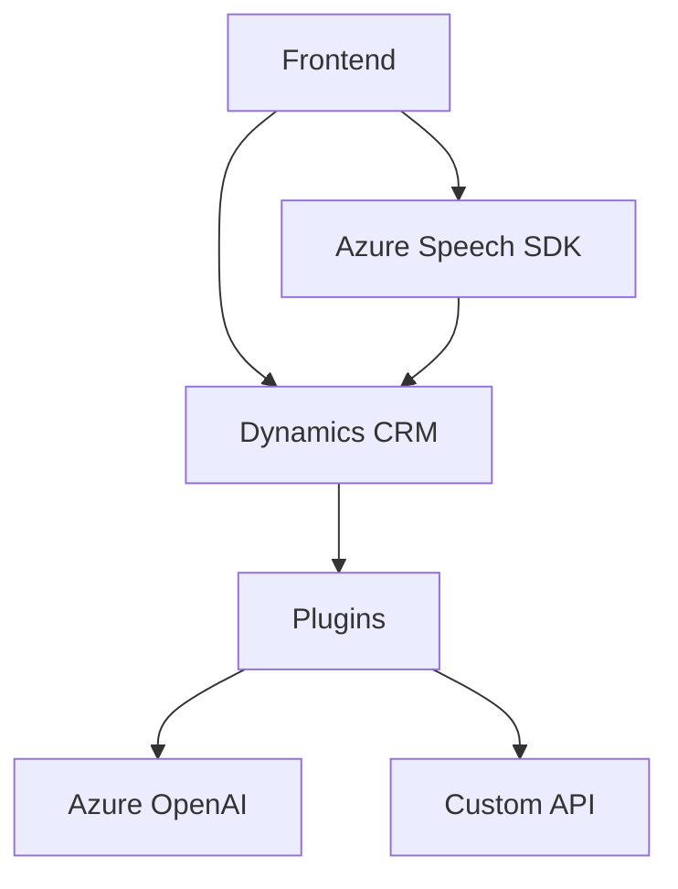

### Breve Resumen Técnico
El repositorio analiza la integración de servicios de voz y procesamiento de texto avanzados, orientados a mejorar formularios dinámicos en una solución basada en Dynamics CRM con el uso de servicios como Azure Speech SDK y Azure OpenAI. 

### Descripción de Arquitectura
La arquitectura del sistema combina varios principios:
- **Arquitectura n-capas**: Separación lógica entre frontend, procesamiento por plugins y servicios API externos.
- **Integración de servicios externos y desacoplados**: Azure Speech SDK y Azure OpenAI están bien integrados para proporcionar funcionalidades avanzadas mientras descansan fuera del sistema principal, logrando una arquitectura parcialmente distribuida.
- **Event-driven y plugin-based**: Los plugins de Dynamics CRM actúan como componentes que reaccionan a eventos definidos por el contexto.
- **Command pattern**: Uso de funciones y clases independientes para manejar tareas discretas como reconocimiento de voz, síntesis y modificaciones de datos.

### Tecnologías Usadas
1. **Frontend**:
   - **Azure Speech SDK**: Reconocimiento de voz y síntesis de texto a voz.
   - Integración directa con la API de Dynamics 365.

2. **Backend**:
   - **Plugins basados en Dynamics CRM**: Usando la interfaz `IPlugin` del SDK `Microsoft.Xrm.Sdk`.
   - **Azure OpenAI Service**: Procesamiento avanzado de texto utilizando el modelo IA.

3. **Patrones y buenas prácticas**:
   - Modularización.
   - Uso de callbacks y promesas.
   - Manejo de integración de API externas de manera desacoplada.
   - Command pattern y plugin-based para escalabilidad.

### Diagrama Mermaid Válido para GitHub

### Conclusión Final
Este repositorio forma parte de una solución en **arquitectura n-capas**, combinando un **frontend interactivo**, con formulación de datos dinámicos por voz, y un **backend basado en Dynamics CRM**, que permite conectar capacidades como reconocimiento y síntesis de voz (Azure Speech SDK) con potentes herramientas de procesamiento de texto (Azure OpenAI). La solución usa patrones como el plugin-based architecture y command pattern, permitiendo un diseño modular. Es apto para entornos empresariales donde la eficiencia en la interacción usuario-sistema sea de alta prioridad.