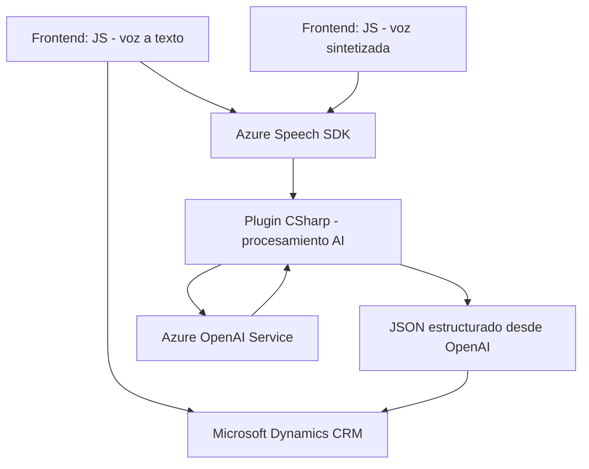

### Breve resumen técnico

El repositorio define una solución desarrollada principalmente para integrar funcionalidades relacionadas con reconocimiento y síntesis de voz, conectando con servicios de Azure Speech SDK y Azure OpenAI dentro de un sistema CRM (Microsoft Dynamics CRM). Contiene scripts JavaScript para el frontend que interactúan directamente con formularios dinámicos del CRM, y un plugin en C# para procesamiento avanzado mediante Azure OpenAI.

---

### Descripción de arquitectura

La solución implementa una **arquitectura modular por capas**. Esto se evidencia en las siguientes características:
- **Frontend**:
  - Scripts implementan funciones divididas en responsabilidades específicas como extracción de datos del DOM, integración con el Azure Speech SDK, y configuración de credenciales.
  - Utiliza un modelo cliente ligero que delega gran parte del procesamiento a servicios externalizados (Azure Speech y OpenAI).
- **Backend**:
  - Implementación de un plugin como lógica personalizada en Dynamics CRM, basada en el patrón Plugin Architecture, que actúa como intermediario entre el sistema CRM y el servicio Azure OpenAI para generar JSON estructurado.
- **Comunicación con API externas**:
  - El backend se comunica con Azure OpenAI para transformar datos.
  - El frontend se conecta con Azure Speech SDK en tiempo real para reconocimiento y síntesis de voz.

---

### Tecnologías usadas

1. **Frontend**:
   - **JavaScript**: Para lógica basada en funciones y manipulación del DOM.
   - **Azure SDK**: Integración del servicio Azure Speech para reconocimiento y síntesis de voz.
   - **HTTP**: Para comunicar con APIs e interactuar con dynamics or cloud services.

2. **Backend**:
   - **Microsoft .NET Framework** con C#: Usado para crear un plugin en Dynamics CRM.
   - **Azure OpenAI SDK** para procesamiento de texto avanzado.
   - **Newtonsoft.Json** y **System.Text.Json**: Para tratamiento de estructuras JSON.

3. **Patrones y principios**:
   - Modularización: Separar responsabilidades en grupos funcionales.
   - Dependency injection: Uso de `executionContext` para desacoplar la lógica de negocio.
   - API integration: Conexión directa a servicios externos para encargarse de tareas específicas como reconocimiento, síntesis, o transformación avanzada de texto.

---

### Diagrama Mermaid (Entrada de Voz → Procesamiento → Salida)

---

### Conclusión final

La solución presentada es una **integración avanzada de tecnologías en un sistema CRM**, orientada principalmente a:
- **Procesamiento de datos por voz**: Lectura y reconocimiento de voz en tiempo real gracias a Azure Speech SDK.
- **Transformación de entrada de texto**: Uso de inteligencia artificial (Azure OpenAI) en la capa backend para estructurar los datos correctamente.
- **Interacción directa con CRM**: Tanto desde el frontend como desde el plugin backend, asegurando que todos los datos relevantes se apliquen directamente al sistema de gestión.

La arquitectura modular basada en múltiples capas, junto con la integración de APIs externas como servicios de Azure SDK, ofrece escalabilidad y adaptabilidad, especialmente útil para sistemas CRM empresariales que requieren alta integración con tecnologías externas.