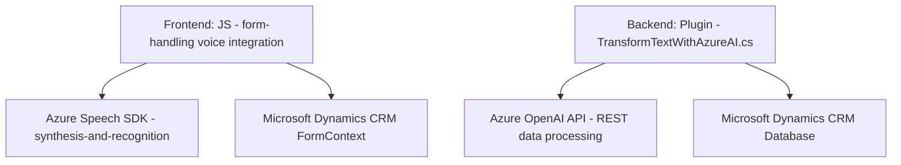

### Breve Resumen Técnico
El repositorio contiene múltiples archivos que implementan un sistema de interacción basada en **Microsoft Dynamics CRM**, con enfoque en el uso de voz y procesamiento de texto mediante **Azure Speech SDK** y **Azure OpenAI APIs**. La solución involucra un frontend para interacción con formularios mediante síntesis y reconocimiento de voz, además de un plugin en backend para manipulación avanzada de datos. 

### Descripción de la Arquitectura
La solución se puede clasificar como una arquitectura de **microservicios** y de **n capas**.  
- **Microservicios:** Existen componentes independientes para el frontend (integración con formularios y Azure Speech SDK) y backend (plugin para procesamiento en Dynamics CRM usando la API de Azure OpenAI).  
- **N Capas:** Cada archivo tiene una identificación clara de capas: presentación y procesamiento en frontend, junto con una capa de lógica empresarial (plugin en Dynamics CRM) que se integra con almacenamiento de datos en CRM e intercambio de información a través de APIs externas.

### Tecnologías Usadas
1. **Frontend:**
   - Vanilla JavaScript: Implementación funcional, no orientada a objetos, manejando lógica de formularios y voz.
   - **Azure Speech SDK**: Para síntesis de habla y reconocimiento de voz en tiempo real. 
   - Principios de diseño basados en Modularidad y Carga dinámica.
2. **Backend:**
   - **Microsoft Dynamics CRM Plugin Framework:** Para extender la funcionalidad de Dynamics CRM.
   - **Microsoft Xrm SDK**: Interacción directa con la plataforma de CRM.
   - **Azure OpenAI API**: Para procesamiento avanzado de textos.
   - **Newtonsoft.Json**: Para manejo avanzado de JSON.

### Dependencias o Componentes Externos
1. **Azure Speech SDK**: Se reutiliza en el frontend para entrada y salida de voz.
2. **Azure OpenAI API**: Procesa el texto del plugin.
3. **Microsoft Dynamics CRM**: Base de datos y almacenamiento de los formularios, campos y atributos.
4. **Microsoft Xrm SDK**: Facilidad para acceder a servicios CRUD de la base de datos.
5. **JavaScript SDK** para formularios de Dynamics CRM.
6. **HTTP Client Libraries** para invocar endpoints de Azure OpenAI.

---

### Diagrama Mermaid

### Conclusión Final
El repositorio implementa una solución que integra interacción por voz en formularios dentro de Dynamics CRM, aprovechando Azure Speech SDK en el frontend para síntesis y reconocimiento de voz, y Azure OpenAI en el backend para procesamiento de texto avanzado. La arquitectura es híbrida, combinando elementos de microservicios y n capas. Aunque funcionalmente completa, podría optimizarse con una refactorización estructural hacia un enfoque modular y orientado a objetos, facilitando su mantenimiento y escalabilidad.