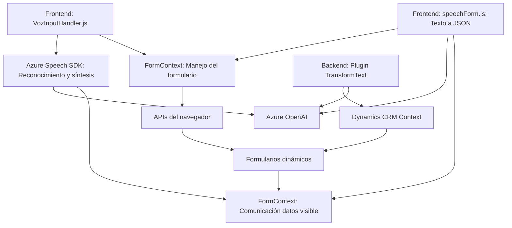

### Breve resumen técnico
El repositorio es una solución híbrida que implementa capacidades de lectura y entrada de voz para formularios en una aplicación frontend integrada con Azure Speech SDK y Dynamics CRM. Contiene componentes de desarrollo relacionados con accesibilidad y comunicación mediante Azure OpenAI.

### Descripción de arquitectura
La arquitectura sigue patrones de interacción entre frontend y servicios de nube. Los archivos en las carpetas `FRONTEND/JS` implementan funcionalidades del lado del cliente para captura, síntesis y procesamiento de datos relacionados con formularios dinámicos. El archivo en `Plugins` desarrolla un plugin de backend para Microsoft Dynamics CRM, utilizando Azure OpenAI para transformar datos de texto. La estructura general representa una solución de **arquitectura N-capas**, en la que las siguientes capas son evidentes:
- **Capa de presentación (Frontend):** Implementa funcionalidades de interacción con el usuario.
- **Capa de lógica de negocio:** Con centro en plugins para Dynamics CRM.
- **Capa de servicios externos:** Integra SDK para voz y APIs de inteligencia artificial como parte de procesamiento avanzado.

### Tecnologías usadas
1. **Frontend:**
   - Lenguaje: JavaScript.
   - Servicios: Azure Speech Services (SDK y APIs), APIs del navegador para manejar DOM.
   - Framework implícito: Dynamics CRM para manejar formularios y contextos.

2. **Backend:**
   - Lenguaje: C#.
   - Framework: Microsoft Dynamics CRM SDK.
   - Librerías: `Newtonsoft.Json`, `System.Text.Json`, `HttpClient`.
   - Servicio externo: Azure OpenAI.

3. **Común:**
   - Azure SDKs (`Speech SDK`, `OpenAI API`).
   - Promesas para asincronía en JavaScript y C#.

### Dependencias o componentes externos presentes
- **Azure Speech SDK:** Para síntesis y reconocimiento de voz.
- **Azure OpenAI Service:** Para transformación y procesamiento de texto.
- **Microsoft Dynamics SDK:** Para plugins y manipulación de formularios dinámicos.
- **APIs del navegador:** Dinámica relacionada con manipulación DOM (Frontend).

### Diagrama Mermaid válido para GitHub

### Conclusión final
La solución combina capacidades avanzadas de accesibilidad y procesamiento textual mediante servicios en la nube, integrándose con Microsoft Dynamics CRM. La arquitectura es de tipo **N-capas**, con fuerte dependencia de servicios externos (Azure Speech, Azure OpenAI y Dynamics CRM). La modularización en frontend facilita su presentación y soporte de UI/UX, mientras que el plugin del backend se especializa en procesamiento contextual del CRM. Ideal para sistemas que buscan accesibilidad y manejo dinámico de datos basados en voz para formularios.