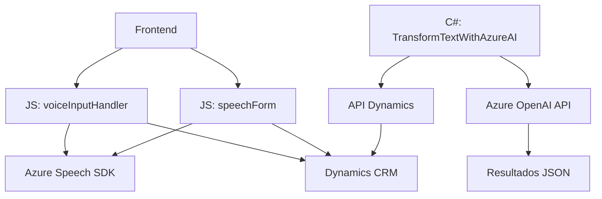

### Resumen técnico

Este repositorio está diseñado para integrar Microsoft Dynamics CRM con los servicios de **Azure Cognitive Services**, específicamente **Azure Speech SDK** y **Azure OpenAI API**. Proporciona capacidades avanzadas como entrada y síntesis de voz, reconocimiento de voz, y transformación de texto mediante IA, para asistir en la gestión automatizada y asistida de formularios y datos empresariales.

---

### Descripción de la arquitectura

1. **Tipo de solución**:  
   Sistema híbrido compuesto por un **frontend** (scripts para interacción con Dynamics CRM) y **backend** (plugins para procesamiento desde el servidor). Parece ser parte de una implementación de extensiones sobre Dynamics CRM para automatización y soporte de voz.

2. **Arquitectura empleada**:  
   - Arquitectura de **n-capas**:
     - **Presentación**: Interfaz de usuario en el CRM, con capacidad de interacción mediante voz.  
     - **Capa lógica**: Funcionalidad implementada mediante scripts y plugins que interactúan directamente con Dynamics CRM y servicios externos.  
     - **Datos**: APIs del CRM y de Azure gestionan datos y transcripciones.  
   - Uso de **patrones de integración de servicios externos** para conectarse con Azure Speech SDK y Azure OpenAI API.  
   - Modularidad: Scripts y plugins diseñados para manejar responsabilidades específicas, siguiendo el **Single Responsibility Principle**.

---

### Tecnologías, frameworks y patrones usados

1. **Tecnologías**:
   - **Azure Speech SDK**: Aporta capacidades de entrada por voz y síntesis de texto.  
   - **Azure OpenAI API**: Procesamiento de lenguaje natural y generación de texto transformado basado en IA.  
   - **Dynamics CRM API (`Xrm.WebApi`)**: Permite gestionar datos y eventos relacionados con el CRM.  
   - **JavaScript**: Lenguaje de scripting para crear funcionalidades en frontend.  
   - **C#**: Para desarrollo de plugins en backend.  

2. **Patrones de diseño**:
   - **Service Integration**: Uso de servicios externos (Azure Speech y OpenAI) mediante llamadas HTTP con API Keys y configuración dinámica.  
   - **Modularidad**: Scripts agrupados por contexto funcional específico.  
   - **Plugin Pattern**: En el backend para extender eventos del CRM (mediante `IPlugin`).  
   - **Strategy Pattern**: Aplicación de métodos específicos para procesamiento de datos en formularios (extracción, ajuste, mapeo).  

---

### Dependencias o componentes externos

1. **Dependencias internas**:
   - Dynamics CRM API (`Xrm.WebApi`, `IPlugin`) para interacción directa con los datos del CRM.
   - Métodos avanzados de `Xrm` para manipulación de entidades y atributos.
  
2. **Dependencias externas**:
   - **Azure Speech SDK**: Cargado dinámicamente desde CDN para evitar dependencias locales.  
   - **Azure OpenAI API**: Consumida mediante solicitudes HTTP REST desde el plugin.  
   - **API personalizada** (Dynamics CRM): Podría estar alojada como middleware entre el sistema y Azure.  

---

### Diagrama Mermaid

---

### Conclusión final

Esta solución representa una integración avanzada entre Microsoft Dynamics CRM y Azure Cognitive Services. Ofrece funcionalidades modernas como comandos de voz, síntesis de texto, y procesamiento mediante IA, enfocadas en mejorar la experiencia del usuario y automatizar procesos empresariales. La estructura del repositorio refleja una buena modularidad, separación por responsabilidad y uso efectivo de patrones de diseño. Sin embargo, podría beneficiarse de mejoras como la centralización de configuraciones de servicios externos y refactorización para mayor seguridad en almacenamiento de claves API.