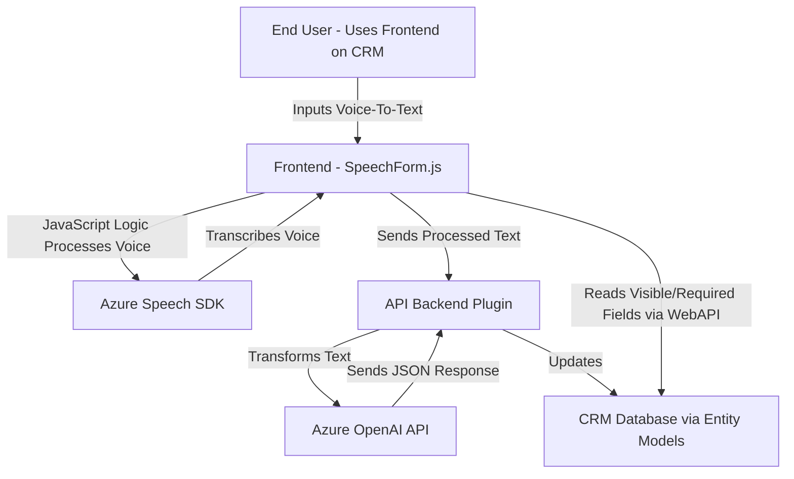

### Resumen Técnico
El repositorio contiene un conjunto de archivos para desarrollar funcionalidades de voz y procesamiento de datos para formularios integrados en Microsoft Dynamics 365 CRM. La solución utiliza JavaScript y C# para implementar la integración del reconocimiento de voz y transformación de texto mediante el uso de servicios en la nube, como Azure Speech SDK y Azure OpenAI API. Además, emplea Dynamics 365 WebAPI y plugins de Dynamics CRM para gestionar datos contextualizados con la interfaz del usuario.

---

### Descripción de arquitectura
El sistema implementa una mezcla de arquitecturas de **n capas** y **event-driven workflows**. La plataforma CRM (Dynamics 365) actúa como base para la ejecución de los plugins y la manipulación de datos empresariales, mientras que los scripts de frontend (JavaScript) ejecutan procesos en el navegador del usuario. Estas funcionalidades interactúan con Azure para reconocimiento de voz y transformación de texto mediante dos servicios distintos:
1. Azure Speech SDK para el tratamiento de texto en voz y viceversa en la interfaz.
2. Azure OpenAI API para transformar texto con inteligencia artificial empleando un plugin en el backend del CRM.

La solución divide claramente sus componentes entre frontend (JavaScript) y backend (C#), manteniendo una distinción clara entre lógica orientada al cliente y lógica empresarial. Esto permite una arquitectura distribuida con soporte para integraciones externas.

---

### Tecnologías usadas
1. **Framework y plataformas:**
   - **Microsoft Dynamics 365 CRM**
   - **Dynamics WebAPI para extensión del cliente**
   - **Azure Speech SDK** para funcionalidad de texto a voz y captura de voz.
   - **Azure OpenAI API** para transformación mediante IA.
2. **Lenguajes:**
   - **Frontend:** JavaScript.
   - **Backend:** C# para plugins de Dynamics CRM.
3. **Bibliotecas:**
   - Microsoft.Xrm.Sdk (SDK de Dynamics CRM)
   - System.Net.Http (C# HTTP client para realizar peticiones)
   - Newtonsoft.Json (manejo de JSON en C#)
4. **Patrones:**
   - **Event-Driven Architecture:** Uso intensivo de callbacks y promesas para manejar respuestas asíncronas.
   - **Modularización Funcional:** Organización del código en unidades reutilizables para cada flujo lógico en los scripts frontend (ejemplo: captura de voz y procesamiento de valores JSON).
   - **Plugin-based Architecture:** Extensiones del backend de Dynamics CRM mediante plugins.

---

### Diagrama Mermaid

---

### Conclusión Final
La solución combina múltiples technologies y patterns para implementar una funcionalidad avanzada en el ámbito de la inteligencia artificial y reconocimiento de voz. La arquitectura es claramente basada en **n capas** (separación frontend/backend), con patrones de integración para maximizar el uso de servicios externos como Azure API y Dynamics WebAPI. La modularidad transversal permite el fácil mantenimiento y ampliación de la solución para futuras necesidades empresariales.

