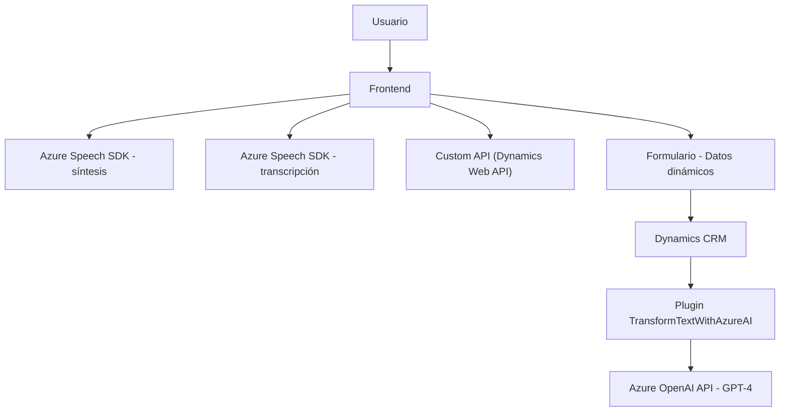

# Análisis técnico y explicación

## Breve resumen técnico:
El repositorio presentado contiene artefactos que implementan dos módulos (`readForm.js` y `speechForm.js`) en JavaScript para un frontend, que interactúan con un plugin de Dynamics CRM (`TransformTextWithAzureAI.cs`). Estos componentes operan en conjunto para añadir accesibilidad a formularios de Dynamics CRM mediante síntesis y transcripción de voz, facilitando la interacción de los usuarios con datos provenientes de formularios o APIs externas.

---

### Descripción de arquitectura:
Esta solución utiliza una arquitectura **modular basada en capas**, donde los diferentes archivos y tecnologías se integran según una separación de responsabilidades:
1. **Frontend (Presentación):**
   - `readForm.js`: Módulo que obtiene datos del formulario y los convierte en audio usando el SDK de Azure Speech para proporcionar una experiencia accesible mediante síntesis de voz.
   - `speechForm.js`: Módulo que agrega funcionalidad de entrada de voz. Convierte la voz del usuario a texto utilizando el SDK de Azure Speech y aplica los valores obtenidos directamente a los campos de un formulario.
2. **Backend (API personalizada y plugin de Dynamics):** 
   - `TransformTextWithAzureAI.cs` permite interactuar entre el CRM (como Dynamics) y el servicio de Azure OpenAI API, para aplicar procesos de transformación avanzados a los datos de entrada mediante AI.

La arquitectura puede considerarse **n capas**, consistiendo en las siguientes:
- **Capa de presentación (cliente Angular o similar):** Interactúa con los datos a través de los archivos JavaScript.
- **Capa de lógica y negocio:** Utiliza plugins personalizados en Dynamics CRM para realizar tareas complejas como la manipulación de texto mediante Azure OpenAI.
- **Capa de servicios externos:** Integración de SDKs (Azure Speech y Azure OpenAI) para tareas específicas.

**Patrones observados:**
- **Facade**: Funciones que encapsulan subprocesos complejos, como carga de SDKs y orquestación de servicios.
- **Service Layer**: Integración con Dynamics y Azure OpenAI presenta un claro uso de servicios externos y sus APIs.
- **Dynamic Field Mapping**: Extracción dinámica de estructuras de datos del formulario para su manipulación.

---

### Tecnologías usadas:
1. **Frontend:**
   - JavaScript.
   - Azure Speech SDK: Para síntesis y transcripción de voz.
   - Dynamics Web API (Xrm.WebApi): Para lectura y modificación de formularios de Dynamics.

2. **Backend:**
   - **Microsoft Dynamics CRM**: Plataforma base de CRM con ejecución basada en eventos y uso de plugins.
   - **C#**: Lenguaje base del plugin para trabajar con Dynamics y servicios externos.
   - **Azure OpenAI Service**: Modulo GPT-4 para procesamiento y transformación avanzada de texto.
   - **HTTP client libraries** (`System.Net.Http`) y JSON serializers (`System.Text.Json` / `Newtonsoft.Json.Linq`).

---

### Dependencias y componentes externos:
1. **Azure Speech SDK:** Suministra funcionalidad de texto a voz y transcripción de voz desde el frontend.
2. **Azure OpenAI API:** Integra modelos GPT para tareas avanzadas de procesamiento de lenguaje natural.
3. **Microsoft Dynamics CRM SDK:** Permite la conexión y manipulación de datos en formularios de la plataforma CRM durante los eventos correspondientes.
4. **Custom API:** Una API interna usada en el frontend para integración con servicios personalizados.

---

### Diagrama Mermaid (100% compatible con GitHub Markdown):

---

### Conclusión final:
La solución presentada combina tecnología frontend (JavaScript) y backend (Dynamics CRM con plugin de C#) para desarrollar un sistema accesible basado en voz. Aprovecha servicios gestionados de Azure como el Speech SDK y OpenAI, lo que muestra una integración escalable y moderna. Asimismo, utiliza patrones como `Facade` y `Service Layer` para orquestar procesos complejos. Sin embargo, el uso de HTTP síncrono en el backend podría ser un área de mejora para optimizar su desempeño. Este diseño modular y basado en capas facilita la integración y el mantenimiento, siendo ideal para servicios de accesibilidad integrados en plataformas CRM.