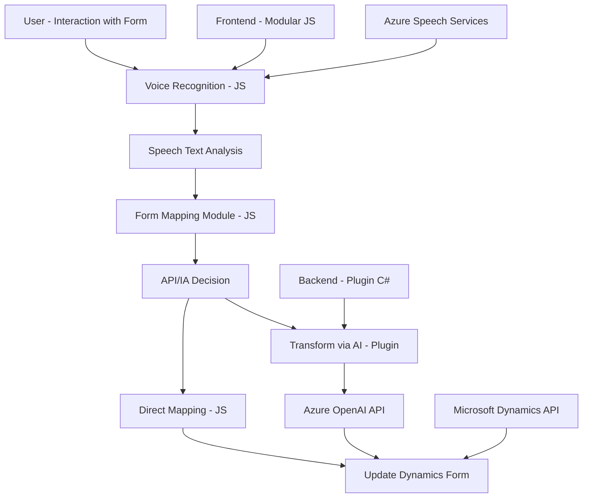

### Análisis completo del repositorio

#### **Breve resumen técnico**
El repositorio contiene una solución híbrida que combina funcionalidad de frontend (JavaScript), integración de APIs externas (Azure Speech SDK y Dynamics API), y un componente backend/plugin desarrollado en C# para Dynamics CRM. La solución está diseñada para facilitar la interacción de usuario mediante voz, permitiendo reconocimiento, síntesis y gestión avanzada de datos en formularios empresariales, así como la transformación de datos mediante Azure OpenAI.

---

#### **Descripción de arquitectura**
La arquitectura empleada en la solución es **modular basada en n-capas**, con una separación clara entre los diferentes componentes:
1. **Frontend:** Implementado en JavaScript, con modularización del código y uso de funciones interdependientes. Este se conecta directamente a componentes externos como Azure Speech SDK y APIs de Dynamics.
2. **Backend - Plugin:** El plugin en C# es responsable de la lógica empresarial avanzada y la comunicación con la API de Azure OpenAI desde Dynamics CRM. Al seguir el Plugin Pattern, se alinea con las prácticas de extensibilidad del framework de Microsoft Dynamics.
3. **Integración de servicios externos:** La solución depende de servicios como Azure Speech SDK para entrada y salida de voz, y Azure OpenAI para transformación de textos.

Por tanto, la arquitectura puede ser clasificada como **híbrida entre n-capas y SaaS (Software as a Service)** por su dependencia significativa en servicios externos como Azure y Dynamics 365.

---

#### **Tecnologías y patrones empleados**
1. **Frontend:**
   - **Lenguaje:** JavaScript.
   - **Frameworks/Bibliotecas:** Azure Speech SDK (Javascript).
   - **Patrones:**
     - Modularización por funciones.
     - Delegación asincrónica al cargar SDK y ejecutar tareas.
     - Mapeo dinámico de elementos DOM/Form.

2. **Backend (Plugin en C#):**
   - **Lenguaje:** C# (.NET Framework en general).
   - **Frameworks/Bibliotecas:** Microsoft Dynamics SDK, Newtonsoft.Json, System.Text.Json.
   - **Patrones:**
     - Plugin Pattern de Dynamics CRM.
     - Dependency Injection (`IServiceProvider`).
     - REST API Integration con Azure OpenAI.
     - Validaciones de datos según reglas específicas.

3. **Dependencias externas:**
   - **Azure Speech SDK:** Sintetización de voz y reconocimiento de audio (idiomas, modelos predefinidos como "es-ES-AlvaroNeural").
   - **Azure OpenAI GPT:** Transformación y estandarización avanzada de texto.
   - **Microsoft Dynamics API:** Manipulación de formularios y entidades en un entorno CRM.

---

#### **Diagrama Mermaid**

---

#### **Conclusión final**
La solución expuesta en el repositorio está optimizada para entornos empresariales con flujos de trabajo basados en Dynamics CRM. Su principal propósito es mejorar la interacción humano-computadora mediante comandos de voz y transformar datos con IA. Técnicamente hablando:
- Se utiliza una arquitectura funcional en el frontend, que delega tareas al SDK de Azure y APIs externas mediante un enfoque modular y asincrónico.
- En el backend (plugin), se sigue el Plugin Pattern estándar, con integración de servicios REST y un enfoque en la validación y transformación basada en normas.
- La integración de servicios de Azure alinea la solución con un paradigma SaaS, asegurando escalabilidad.
El diseño modular, junto con el uso de tecnologías modernas, lo convierte en una solución eficiente para la gestión y automatización en entornos CRM.