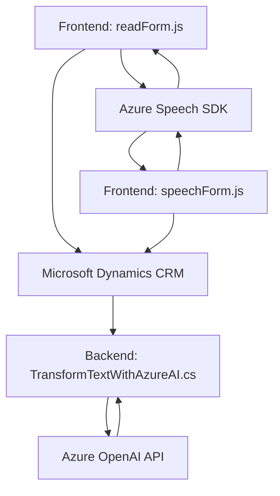

### **Breve Resumen Técnico**

El repositorio examinado contiene archivos organizados en diferentes carpetas que integran una solución híbrida de **Frontend** y **Backend**. A partir de los archivos proporcionados se observa que la solución implementa principalmente capacidades de entrada por voz, síntesis de texto, y transformación de datos estructurados mediante APIs de Azure.

---

### **Descripción de Arquitectura**

La arquitectura proporciona una integración **n capas**, combinando módulos de frontend y plugins para Dynamics CRM con servicios de terceros. Los módulos actúan como:

1. **Frontend JS (readForm.js/speechForm.js):**
   - Se encarga de capturar información visual y procesarla junto con entradas por voz.
   - Usa componentes reutilizables (funciones de síntesis, procesamiento de voz y llamadas a APIs externas).
   - Se integra con APIs como Azure Speech SDK y eventualmente con MS CRM.

2. **Backend Plugin (TransformTextWithAzureAI.cs):**
   - Un plugin para **Dynamics CRM**, donde el evento principal (como entrada de datos) dispara un procesamiento API desde **Azure OpenAI** que transforma texto en JSON estructurado.
   - Sigue el patrón de **Plugin** para extender funcionalidades en el CRM mediante servicios externos.

---

### **Tecnologías Usadas**

1. **Frontend JS**:
   - **Vanilla JavaScript**: Se priorizan funciones simples y modulares.
   - **Azure Speech SDK**: Tecnología para reconocimiento y síntesis de voz.
   - **Promises y asincronismo**: Uso de `async/await` y callbacks para manejar dependencias externas como SDKs.
   - **Dynamic CRM**: Puede pasar parámetros de formulario (con objetos `executionContext`).

2. **Backend .NET Plugin**:
   - **C#**: Desarrollo basado en .NET Framework, compatible con **Microsoft Dynamics CRM**.
   - **Microsoft.Xrm.Sdk**: Librería específica para trabajar con el modelo CRM.
   - **Azure OpenAI API**: Envíos HTTP para procesamiento avanzado de texto (GPT compatible).
   - **Newtonsoft.Json.LINQ**: Para manipular respuestas JSON complejas.
   - **HttpClient**: Para comunicación API basada en POST.

---

### **Diagrama Mermaid Válido**:

---

### **Conclusión Final**

Esta solución integra módulos de frontend con funcionalidades de síntesis y procesamiento de datos de formularios, y un backend plugin con acceso programático al sistema de Microsoft Dynamics CRM. Está diseñada para ofrecer servicios automatizados en entornos empresariales de gestión de datos, optimizados mediante APIs de inteligencia artificial de Azure OpenAI y procesamiento de voz con Azure Speech SDK.

Sin embargo, se observan **puntos críticos** como el uso de claves y configuraciones **hardcoded** en el código fuente del frontend, lo cual presenta vulnerabilidades de seguridad, además de ser una práctica poco mantenible. Es recomendable que estas configuraciones sean externalizadas hacia un servicio de configuración seguro adaptado al entorno de despliegue.