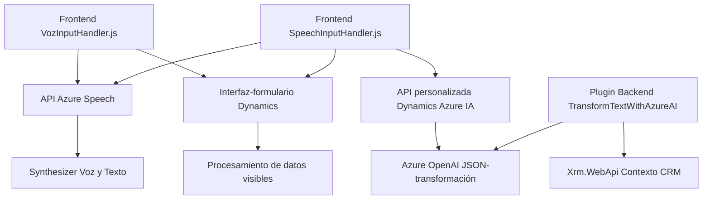

### Breve resumen técnico

El repositorio contiene archivos orientados a integrar y mejorar la experiencia de usuario dentro del ecosistema Dynamics 365 mediante funcionalidades de entrada de voz y procesamiento de texto. Estos se apoyan en servicios de Azure, como Azure Speech SDK para reconocimiento y síntesis de voz, y Azure OpenAI para transformación avanzada de texto, con resultados directamente aplicados a formularios del CRM.

---

### Descripción de la arquitectura

La solución representada tiene un enfoque híbrido orientado a una arquitectura basada en microsistemas y APIs, con módulos de frontend y backend conectados a servicios externos en la nube (Azure). La arquitectura está organizada como módulos independientes que interactúan mediante APIs y SDKs externos:

1. **Frontend (JS)**: Proporciona reconocimiento y síntesis de voz, gestión de transcripción, y mapeo directo de datos hacia formularios de Dynamics 365. Usa Azure Speech SDK como dependencia externa principal.
2. **Backend (.NET Plugin)**: Integrado al sistema de Dynamics 365 como un plugin basado en eventos. Realiza transformación de datos mediante APIs externas (Azure OpenAI) y regresa resultados estructurados en JSON.

La comunicación entre elementos utiliza servicios REST para la interacción con APIs externas y contextos internos de Dynamics 365.

---

### Tecnologías usadas

1. **Lenguajes**:
   - **JavaScript**: En los archivos de frontend para gestionar eventos, SDKs y el DOM/formulario de Dynamics 365.
   - **C#/.NET**: Para crear un plugin acoplado al backend del CRM.

2. **Frameworks y SDKs**:
   - **Azure Speech SDK**: Reconocimiento y síntesis de voz.
   - **Xrm.Sdk**: Interacción con el contexto y modelo de Dynamics 365.
   - **Newtonsoft.Json**: Manipulación de JSON en C#.
   - **System.Net.Http**: Integración con APIs REST.

3. **Patrones de diseño**:
   - **Modularización**: Separación clara de lógica por funcionalidades (voz, texto, integración con API).
   - **API Wrapper**: Uso de métodos específicos para conectar con APIs externas (Speech SDK, OpenAI).
   - **Plugin-based**: Dynamics 365 utiliza el patrón de plugins para manejar eventos de forma extensible.
   - **Cargador dinámico**: El SDK de Azure Speech se carga dinámicamente solo cuando es necesario.

---

### Dependencias o componentes externos

1. **Azure Speech SDK**: Para funcionalidad de voz (reconocimiento y síntesis).
2. **Azure OpenAI**: Procesamiento de texto avanzado y transformación a JSON.
3. **Xrm.WebApi (Dynamics 365)**: Llamadas y manipulación de datos a través del backend del CRM.
4. **Servicios HTTPS/API**: Uso de servicios REST para interactuar con SDKs externos (Speech SDK y OpenAI).

---

### Diagrama Mermaid para GitHub

---

### Conclusión final

La solución representada en este repositorio integra funcionalidades modernas y escalables dentro del ecosistema Dynamics 365 mediante una arquitectura modular conectada a servicios de Azure. Utiliza SDKs especializados para reconocimiento/síntesis de voz y procesamiento avanzado de texto, logrando una interacción fluida entre frontend y backend. El diseño enfatiza la separación de responsabilidades y el uso de APIs, permitiendo extender funcionalidades dinámicamente según las necesidades del cliente y de la plataforma.