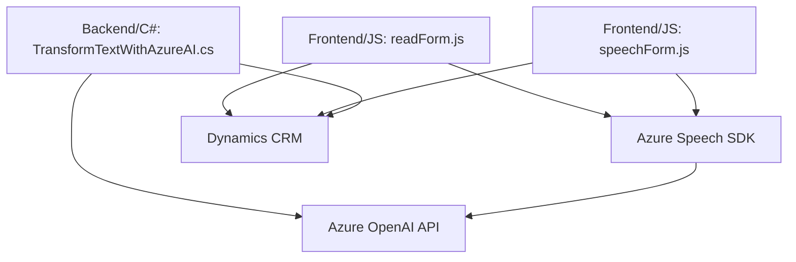

### Breve resumen técnico
Este repositorio contiene una solución que combina funcionalidades de entrada de voz, síntesis de texto a voz, procesamiento de formularios dinámicos y manipulación de datos mediante Microsoft Dynamics CRM con integración de servicios avanzados como Azure Speech SDK y Azure OpenAI API. Los archivos cubren tanto lógica de frontend (JavaScript) para interacciones en cliente, como un plugin backend (C#) para Dynamics CRM.

---

### Descripción de arquitectura
Esta solución utiliza una arquitectura **n-capas**, subdividida en:
1. **Frontend (cliente)**: Gestiona interacciones con formularios y servicios de voz mediante Azure Speech SDK.
2. **Backend (Dynamics CRM Plugin)**: Extiende las capacidades de Microsoft Dynamics CRM con procesamiento de texto avanzado mediante Azure OpenAI.
3. **Servicios externos**: Une servicios de Azure Speech y Azure OpenAI mediante invocaciones HTTP, actuando como componentes externos.

Por tanto, es una arquitectura de integración donde varias capas (dato, lógica y presentación) interactúan con servicios externos según patrones SOA (Service-Oriented Architecture).

---

### Tecnologías usadas
#### **Frontend:**
- **JavaScript**:
  - Manipulación del DOM y contexto en formularios.
  - Promesas y callbacks para flujo asincrónico.
- **Azure Speech SDK**: Utilizado para síntesis de voz y reconocimiento de comando hablado.

#### **Backend:**
- **C#** (Dynamics CRM Plugin):
  - Implementación de la interfaz `IPlugin` para extender las capacidades de Dynamics CRM.
  - Integración con Azure OpenAI mediante llamadas REST con `HttpClient`.

#### **Dependencias externas:**
- **Azure Speech SDK**: Para entrada/salida de voz.
- **Azure OpenAI API**: Transformación avanzada de texto mediante modelos de lenguaje.
- **System.Net.Http y Newtonsoft.Json**: Manipulación y transporte de datos JSON en backend.

#### **Patrones utilizados:**
- **Modularización**: Cada archivo está dividido de manera lógica por funciones y métodos.
- **Integración orientada a servicios**: La arquitectura está diseñada para interactuar con APIs externas.
- **Event-driven**: Respuesta a eventos como entrada de voz o modificaciones en formularios.
- **Plugin Pattern**: Extensión en CRM mediante Microsoft Dynamics Plugins basado en interfaces.

---

### Diagrama Mermaid

---

### Conclusión final
La solución del repositorio es una integración avanzada centrada en mejorar la experiencia de usuario mediante voz y procesamiento dinámico de formularios, respaldada por capacidades de IA (Azure Speech y Azure OpenAI). La arquitectura **n-capas** asegura una separación clara entre frontend, backend y servicios externos, ofreciendo flexibilidad para extender funcionalidades. Este diseño sería ideal para empresas que necesitan automatizar y enriquecer procesos en interfaces basadas en Microsoft Dynamics CRM.