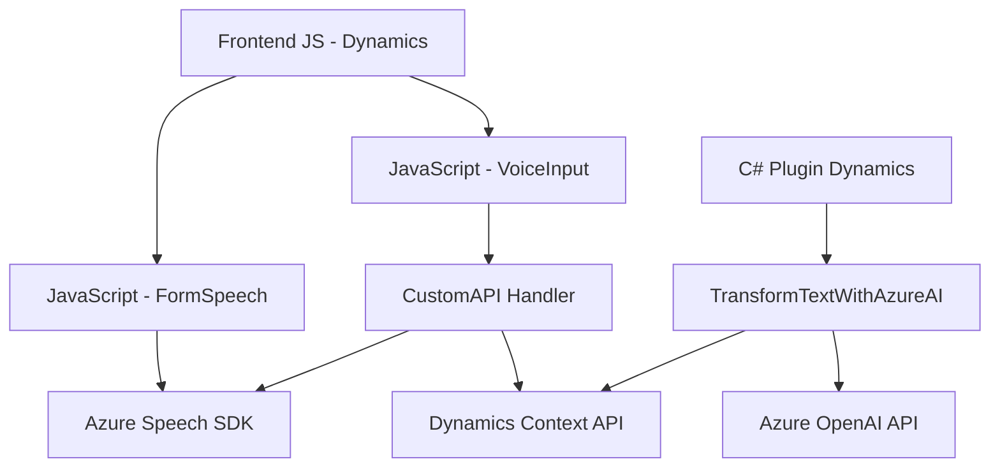

### Breve resumen técnico
El repositorio contiene una solución mixta que integra componentes de frontend JavaScript, un plugin de Dynamics CRM desarrollado en C#, y el uso de servicios en la nube (Azure Speech SDK y Azure OpenAI API). Está diseñado para enriquecer formularios en Dynamics 365 con la capacidad de interacción por voz y procesamiento estructurado de texto mediante IA.

---

### Descripción de arquitectura
La arquitectura es híbrida y combina características de aplicaciones **cliente-servidor**. Por un lado, los archivos JavaScript para el frontend gestionan la interacción con Dynamics 365 y el reconocimiento de voz. Por otro lado, el plugin en C# actúa como un módulo reusable que se ejecuta en el backend de Dynamics CRM para procesar datos y realizar integraciones con la API de Azure OpenAI. Esto sugiere un enfoque **multicapas** con las siguientes características:
1. **Presentación**: Frontend en JavaScript ligado a Dynamics 365 para interacción con el usuario.
2. **Lógica de aplicación**: Procesamiento vía plugins en C# y funciones externas de Azure.
3. **Servicios externos**: Azure Speech SDK para síntesis de voz y Azure OpenAI para procesamiento semántico.

---

### Tecnologías y patrones usados
1. **Tecnologías**:
   - **Frontend**: JavaScript integrado con Dynamics 365. Uso de Azure Speech SDK para reconocimiento y síntesis de voz.
   - **Backend**: Plugin en C# desarrollado para Dynamics CRM. Integración directa con Azure OpenAI API.
   - **Cloud**: Dependencias como Speech SDK y OpenAI API, ambas parte del ecosistema Azure.

2. **Frameworks y servicios**:
   - Dynamics 365 CRM SDK y herramientas relacionadas.
   - Azure APIs (OpenAI, Speech SDK para JavaScript).

3. **Patrones**:
   - **Integración basada en eventos**: Plugins de Dynamics CRM que se ejecutan en respuesta a actividades específicas.
   - **Cargador dinamico (Lazy Loading)**: El SDK de síntesis de voz se carga dinámicamente según necesidad, mejorando rendimiento.
   - **Command Pattern**: Aplicación de datos procesados en distintos formatos al formulario.
   - **Callback y Promises**: Uso moderno en async JavaScript para manejar dependencias externas como SDKs y APIs.

---

### Dependencias externas
Los componentes dependen de:
1. **Azure Speech SDK**: Para reconocimiento de voz y síntesis de texto.
2. **Azure OpenAI API**: Para transformar texto y generar respuestas JSON estructuradas.
3. **Microsoft Dynamics SDK**: Orientado a interactuar con formularios y datos del CRM.
4. **APIs nativas del navegador**: Métodos como `fetch` para invocar servicios externos desde JavaScript.
5. **HTTP client en C#**: Para invocar APIs externas (HttpClient).

---

### Diagrama Mermaid compatible con GitHub Markdown

---

### Conclusión final
La solución es una integración orientada a mejorar la experiencia de usuario en Dynamics 365 mediante interacción por voz y uso de inteligencia artificial. Usa una arquitectura multicapa que combina funcionalidades del frontend, procesamiento en plugins de backend, y servicios en la nube. Sin embargo, algunas dependencias como la definición directa de claves API en el código podrían comprometer la seguridad. Se recomienda modularizar aún más el acceso a credenciales y optimizar la redundancia en la carga de dependencias.