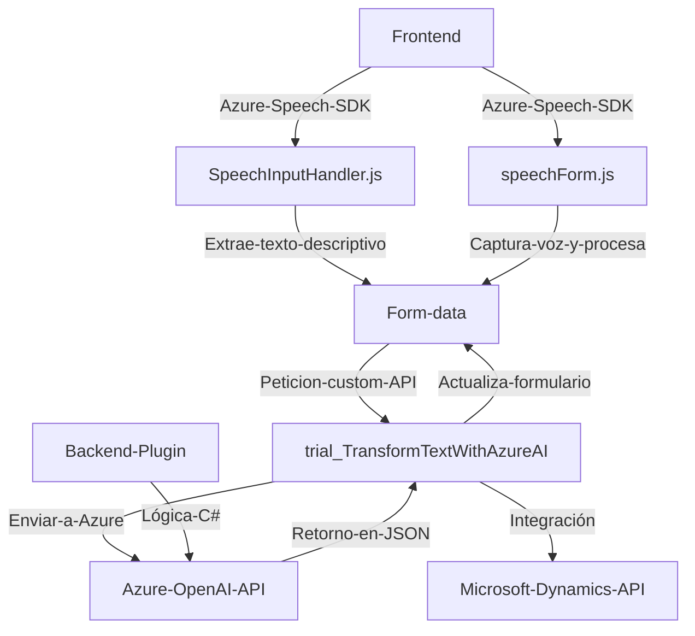

### Breve resumen técnico
El repositorio incluye múltiples archivos que parecen integrar y extender funcionalidades asociadas a Microsoft Dynamics 365 mediante la integración de servicios de Azure (Speech SDK y OpenAI). Los archivos analizados muestran una solución que conecta dinámica e inteligentemente la interfaz de usuario (formulario de Dynamics) con servicios externos de inteligencia artificial y reconocimiento de voz.

---

### Descripción de arquitectura
La solución presenta una arquitectura **n capas** con elementos distribuidos que interactúan entre sí:
1. **Frontend (JS)**: Scripts que manejan la interfaz de usuario, recogiendo entrada de voz, procesando transcripciones y actualizando los formularios en Dynamics.
2. **Backend Plugin (C#)**: Procesa texto mediante reglas específicas usando `Azure OpenAI` y define la lógica de negocio requerida como plugins en Dynamics 365.
3. **Servicios externos**: Los componentes dependen significativamente de API de Azure Speech SDK y OpenAI para funcionalidades avanzadas como transcripción de voz y transformación de texto.

La arquitectura combina principios de SOA (Service-Oriented Architecture) y modularidad. El uso de SDK externos como servicios conectados refuerza un modelo de integración basado en protocolos web estándar.

---

### Tecnologías usadas
1. **Frontend**:
   - **JavaScript**: Implementación de scripts dinámicos para manejar datos de formularios.
   - **Azure Speech SDK**: Para transcripción y síntesis de voz.
2. **Backend**:
   - **C# y Microsoft Dynamics SDK**: Extensión del comportamiento mediante plugins.
   - **Azure OpenAI**: Para procesamiento avanzado de texto con IA.
3. **Frameworks y patrones observados**:
   - Modularidad: Funciones separadas con responsabilidades claras.
   - ETL (Extraer, Transformar, Cargar): Extraen datos de formularios, procesan texto y envían los resultados a servicios externos o al formulario.
   - Integración vía API: Uso extensivo de llamadas a servicios externos para mejorar las capacidades del sistema (Speech SDK y OpenAI).
   - Dynamic Loading: Uso del cargado dinámico de SDKs (Azure Speech) para optimizar el rendimiento.

---

### Dependencias o componentes externos
Las principales dependencias incluyen:
1. **Azure Speech SDK**: Para el reconocimiento de voz y síntesis de texto a voz.
2. **Azure OpenAI API**: Para procesar contenido textual según reglas específicas.
3. **Microsoft Dynamics 365 Web API**: Manipulación de datos en formularios y ejecución de Custom Actions (trial_TransformTextWithAzureAI).
4. **Newtonsoft.Json y System.Text.Json**: Manejo y procesamiento de datos en formato JSON en el backend para comunicar con Azure APIs.

---

### Diagrama Mermaid válido para GitHub

---

### Conclusión final
La solución analizada configura una integración avanzada entre la capa de frontend de un sistema Dynamics 365, servicios de inteligencia artificial de Azure, y plugins personalizados para la extensión de la funcionalidad del backend CRM. Presenta una arquitectura **n capas con principios de diseño modular y de servicios**, compatible con aplicaciones empresariales que dependan de múltiples servicios externos. Aunque no es estrictamente "microservicios", tiene elementos de SOA al integrar con APIs externas.