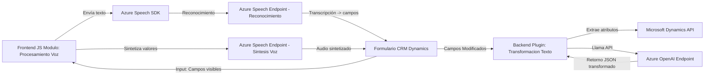

### Breve resumen técnico
El código presentado pertenece a una solución integrada con Microsoft Dynamics CRM que utiliza Azure Speech SDK para interacción de voz en la interfaz y Azure OpenAI para procesamiento avanzado de texto en un plugin backend. Las piezas del repositorio están organizadas en archivos específicos que cumplen funciones relacionadas: interacción en frontend (procesamiento y síntesis de datos de formularios) y procesamiento backend (transformación avanzada con IA).

---

### Descripción de arquitectura
La solución parece tener una **arquitectura en capas** orientada a servicios con comunicación directa a componentes externos (Azure Speech y Azure OpenAI). Está diseñada para extender las funcionalidades de Dynamics CRM mediante:
1. **Plugins backend:** Manipulan y transforman datos de manera más estructurada usando OpenAI.
2. **Frontend embebido JS:** Realizan interacción directa con los formularios de Dynamics CRM para entrada y salida de datos, integrados con servicios de reconocimiento y síntesis de voz.

La estructura sugiere una organización modular, aunque su escalabilidad depende de cómo se separen responsabilidades en los módulos y cómo se integren con servicios externos.

---

### Tecnologías usadas
1. **Frontend:**  
   - Javascript: Para manipulación de datos del formulario y comunicación directa con APIs externas.  
   - Azure Speech SDK: Procesamiento de entrada de voz y síntesis de audio.  
   - CRM/Dynamics Context APIs (e.g., `Xrm.WebApi`): Modificación y lectura de datos en el CRM.
2. **Backend:**  
   - Microsoft Dynamics SDK (`Microsoft.Xrm.Sdk`): Implementación de plugins en el contexto del CRM.  
   - Azure OpenAI: Transformación avanzada de texto utilizando GPT a través de un endpoint definido.
   - JSON Parsers (`System.Text.Json`, `Newtonsoft.Json.Linq`): Serialización y manipulación de datos.  
   - HTTP Client (`System.Net.Http`): Comunicación con el modelo de Azure OpenAI.

---

### Dependencias y componentes externos
1. **Azure Speech SDK:**  
   - Servicios de síntesis de voz basados en datos capturados del formulario.  
   - Reconocimiento de voz para entrada dinámica.
2. **Azure OpenAI:**  
   - Lógica avanzada del plugin para transformar datos en JSON estructurado basado en reglas.
3. **Dynamics CRM API:**  
   - Permite integración directa con los campos y datos del CRM.
4. **Other Libraries (Backend):**  
   - Gestión de peticiones HTTP, manipulación de JSON, y extensión funcional del plugin.

---

### Diagrama Mermaid válido para GitHub

---

### Conclusión final
La solución presentada es una integración directa entre sistemas CRM y servicios de nube avanzada. Su arquitectura es típica de **n capas**, intercalando lógica frontend (formulario CRM + servicios Azure Speech) con lógica backend (plugin para llamadas y transformación con Azure OpenAI). Aunque modular en funciones, el nivel de acoplamiento con servicios externos sugiere que la escalabilidad depende de optimizar la separación de responsabilidades y los módulos más críticos (e.g., JS altamente centralizado).