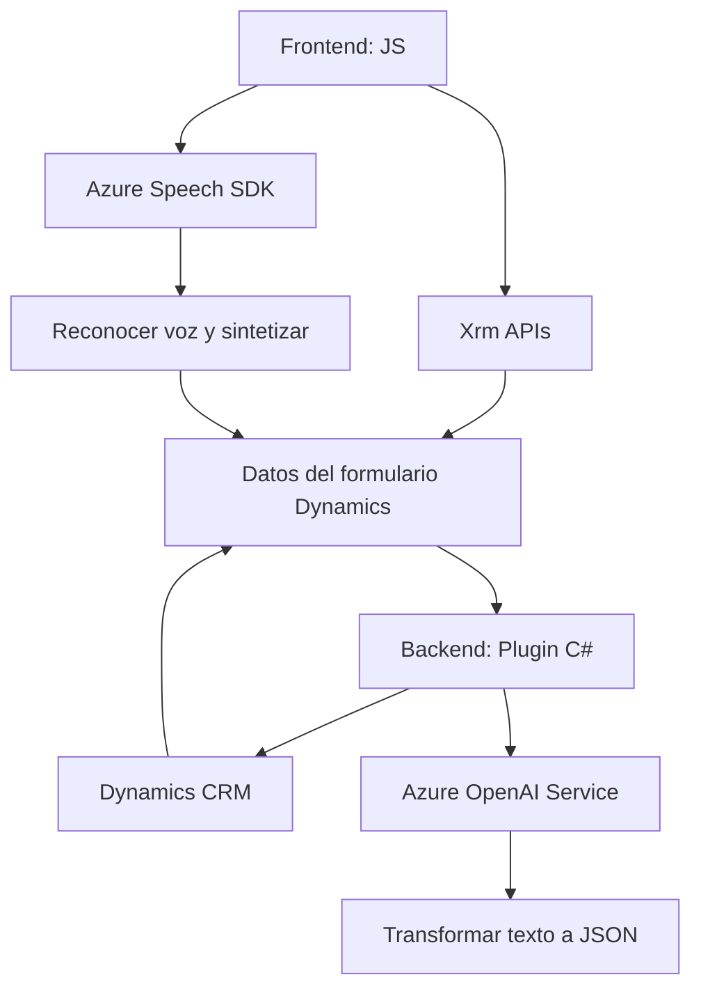

### Breve Resumen Técnico
La solución parece ser una plataforma que combina interacción humana vía voz y texto con capacidades de inteligencia artificial (Azure AI y OpenAI). Incluye un sistema de frontend para procesamiento de formularios y un backend basado en Dynamics CRM con integración a Azure servicios.

---

### Descripción de Arquitectura
La arquitectura utiliza el paradigma **multi-capa**:
1. **Frontend**:
   - Procesamiento local con JavaScript (Azure Speech SDK).
   - Manipulación de formularios en Dynamics CRM (integración Xrm APIs).
   - Manejo de eventos y lógica modular (procesos asincrónicos y callbacks).
2. **Backend**:
   - Plugins extendiendo lógica en el lado de Dynamics CRM con patrones de programación en .NET.
   - Comunicación con el servicio de Azure OpenAI para texto a JSON y procesamiento avanzado.
3. **Servicios de terceros**:
   - Speech SDK para síntesis y reconocimiento de voz.
   - OpenAI para transformación avanzada de texto.

La arquitectura global integra servicios externos como parte de los procesos de trabajo, acercándose a un enfoque **event-driven** con integración de APIs.

---

### Tecnologías Usadas
1. **Frontend**:
   - JavaScript.
   - Azure Speech SDK.
   - Dynamics Xrm APIs (WebApi).
2. **Backend**:
   - .NET Framework (C#).
   - Dynamics CRM SDK.
   - Azure OpenAI Service.
   - Dependencias comunes: HttpClient, JSON parsers (Newtonsoft y System.Text.Json).

---

### Diagrama **Mermaid**

---

### Conclusión Final
La solución integra múltiples componentes frontales y traseros utilizando servicios de terceros. Esto le brinda la capacidad de ejecutar tanto tareas en tiempo real (reconocimiento de voz, interacción con formularios) como procesamiento avanzado (integración con OpenAI). La arquitectura no es estrictamente **microservicios**; sin embargo, interactúa con APIs externas, mostrando una aproximación a un estilo **híbrido multi-capa basado en eventos**. Es ideal para entornos empresariales como Dynamics CRM.