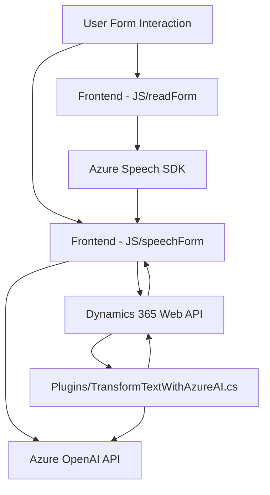

### Resumen técnico:
El repositorio consiste en componentes de integración y manejo de datos entre formularios web (frontend) y servicios externos (Azure Speech SDK, OpenAI). Incluye piezas diseñadas para interacción mediante voz y procesamiento avanzado de texto, integradas a sistemas como Dynamics 365.

### Descripción de arquitectura:
La solución adopta una **arquitectura modular en tres capas**:
1. **Frontend**: Archivos `JS/readForm.js` y `JS/speechForm.js` manejan la interacción directa del usuario con formularios web y entrada/salida de voz.
2. **Lógica externa y APIs**: Archivos frontend integran servicios externos como Azure Speech SDK, y los plugins complementan con llamadas a APIs (Azure OpenAI o APIs personalizadas).
3. **Plugins**: El archivo `Plugins/TransformTextWithAzureAI.cs` está vinculado a Dynamics 365, actuando como intermediario para interacción y transformación de datos vía Azure OpenAI.

### Tecnologías usadas:
1. **Frontend**:
   - JavaScript.
   - Azure Speech SDK (https://aka.ms/csspeech/jsbrowserpackageraw).
   - APIs de Dynamics 365 (`Xrm.WebApi`).

2. **Backend**:
   - C# con Microsoft Dynamics SDK.
   - System libraries (e.g., `System.Net.Http`, `Newtonsoft.Json`, `System.Text.Json`).
   - Azure OpenAI API.

### Patrones utilizados:
1. **Plugin Design Pattern**: En los componentes de Dynamics 365.
2. **Integración vía SDK/API**: Uso de Azure Speech SDK (para síntesis y reconocimiento de voz) y Azure OpenAI API (para transformación de texto).
3. **Modularidad**: Separación de funcionalidades específicas en funciones y clases bien definidas.
4. **Event-driven Architecture**: Procesamiento basado en eventos (e.g., entrada de datos, inicio de voz, etc.).

### Dependencias y componentes externos:
1. **Azure Speech SDK**: Reconocimiento y síntesis de voz.
2. **Azure OpenAI API**: Transformación avanzada de texto.
3. **Dynamics 365 Web API**: Acceso y modificación de datos en el entorno CRM.
4. **Contextos de formularios (Dynamics)**: Proporcionados por `executionContext`.

---

### Diagrama Mermaid:
El siguiente diagrama representa las interacciones y arquitectura del proyecto:

---

### Conclusión final:
Este repositorio representa una **modular solución de integración entre frontend y backend**, diseñada para mejorar la accesibilidad y funcionalidad en aplicaciones de Dynamics 365 mediante la incorporación de entrada/salida por voz y procesamiento avanzado de texto. La arquitectura de **n capas** puede adaptarse fácilmente a otros contextos o ampliarse a microservicios, dado el uso extensivo de SDKs y servicios externos.