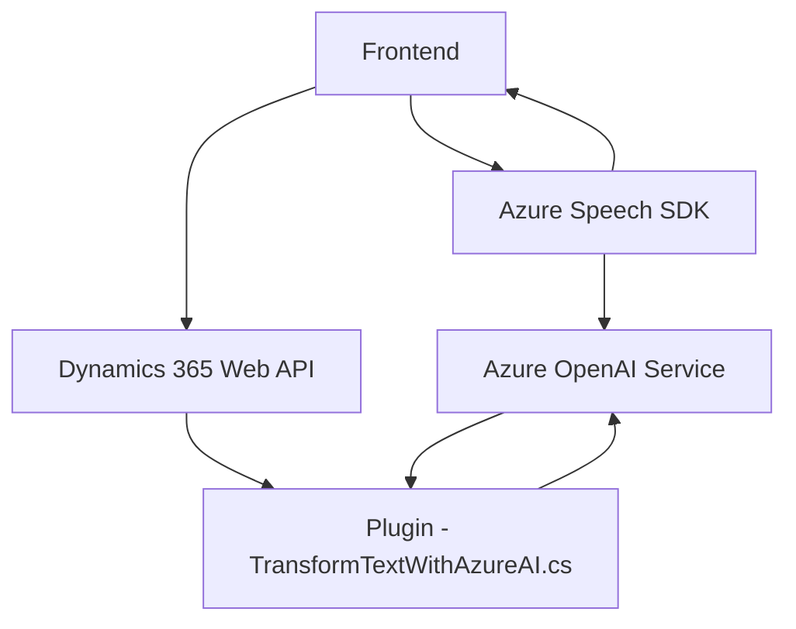

### Breve resumen técnico
El repositorio parece ser una solución que integra el procesamiento de voz y texto con Microsoft Dynamics 365, usando el Azure Speech SDK y el Azure OpenAI Service. Está compuesto por múltiples módulos para la interacción tanto en el frontend (procesamiento de formularios y entrada de voz) como en el backend (plugin de Dynamics CRM para procesar texto con AI).

---

### Descripción de la arquitectura
La arquitectura combina componentes:
1. **Frontend (readForm.js y speechForm.js):**
   - Implementa funcionalidad de entrada y salida de voz. Usa el Azure Speech SDK para la síntesis y reconocimiento de texto hablado, y los APIs de Dynamics 365 para interactuar con formularios y entidades.
   - Modularización con funciones específicas y separación de responsabilidades.

2. **Backend (TransformTextWithAzureAI.cs):**
   - Implementado como un **plugin** que interactúa con Microsoft Dynamics CRM mediante la interfaz `IPlugin`.
   - Usando el Azure OpenAI Service para transformar texto al formato requerido.

En conjunto, la solución tiene carácter híbrido al utilizar una integración de sistemas existentes (Dynamics 365) junto con servicios especializados de Azure. La arquitectura usada es **n capas**: el frontend maneja la interacción del usuario y la comunicación con APIs; el plugin procesa las solicitudes del lado del servidor.

---

### Tecnologías usadas
1. **Lenguajes:**
   - JavaScript (Frontend).
   - C# (.NET Framework en el contexto de Dynamics CRM).

2. **Single Responsibility Principle:**
   Cada función resuelve un problema específico dentro de las operaciones de entrada/salida por voz o de transformación basada en AI.

3. **Frameworks y SDKs:**
   - **Azure Speech SDK:** Synthesis y recognition para entrada y salida de voz.
   - **Microsoft Dynamics 365 SDK/API:** Manipulación y lectura dinámica de formularios.
   - **Azure OpenAI Service:** Procesamiento de texto basado en normas mediante GPT-4.

4. **Externos:**
   - Microsoft Dynamics 365.
   - Azure OpenAI Service para la generación de contenido JSON estructurado.
   - Browser APIs para la carga dinámica del Speech SDK en el frontend (`document.head.appendChild`).
   - Newtonsoft.Json para manejo de datos JSON en el backend.

---

### Diagrama **Mermaid**

---

### Conclusión final
La solución representa una aplicación modular basada en una arquitectura **n capas** que integra servicios avanzados de procesamiento de voz y texto con Dynamics 365. La comunicación externa utiliza servicios como el **Azure Speech SDK** y el **Azure OpenAI Service**, lo que refleja un enfoque de integración con microservicios. Aunque la implementación es funcional, el uso de claves API y configuración específica dentro del código puede mejorarse aplicando un enfoque más seguro y flexible (uso de variables de entorno, por ejemplo).