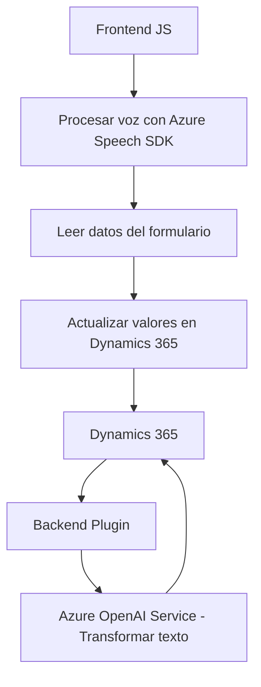

**Breve resumen técnico:**
El repositorio contiene una solución integrada que combina funcionalidades de frontend (procesamiento de formularios con interacción de voz) y backend (plugin para la transformación de textos mediante inteligencia artificial). Utiliza Azure Speech SDK y Azure OpenAI Service junto con Dynamics 365 APIs. Esto sugiere que el proyecto está diseñado como una solución híbrida compuesta por frontend y lógica empresarial (backend).

---

**Descripción de arquitectura:**
1. **Tipo:**  
   - **Frontend:** Scripts que se integran en aplicaciones web para procesamiento de voz y entrada de datos en formularios.  
   - **Backend:** Un plugin diseñado para Dynamics 365 que desbloquea transformaciones avanzadas de texto utilizando Azure OpenAI Service.  

2. **Arquitectura:**  
   - **Frontend:** Aplicación modular basada en funciones.  
   - **Backend:** Plugin dinámico implementado bajo la arquitectura del marco de extensibilidad de Dynamics 365.  
   - Se puede considerar una arquitectura **n-capas**, con la capa de presentación en el frontend y la capa de lógica empresarial en los plugins, colaborando con servicios externos como OpenAI y Speech SDK.  

---

**Tecnologías usadas:**
1. **Frontend:**  
   - **Azure Speech SDK:** Para captura, síntesis de voz y reconocimiento.  
   - **JavaScript:** Programación estructurada sin clases, orientada a funciones.  
   - **APIs de Dynamics 365:** Para manipulación de datos dentro de los formularios.  

2. **Backend:**  
   - **C#:** Código estructurado siguiendo la interfaz de plugins `IPlugin` en Dynamics 365.  
   - **Azure OpenAI Service:** Para transformación avanzada de texto.  
   - **HTTP Client:** Comunicación con servicios externos.

3. **Dependencias externas:**  
   - `Newtonsoft.Json` y `System.Net.Http`: Para el manejo de JSON y operaciones HTTP.  
   - `Xrm.Sdk`: Para interacción con estructuras de Dynamics 365.  

---

**Diagrama Mermaid compatible con GitHub Markdown:**

---

**Conclusión final:**
El repositorio proporciona una solución basada en **n-capas**, combinando un frontend orientado a funciones que se integra con Dynamics 365 para facilitar la interacción del usuario mediante voz, junto con un backend que utiliza el framework de plugins de Dynamics 365 y servicios avanzados de inteligencia artificial (Azure OpenAI). La solución es modular, extensible y aprovecha el potencial de la infraestructura en la nube de Azure, fortalecida con patrones de integración y procesamiento asincrónico.