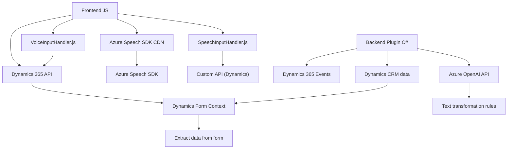

### **Breve resumen técnico**
El repositorio contiene archivos que implementan funcionalidades de síntesis de voz, transcripción de texto por voz en formularios, y un plugin de inteligencia artificial para transformar texto desde Dynamics 365 CRM a través de Azure services. Es una solución que integra frontend y backend con APIs externas y componentes corporativos (Dynamics 365 y Azure). En definitiva, usa un enfoque modular y patrones de arquitectura orientados a servicios.

---

### **Descripción de arquitectura**
La arquitectura general parece ser una mezcla de **n capas** y **hexagonal**, donde se separan las responsabilidades por módulos específicos. Por ejemplo, el frontend interactúa directamente con el usuario mediante JavaScript para la captura, transcripción y lectura de voz, mientras que el backend (C# plugin) se conecta con Dynamics y servicios externos como Azure OpenAI. Los puntos clave son:
- **Frontend:** Maneja la interacción de voz con formularios Dynamics 365, usando Azure Speech SDK.
- **Backend .NET Plugin:** Implementa lógica conectada a Dynamics 365 y Azure OpenAI para transformar texto.
- **Servicios Azure:** Incluye Azure Speech SDK y Azure OpenAI para proporcionar síntesis de voz, transcripción y procesamiento avanzado.

---

### **Tecnologías usadas**
1. **Frontend:**
   - **Lenguaje:** JavaScript/ES6.
   - **Framework externo:** Azure Speech SDK (integrado vía CDN).
   - **APIs internas:** Dynamics 365 API (Xrm.WebApi).
   - **Patrones:** Modularidad funcional, wrapper para SDK, integración dinámica de dependencias (patrón de carga dinámica).

2. **Backend:**
   - **Lenguaje:** C# (.NET Framework con Dynamics SDK).
   - **Frameworks:** Dynamics 365 Plugin SDK, Azure OpenAI API.
   - **Librerías utilizadas:** Newtonsoft.Json, System.Text.Json.
   - **Patrones:** Facade para servicios externos, extensión CRM (plugin), capa de servicio para lógica de negocio.

3. **Servicios utilizados:**
   - **Azure Speech SDK:** Captura de voz y lectura/síntesis de texto.
   - **Azure OpenAI API:** Transformación de texto basado en IA.

---

### **Diagrama Mermaid**
El siguiente diagrama muestra las principales interacciones entre los componentes:

---

### **Conclusión final**
El repositorio presenta una integración sofisticada entre frontend y backend utilizando tecnologías modernas como Azure Speech SDK y Azure OpenAI API. La solución está orientada a empresas que usan Dynamics 365, facilitando interacción por voz y procesamiento de datos mediante IA. La arquitectura híbrida entre **n capas** y **hexagonal** optimiza la separación de responsabilidades, mejora la mantenibilidad del código y permite la escalabilidad. Sin embargo, sería importante considerar mejoras como refactorización de funciones repetidas y consolidación de lógica distribuida para maximizar rendimiento y seguridad.