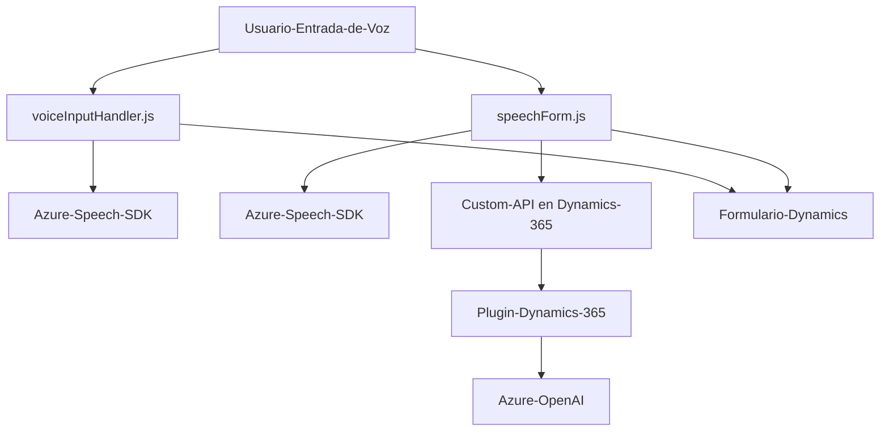

### Breve resumen técnico:
El análisis cubre tres archivos principales de un repositorio que implementa una solución relacionada con reconocimiento y síntesis de voz, manipulación de formularios en Dynamics 365 y procesamiento de texto con Azure AI. La solución combina tecnologías como Azure Speech SDK, Azure OpenAI, y Dynamics CRM para implementar funcionalidades de interacción entre usuario, formulario, y API externa.

---

### Descripción de arquitectura:
La arquitectura general de la solución parece ser un sistema *híbrido* que integra funcionalidades de diferentes componentes:
1. **Frontend (FRONTEND/JS):** JavaScript para la interfaz cliente, ejecutada en el navegador (Funcionalidades de voz, lectura de formularios y manejo dinámico).
2. **Backend Plugin (Plugins/TransformTextWithAzureAI.cs):** Implementado como plugin de Dynamics CRM. Usa *Service Layer* para integrar servicios API externos (Azure OpenAI).
3. **Patrones detectados:**
   - Modular: Dividido en piezas funcionales (por ejemplo, una relacionada con la voz y otra con Dynamics CRM).
   - Event-driven: Reconocimiento y síntesis de voz, procesamiento de transcripciones.
   - Uso de microservicios externos: Azure Speech y Azure OpenAI son servicios externos conectados mediante HTTP.

---

### Tecnologías usadas:
1. **Lenguajes:** 
   - *JavaScript:* Para scripting en el frontend.
   - *C# (.NET):* Para el plugin de Dynamics CRM.
2. **Frameworks y SDKs:**
   - Azure Speech SDK para síntesis y transcripción de voz.
   - Dynamics SDK para plugins y manejo de datos en Dynamics CRM.
   - Azure OpenAI (GPT) para procesamiento avanzado de texto.
3. **APIs:**
   - Dynamics Web API (`Xrm.WebApi.online.execute()`).
   - Azure OpenAI (llamadas HTTP).

---

### Dependencias o componentes externos:
1. **Azure Speech SDK:** Para síntesis y reconocimiento de voz.
2. **Dynamics 365 Web API:** Integración directa para consulta y actualización de formularios.
3. **Azure OpenAI:** Procesamiento de texto con GPT y generación de JSON estructurado usando reglas específicas.
4. **Entidades de Dynamics CRM:** Formulario y campos manejados como recursos internos por la solución.

---

### Diagrama Mermaid:

---

### Conclusión final:
La solución es un sistema habilitado con inteligencia artificial para trabajar con formularios en Dynamics 365 usando Azure Speech SDK y Azure OpenAI. Combina un frontend capaz de interpretar y sintetizar voz con un backend que transforma texto en datos estructurados mediante un plugin en Dynamics CRM. Está diseñado con una arquitectura modular y basada en eventos, e incorpora dependencias externas como el servicio de reconocimiento de voz y procesamiento textual de Azure. La integración de los diferentes componentes demuestra el principio de diseño basado en microservicios y desacoplamiento lógico.