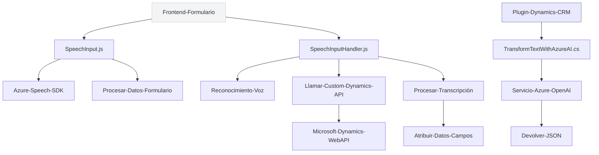

### Breve resumen técnico

El repositorio parece contener módulos altamente especializados para la integración con servicios de Microsoft Azure y Dynamics CRM. Los archivos tienen funcionalidades clave:
1. **Frontend**: Implementación en JavaScript que realiza procesamiento de formularios y síntesis de voz usando Azure Speech SDK.
2. **SpeechInputHandler.js**: Manejo de reconocimiento de voz y transcripción utilizando Azure Speech SDK. Permite integración personalizada con formularios dinámicos.
3. **TransformTextWithAzureAI.cs**: Plugin para Dynamics CRM que aplica Azure OpenAI para convertir texto en JSON estructurado.

### Descripción de arquitectura

La arquitectura del sistema parece combinar un **modelo de capas con integración hacia APIs externas**. Algunas características arquitectónicas destacadas:
1. **Frontend modular basado en funcionalidades**: Los componentes JavaScript explican una estructura lógica separada por responsabilidades (procesamiento de voz, manejo de formularios, integración con APIs).
2. **Plugins orientados a escenarios CRM específicos**: El código en C# implementa la arquitectura de plugins común en Dynamics CRM y extiende la funcionalidad por medio de servicios externos.
3. **Integración externa con microservicios (Azure)**: La solución consume microservicios basados en el Azure Speech SDK y Azure OpenAI Service, ajustándose al concepto de integración con APIs cloud específicas.

### Tecnologías usadas

1. **JavaScript**:
   - Componente esencial del Frontend para integración con formularios.
   - Uso de Azure Speech SDK para síntesis de voz y reconocimiento de voz.
   - APIs dinámicas del navegador (e.g., `document.createElement()`).
2. **C# (.NET)**:
   - Plugins para Microsoft Dynamics CRM.
   - Integración REST con Azure OpenAI Service.
   - Manejo de JSON usando `System.Text.Json` y `Newtonsoft.Json.Linq`.
3. **Dependencias externas**:
   - Microsoft Dynamics CRM APIs.
   - Azure Speech SDK (`https://aka.ms/csspeech/jsbrowserpackageraw`).
   - Azure OpenAI Service API (`2024-04-01-preview`).
4. **Integration patterns**:
   - Dynamic SDK loading (Frontend).
   - RESTful calls for external services.
   - Mapping fields dynamically between data sources (custom logic for CRM/IA).

### Diagrama Mermaid

### Conclusión final

La solución presente en el repositorio parece ser una **arquitectura modular** orientada al consumo de servicios de inteligencia artificial y síntesis de voz de Microsoft Azure. Los componentes frontales en JavaScript interactúan con formularios en Dynamics CRM y servicios externos, mientras que los plugins implementados en C# extienden la funcionalidad del backend de Dynamics CRM mediante la integración con Azure OpenAI Service.

Esta estructura es adecuada para aplicaciones empresariales que necesitan **automatización y procesamiento inteligente de datos**, como entrada de voz y transformación textual. Se observa un diseño limpio, separado por responsabilidades, con un buen manejo de la interacción entre sistemas. Sin embargo, se deben manejar con cuidado las configuraciones sensibles como claves de API y credenciales.