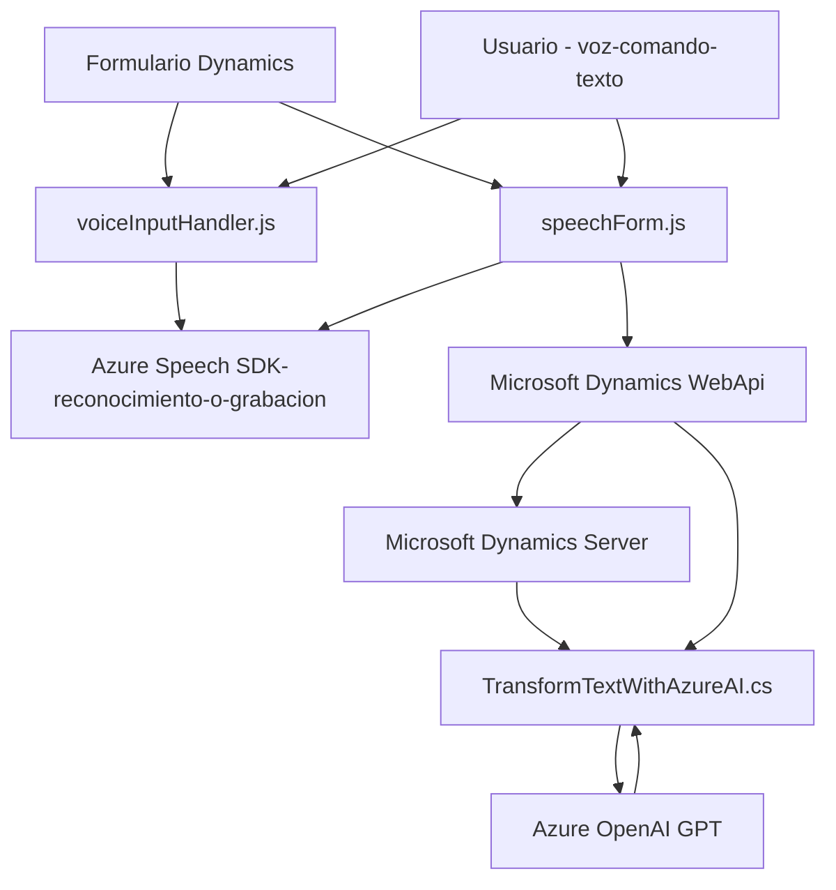

### Breve Resumen Técnico
El repositorio analizado tiene múltiples componentes orientados a un ecosistema integrado de Microsoft Dynamics CRM y Azure AI. Combina funcionalidades frontend en JavaScript con un componente backend implementado en un plugin de Dynamics CRM. Estas operaciones dependen de servicios externos como **Azure Speech SDK** y **Azure OpenAI API**, formando una solución híbrida que extiende capacidades de interacción dinámica entre usuarios y sistemas mediante voz y texto.

---

### Descripción de Arquitectura
La arquitectura general del sistema parece ser **n-capas** en un contexto de integración extensible:
1. **Capa de Presentación:** Se le asigna la responsabilidad de implementar interacciones del usuario mediante formularios de Dynamics y scripts en JavaScript.
   - Ejemplo: Archivos `voiceInputHandler.js` y `speechForm.js`.
2. **Capa de Lógica de Negocios:** El plugin `TransformTextWithAzureAI.cs` ejecuta las reglas de transformación y manipulación de datos utilizando servicios de IA remotos.
3. **Capa de Integración:** Llamadas remotas a servicios como **Azure OpenAI API** y **Azure Speech SDK** para reconocimiento de voz y procesamiento semántico.

Opcionalmente puede integrarse con APIs personalizadas para extender las operaciones hacia otros servicios (indicadas en `callCustomApi`).

---

### Tecnologías Usadas
1. **Frontend (JavaScript):**
   - Azure Speech SDK (Reconocimiento y síntesis de voz).
   - Microsoft Dynamics API (`Xrm.WebApi`) para integración con formularios.
   - Web APIs: General para trabajo sobre DOM y eventos de formularios.
2. **Backend (.NET):**
   - C# con .NET Framework dedicado al desarrollo de plugins para Dynamics CRM.
   - Microsoft.Xrm.Sdk: Para interactuar con objetos del sistema CRM.
   - Newtonsoft.Json.Linq: Para manejar y transformar estructuras JSON.
   - Azure OpenAI (GPT) para análisis y generación de lenguaje natural automatizado.

---

### Diagrama Mermaid válido para GitHub

---

### Conclusión Final
La solución implementada es una plataforma híbrida de interacción basada en voz y texto dirigida a entornos de Dynamics CRM, potenciando la productividad mediante IA para transformación semántica mediante **Azure OpenAI** y herramientas de síntesis de voz. Su arquitectura adopta patrones de **n-capas** donde cada capa cumple una responsabilidad distinta (frontend, lógica de negocio, integración). Además, hace uso de múltiples soluciones de Azure para brindar servicios avanzados con facilidad de integración a través de APIs.