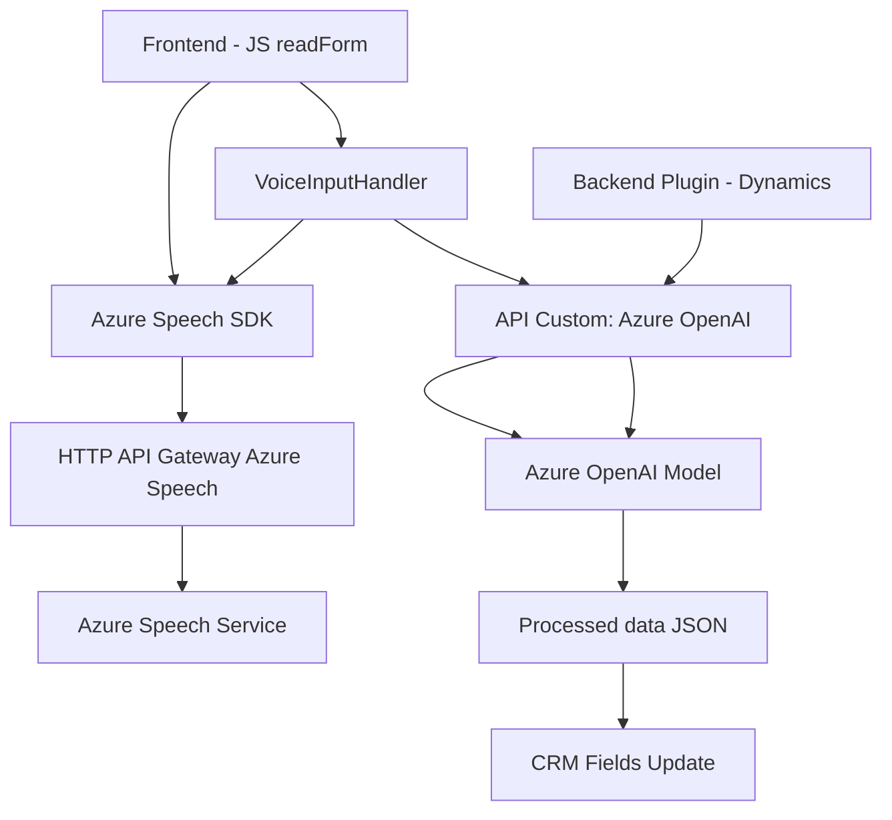

### Breve resumen técnico
El repositorio implementa una solución híbrida que utiliza principalmente **Azure Speech SDK** y **Azure OpenAI** para permitir interacción avanzada con formularios mediante entrada de voz y transformación de texto en aplicaciones web y CRM. Consiste en una estructura orientada a proporcionar funcionalidades que conectan frontend web con servicios externos de IA y plugins internos en Dynamics CRM.

---

### Descripción de arquitectura
La arquitectura sigue el enfoque **cliente-servidor**, con un frontend independiente que consume servicios externos de Azure para voz y procesamiento de datos. En el backend, existe un **plugin de Dynamics CRM** que conecta los datos con el procesamiento de lenguaje mediante una API de Azure OpenAI. Esto posiciona la solución como un sistema de extensibilidad.

1. **Frontend estructura modular**:
   - Mediante JavaScript, el frontend utiliza servicios de **Azure Speech SDK** para entrada y salida de voz, empleando un patrón **wrapper** para manejar el SDK y dividir responsabilidades en funciones específicas.

2. **Backend basado en plugins**:
   - El backend implementa un plugin **Dynamics CRM** orientado a procesar textos mediante **Azure OpenAI**. Este sigue el patrón de **Plugin extensible**, que es estándar en entornos de Dynamics.

3. **Patrones arquitectónicos**:
   - **Facade Pattern** (Frontend): Uso de funciones simplificadas para consumir el SDK.
   - **Plugin extensible** (Backend): Estándar dentro de Dynamics CRM.
   - **API Gateway**: Interacción con servicios externos como Azure Speech y Azure OpenAI representa un uso como puerta de enlace.

4. Tipo de arquitectura:
   Es una arquitectura de **n capas**:
   - **Capa de frontend**: Interactúa con el usuario y procesa lógica de entrada de voz, envío de consultas, y actualización del cliente.
   - **Capa intermedia (servicio API)**: Consumo de servicios de voz e IA en Azure.
   - **Capa backend**: Plugin extensible que comunica el sistema CRM con la capa externa (Azure OpenAI).

---

### Tecnologías usadas

1. **Frontend:**
   - JavaScript puro: Estructura modular con funciones independientes.
   - **Azure Speech SDK**: Para el reconocimiento de voz y síntesis de voz.
   - DOM APIs: Para manejar scripts y elementos del navegador dinámicamente.

2. **Backend:**
   - .NET y **Dynamics SDK**: Plugin desarrollado para integrarse con entidades CRM.
   - **Azure OpenAI API**: Para procesamiento mediante GPT.

3. **Dependencias externas:**
   - Bibliotecas manejadas dentro del plugin (.NET `HttpClient`, JSON Utilities).
   - Servicios: **Azure Speech SDK** y **Azure OpenAI API**.

---

### Diagrama Mermaid

---

### Conclusión final
La estructura del repositorio muestra una solución bien segmentada, diseñada para integrar servicios de IA como **Azure OpenAI** y funcionalidades avanzadas de manejo de voz por medio de **Azure Speech SDK**. Su arquitectura de **n capas** facilita la escalabilidad y mantiene una responsabilidad clara en cada parte del sistema. Se podría optimizar la seguridad del manejo de claves mediante servicios como **Azure KeyVault** para garantizar mayor robustez en entornos productivos.