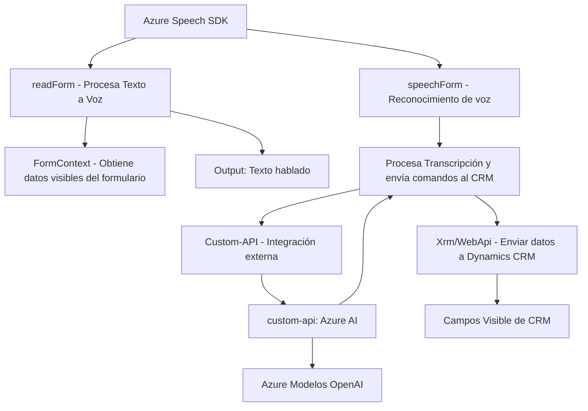

### Breve resumen técnico
El repositorio describe una solución de integración entre Microsoft Dynamics 365 (CRM) y servicios de Azure, utilizando la funcionalidad del Azure Speech SDK para entrada y síntesis de voz, junto con el servicio Azure OpenAI para análisis avanzado y transformación de datos. La solución contiene tres componentes principales: `readForm.js` para la síntesis de voz, `speechForm.js` para el reconocimiento de voz y función de entrada de datos en un CRM, y un plugin en `TransformTextWithAzureAI.cs` que aplica reglas sobre textos usando el servicio Azure OpenAI.

---

### Descripción de arquitectura
La solución utiliza una arquitectura **híbrida basada en servicios** con los siguientes componentes principales:
- **Frontend**: Individualizado en archivos JavaScript, interactúa con un contexto web presente en Dynamics CRM y llama al servicio Azure Speech SDK para el reconocimiento y síntesis de voz.
- **Backend**: Un plugin para Dynamics 365 implementado en .NET que interactúa con Azure OpenAI para proporcionar capacidades avanzadas de transformación de texto estructurado.
Esta arquitectura combina patrones de diseño como **event-driven**, **facade pattern**, y **plugin-based architecture**, con una integración directa hacia servicios externos basados en REST APIs (Azure REST endpoints). La solución tiene un enfoque modular con funciones que encapsulan lógica y funciones específicas para mejorar la mantenibilidad.

---

### Tecnologías usadas
1. **Frontend**:
   - **JavaScript**: Usado para la interacción con el documento DOM (formulario de Dynamics CRM) y para los métodos que integran el SDK de Azure Speech.
   - **Azure Speech SDK**: Cargado desde un endpoint remoto para capacidades avanzadas de lenguaje hablado (síntesis y reconocimiento) en el navegador.
   - **Event Handling**: Uso de eventos y callbacks para garantizar asincronía en la ejecución.

2. **Backend**:
   - **.NET Framework**: Implementación estándar de plugins usando `IPlugin` para Dynamics CRM.
   - **Dynamics 365 SDK**: Para integración directa con los servicios core del CRM.
   - **Azure OpenAI API**: Utilizada a través de peticiones HTTP, para procesamiento del texto basado en AI.
   - **Newtonsoft.Json y System.Text.Json**: Usados para procesamiento y generación de estructuras JSON para el intercambio de datos entre servicios.

3. **Patrones**:
   - **Facade**: El archivo JavaScript principal actúa como fachada para utilizar varios métodos internos.
   - **Event-Driven**: Uso de asincronía y callbacks para manejar la interacción dinámico con usuarios y servicios externos.
   - **Data Mapper**: Mapeo entre campos del formulario CRM y datos extraídos/procesados.
   - **Plugin-based Architecture**: Separación de responsabilidades con un plugin que se ejecuta en el backend del CRM.

---

### Diagrama Mermaid válido para **GitHub Markdown**

---

### Conclusión final
La solución es una integración muy completa que combina servicios frontend y backend con capacidades de IA y reconocimiento de voz. Utiliza tecnologías modernas, como el Azure Speech SDK, el Azure OpenAI API, y las APIs estándar de Dynamics CRM. La arquitectura puede clasificarse como orientada a servicios y sigue varios patrones arquitectónicos fundamentales, como la separación de responsabilidades, la modularidad y la integración con servicios externos mediante REST APIs. Un potencial punto de mejora en esta arquitectura sería explorar el uso de una estrategia para la observabilidad y el loggeo, así como un aumento del manejo de errores para argumentar escenarios excepcionales correctamente.