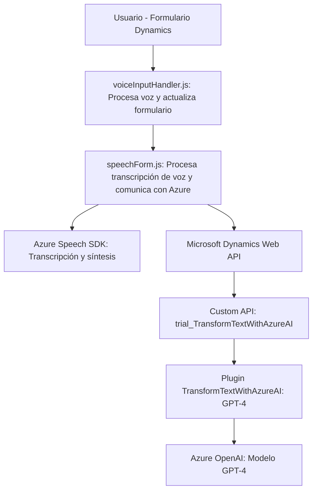

### Breve resumen técnico:

El repositorio parece ser parte de una solución completa integrada con **Microsoft Dynamics 365**. Está dividido en tres áreas principales:
1. **Frontend (JavaScript)**: Scripts para interacción de usuario en formularios de Dynamics.
2. **Backend (Plugins en C#)**: Integración de Dynamics CRM con Azure OpenAI.
3. **Dependencias externas**: Uso del Azure Speech SDK para síntesis y transcripción de voz, y el OpenAI API hospedado en Azure para procesamiento avanzado de texto.

---

### Descripción de la arquitectura:

La arquitectura sigue un modelo **híbrido de integración entre frontend y backend**, centrado en eventos y dependencias externas. La solución combina varios patrones:
1. **N Capas**: La lógica del cliente (JavaScript) interactúa con plugins backend (C#).
2. **Service-Oriented Architecture (SOA)**: Comunicación directa con servicios externos como Azure Speech y OpenAI.
3. **Plugin-Based Architecture**: Extensión de Dynamics CRM mediante un plugin diseñado bajo la interfaz `IPlugin`.
4. **Modularización y Facade Pattern**:
   - En el frontend, funciones como `startVoiceInput` y `ejecutarGrabacion` centralizan la interacción de múltiples componentes.
   - En el backend, el plugin encapsula el procesamiento de texto en una función específica.

---

### Tecnologías usadas:

1. **Frontend**:
   - **JavaScript**: Para la lógica de cliente y manipulación de formularios de Dynamics.
   - **Azure Speech SDK**: Transcripción de voz y síntesis de texto.
   - **Dynamics Web API**: Para la interacción con datos dentro de formularios.

2. **Backend**:
   - **C#**: Implementación de plugins bajo el SDK de Dynamics CRM.
   - **Microsoft Dynamics SDK**: Extensión de funcionalidades del sistema.
   - **Azure OpenAI API**: Uso de modelos GPT-4 para el procesamiento avanzado de texto.

3. **Dependencias externas**:
   - **HttpClient**: Para realizar solicitudes HTTP desde el backend al servicio Azure AI.
   - **Azure Speech Service**: Para transcripción de voz en el frontend.
   - **Azure OpenAI Service**: Para transformar texto en JSON estructurado.

---

### Diagrama Mermaid válido para GitHub:

---

### Conclusión final:

Esta solución representa una arquitectura moderna de servicios integrada con Microsoft Dynamics CRM, utilizando herramientas como **Azure Speech SDK** para procesar voz y **OpenAI API** para transformar texto en información estructurada. Se destaca por el uso de un enfoque basado en plugins en el backend para extender dinámicamente los formularios de Dynamics y la interacción del frontend con servicios como Speech SDK. 

Se encuentra bien modularizado y sigue patrones estándar de desarrollo, lo que permite una fácil mantenibilidad y escalabilidad. Sin embargo, dado el fuerte acoplamiento entre dependencias externas como Azure Speech y OpenAI, es fundamental garantizar una adecuada configuración de credenciales y planificar la tolerancia a fallos en servicios externos.