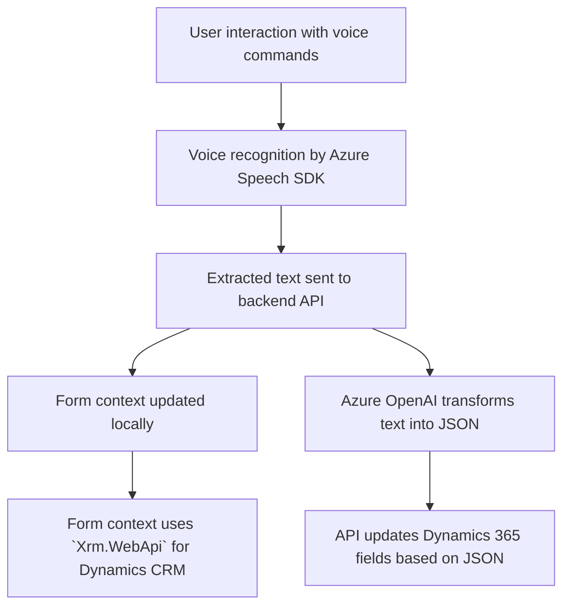

# Breve resumen técnico
El repositorio demuestra una solución híbrida que combina múltiples componentes integrados: un frontend en JavaScript con capacidades de reconocimiento y síntesis de voz (mediante Azure Speech SDK), y una arquitectura CRM basada en Dynamics 365 que incluye extensiones como plugins y APIs que interactúan con servicios de IA en Azure (Azure OpenAI). La solución está diseñada para capturar datos, transformarlos utilizando inteligencia artificial, y actualizar dinámicamente formularios en una plataforma CRM.

---

# Descripción de la arquitectura
1. **Frontend:**
   - Se utiliza JavaScript con una división propuesta de funciones tales como reconocimiento de voz y manipulación de datos capturados. Sigue un enfoque modular, donde cada función realiza una tarea específica y actúa como un SDK wrapper.
   - Parte del procesamiento puede estar externalizado (llamadas a la API personalizada en Dynamics 365 para la transformación mediante IA).

2. **Backend/CRM:**
   - Basado en Microsoft Dynamics 365, se integra con plugins que gestionan la lógica del sistema. Los plugins son responsables de transformar texto de entrada siguiendo reglas de negocio mediante Azure AI y devolver datos estructurados que pueden ser utilizados en formularios dinámicos.

3. **Servicios de terceros:**
   - La solución depende de servicios externos como Azure Speech SDK para síntesis y reconocimiento de voz, y Azure OpenAI para el procesamiento de texto natural usando GPT-4.

La arquitectura general combina **n capas** en el nivel funcional (frontend + backend + API externa), ejecutando una lógica basada en eventos y tareas específicas, y elementos de **arquitectura de microservicios** mediante interacción delegada en Azure.

---

# Tecnologías usadas
1. **Frontend:**
   - **JavaScript**: Desarrollo principal de los archivos de integración del frontend.
   - **Azure Speech SDK**: Para síntesis de voz y reconocimiento desde el usuario.
   - **Dynamics 365 Form API**: Interacciones con el contexto de formularios dinámicos.
   - **REST API**: Para enviar datos capturados a servicios de backend.

2. **Backend:**
   - **C#** (Plugins en Dynamics 365).
   - **Microsoft Dynamics SDK**: Para acceder y manipular datos CRM.
   - **Azure OpenAI**: GPT-4 para el procesamiento basado en IA.

3. **Dependencias externas:**
   - **REST API de Azure OpenAI**.
   - **Xrm.WebApi**: Parte imprescindible para interacciones con Microsoft Dynamics.
   - **System.Net.Http** y **JSON** libraries: Para solicitudes HTTP y análisis de datos.

---

# Diagrama Mermaid

---

# Conclusión final
Este repositorio implementa una solución profesional y avanzada que combina tecnologías de frontend y backend para mejorar la interacción hombre-máquina en formularios CRM. La arquitectura modular y el uso de servicios en la nube (Azure Speech SDK y Azure OpenAI) garantizan escalabilidad, extensibilidad y nuevas oportunidades para integrar funcionalidades adicionales. El diseño híbrido basado en eventos y microservicios lo convierte en una solución flexible y adaptable a otros entornos interactivos y automatizados.