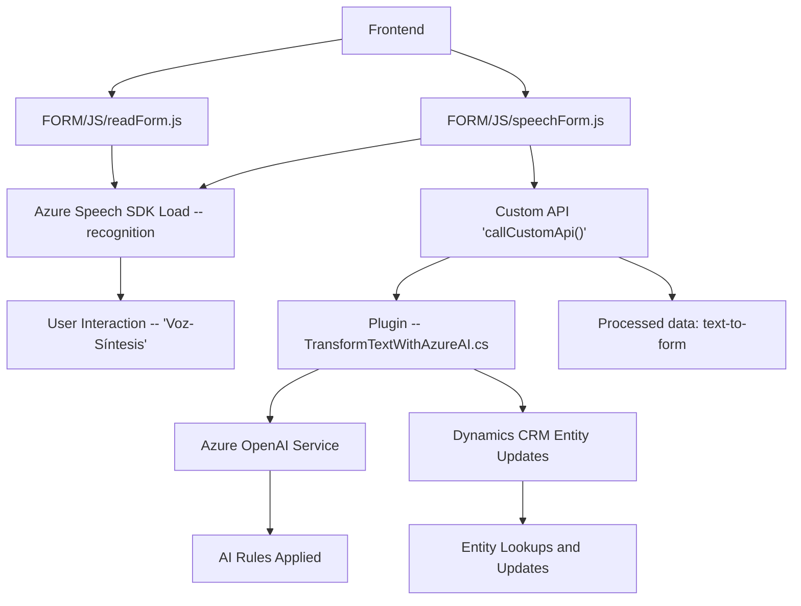

# Análisis del repositorio

## Breve resumen técnico:
El repositorio contiene tres archivos principales que implementan diferentes funcionalidades relacionadas con integración y procesamiento utilizando Azure SDKs, además de una custom API basada en Dynamics CRM que interactúa con el servicio Azure OpenAI. Las soluciones están diseñadas para integrar inteligencia artificial en el frontend y backend, enfocándose principalmente en formularios de Dynamics CRM.

---

### Descripción de arquitectura:
1. **Tipo de solución:** La solución integra una **API personalizada** en el backend y funcionalidades extensibles en formularios personalizados del frontend mediante **SDKs de Azure**. Esto indica que los archivos analizados son parte de un ecosistema híbrido: una combinación de un backend orientado a servicios en Dynamics CRM y un frontend funcional para interacción intensiva.
2. **Arquitectura:** El sistema es de tipo **n capas**, donde:
    - El cliente (frontend) se ejecuta como una capa de acceso a datos mediante JavaScript que interactúa directamente con Dynamics CRM y Azure Speech SDK.
    - El backend (plugin de Dynamics CRM) realiza una integración especializada con Azure OpenAI mediante HTTP requests.

---

### Tecnologías usadas:
- **Frontend:**
  - **JavaScript**: Lógica basada en funciones para interactuar con SDKs y APIs.
  - **Azure Speech SDK**: Carga y uso dinámico para síntesis y reconocimiento de voz en formularios.
  - **Dynamics CRM Application Context APIs**: Manipulación dinámica de formularios mediante `executionContext`.

- **Backend:**
  - **Microsoft Dynamics CRM SDK**: Desarrollo de plugins personalizados que interactúan con campos y datos de entidades del CRM.
  - **Azure OpenAI Service via REST API**: Provee servicios de AI para procesar texto y devolver JSON estructurados.

---

### Dependencias o componentes externos:
1. **Azure Speech SDK:** Interacción vía JavaScript desde CDN (`https://aka.ms/csspeech/jsbrowserpackageraw`) integrado con formularios.
2. **Dynamics CRM SDK:** Involucradas extensiones del SDK como `IPlugin`, `Microsoft.Xrm.Sdk`.
3. **Azure OpenAI API:** Servicio REST utilizado para transformaciones generadas con IA.
4. **Newtonsoft.Json** (posiblemente redundante con `System.Text.Json`): Serialización y deserialización JSON en el plugin.

---

### Diagrama Mermaid válido para GitHub:

---

### Conclusión final:
La solución representada por el repositorio tiene un diseño funcional orientado a servicios, que integra múltiples tecnologías de Microsoft (Azure SDK, Dynamics CRM) en una arquitectura modular tipo n capas. El uso de Azure Speech SDK permite la interacción del usuario mediante comandos de voz, y el plugin de Dynamics utiliza Azure OpenAI para enriquecer esta experiencia con transformación avanzada de texto. Mientras el frontend gestiona la interacción del usuario, el backend maneja datos estructurados y de procesamiento intensivo. Esta solución está especialmente adaptada para enriquecer procesos dinámicos empresariales en aplicaciones CRM.