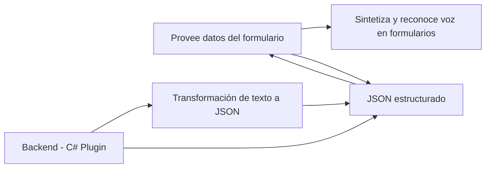

# Análisis técnico del repositorio

### 1. Breve resumen técnico

El repositorio implementa funcionalidades específicas utilizando **Azure Speech SDK** (para operaciones de síntesis y reconocimiento de voz) y **Azure OpenAI** (para estructuración de texto), integrándolo con un sistema Microsoft Dynamics CRM. Está dividido en dos segmentos principales:
- **Frontend**: Integraciones en JavaScript para procesar formularios mediante servicios de voz y transcripción.
- **Plugin Back-End**: Lógica extendida sobre Microsoft Dynamics CRM con acceso a APIs externas.

El objetivo general de la solución es facilitar la interacción entre usuarios y formularios, implementando flujos avanzados de reconocimiento y síntesis de voz, además de procesamiento textual estructurado con inteligencia artificial.

---

### 2. Descripción de la arquitectura

La arquitectura empleada es **n-capas**.
- **Capa de presentación (Frontend/JS):**
  Encapsula lógica para interacción directa con los usuarios y con el servicio Azure Speech SDK (recibe y procesa inputs de voz en el navegador, comunica estos resultados a través de APIs).
  
- **Capa de negocio (Plugins):**
  Implementa lógica personalizada para el procesamiento de texto con reglas de negocios mediante plugins de Microsoft Dynamics CRM. Usa la Azure OpenAI API para realizar transformaciones avanzadas de texto.

- **Capa de servicios externos (Azure / Dynamics CRM):**
  Depende de herramientas externas como:
  - Azure: Speech SDK y OpenAI para reconocimiento de voz, síntesis, y rúbrica de texto.
  - Dynamics CRM: Entorno de datos y lógica empresarial principal.

---

### 3. Tecnologías usadas

#### Tecnologías utilizadas en **Frontend**:
- **Lenguaje:** JavaScript.
- **Framework/Librerías:** 
  - Utilización de **Azure Speech SDK** para síntesis y reconocimiento de voz.
  - Integración con el SDK desde el cliente a través del navegador (dinámicamente cargado desde CDN).
- **Patrones:**
  - Modularización jerárquica: Cada funcionalidad está definida como una función independiente con responsabilidades específicas.
  - Carga condicional de recursos: Uso inteligente de `ensureSpeechSDKLoaded` para descargar el SDK dinámicamente.
  - Interacciones con APIs: Llamadas a APIs externas de Dynamics CRM y Azure AI.

#### Tecnologías utilizadas en **Backend**:
- **Lenguaje y Framework:** C# (.NET)
- **Entorno:** Microsoft Dynamics CRM SDK.
- **Bibliotecas:**
  - **Newtonsoft.Json**: para manejo de serialización y deserialización de objetos JSON.
  - **System.Net.Http**: para realizar solicitudes HTTP contra servicios externos.
- **Servicios de Microsoft Azure:**
  - Azure OpenAI: Transformaciones de texto avanzadas.
  - Dynamics CRM: como plataforma principal de datos y lógica empresarial.
- **Patrones:**
  - Plugin Design Pattern: Implementación en `Execute` y extensiones del CRM.
  - API Connector Pattern: Conexión a servicios API de terceros para el procesamiento avanzado.
  - Observación de contexto y desacoplamiento: Se usa `IPluginExecutionContext` para interactuar directamente con Microsoft Dynamics.

---

### 4. Dependencias o componentes externos

#### **Azure Speech SDK**
- Funcionalidad: Reconocimiento de voz y síntesis de voz.
- Uso: En aplicaciones cliente (JavaScript) para interactuar con formularios en Dynamics CRM.

#### **Azure OpenAI API**
- Funcionalidad: Procesa texto usando modelos avanzados de IA, como GPT-4.
- Uso: Backend transforma criterios y estructuras el texto en JSON para integrar con la lógica CRM.

#### **Microsoft Dynamics CRM/Dataverse**
- Funcionalidad: Plataforma de datos empresariales y de lógica asociada.
- Uso: Manejo de plugins personalizados, integración con API y mapeo de datos en formularios.

#### **Librerías .NET**
- Newtonsoft.Json, System.Net.Http: Para integrar funcionalidades del backend con los datos y servicios.

---

### 5. Diagrama Mermaid válido para GitHub Markdown

---

### Conclusión final

La solución utiliza una arquitectura **n-capas** para integraciones avanzadas con servicios externos (Azure Speech SDK y Azure OpenAI). En el frontend (JavaScript), habilita la interacción de usuarios mediante operaciones de síntesis y reconocimiento de voz para completar automáticamente formularios conectados a Dynamics CRM. En el backend (C#), aplica procesamiento avanzado de texto utilizando inteligencia artificial y transforma información en formato JSON para su aplicación en el negocio.

#### Aspectos destacados:
1. **Modularidad:** Buen diseño con funciones independientes que definen claramente su responsabilidad.
2. **Integración:** Uso de SDK y APIs externas para dar soporte a funcionalidades modernas y eficientes.
3. **Uso de tecnología:** Aprovecha herramientas cloud y SDKs de Microsoft en ambos extremos.

#### Recomendaciones:
- Implementar un sistema de manejo seguro para claves API y datos sensibles.
- Mejorar extensibilidad del código backend para reducir el acoplamiento.
- Auditar los flujos de datos hacia Azure OpenAI para asegurar cumplimiento normativo.