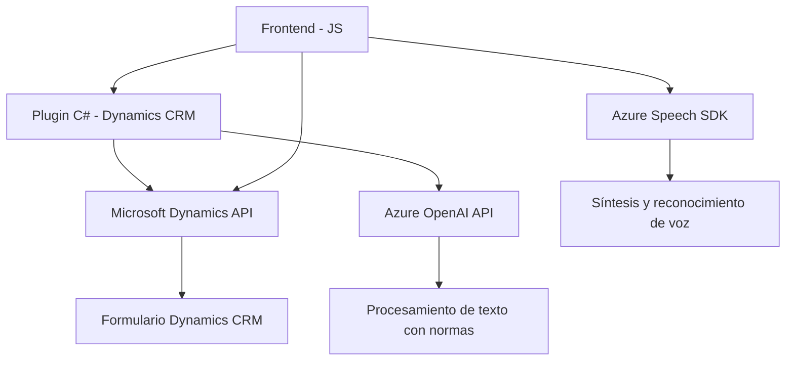

### Breve resumen técnico

El repositorio contiene archivos que implementan una solución basada en la interacción entre un *frontend JavaScript*, funcionalidades de habla y texto con **Azure Speech SDK**, y un plugin C# dirigido a Microsoft Dynamics CRM que integra inteligencia artificial usando **Azure OpenAI API**.

---

### Descripción de arquitectura

La solución parece corresponder a la arquitectura de un sistema dividido en capas con integración entre módulos. Utiliza:
1. **Frontend**: Componentes JavaScript que interactúan directamente con Azure Speech SDK para la síntesis y reconocimiento de voz, y con APIs de Dynamics.
2. **Backend**: Plugins en C# que implementan extensiones para Dynamics CRM, como procesamiento basado en reglas mediante el servicio Azure OpenAI.
3. **Dependencias externas**: Conexión a servicios en la nube para reconocimiento de voz y procesamiento inteligente de texto.

La arquitectura podría clasificarse como **"n capas"** (división lógica según frontend, servicios/backend y dependencias externas). Los plugins de Dynamics actúan como extensión de una plataforma monolítica.

---

### Tecnologías usadas

1. **Frontend**:
   - **JavaScript ES6**: Estructura modular con funciones encapsuladas.
   - **Azure Speech SDK**: Utilizado para síntesis de voz y reconocimiento de voz.
   - **Microsoft Dynamics API (Xrm.WebApi)**: Para actualizar formularios y realizar acciones en Dynamics 365 CRM.

2. **Backend**:
   - **C# (.NET)**: Para implementar plugins de Dynamics CRM.
   - **Microsoft Dynamics SDK**: Extiende funcionalidad cuando se ejecuta dentro del contexto CRM.
   - **Azure OpenAI API**: Consume el servicio de IA para transformar texto según normas definidas.
   - **Newtonsoft.Json**: Para manejo detallado de objetos JSON.

3. **Dependencias externas**:
   - **Azure Speech SDK**: Servicio de voz para reproducción y grabación.
   - **Azure OpenAI API**: Manejo de texto e IA.
   - **Dynamics 365 API**: Actualización de datos en formularios CRM.

---

### Diagrama **Mermaid** válido para GitHub

---

### Conclusión final

La solución presentada integra un sistema empresarial que combina interacción de voz y procesamiento de datos con componentes frontend (JS) y backend en forma de plugins C#. La implementación utiliza servicios en la nube de Microsoft Azure como **Speech SDK** y **OpenAI API** para agilizar y mejorar la interacción del usuario en un sistema CRM basado en **Microsoft Dynamics**.

La arquitectura tiene una ligera separación de módulos (diferenciación entre frontend y backend), pero está fuertemente acoplada a la plataforma Microsoft Dynamics, lo que limita su flexibilidad para portarse hacia sistemas distintos. Esto reforza una arquitectura **orientada a n capas**.