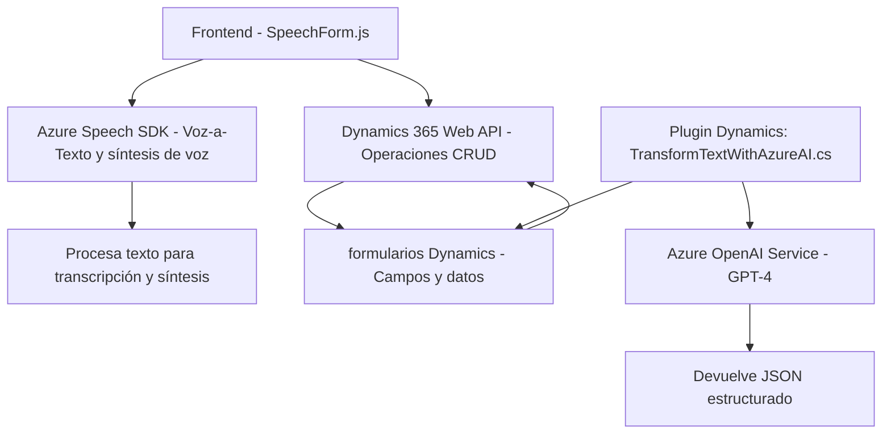

### Breve Resumen Técnico

El repositorio tiene componentes con funcionalidades distribuidas en tres principales archivos:
1. **Frontend**: Implementación de funciones JavaScript que interactúan con formularios en Dynamics 365 utilizando el reconocimiento de voz y síntesis de texto de Azure Speech SDK.
2. **Backend Plugin**: Un plugin para Dynamics CRM que transforma texto utilizando Azure OpenAI (GPT-4) y devuelve información estructurada en JSON.
3. **Dependencias externas**: Funcionalidades de Azure (Speech SDK y OpenAI), integración con Dynamics 365 Web API y procesamiento de datos con HTTP.

---

### Descripción de Arquitectura

La solución implementada puede clasificarse como **aplicación avanzada cliente-servidor**. Sigue principios de integración entre frontend y backend mediante APIs externas. Su diseño modular permite separación de responsabilidades:
1. **Frontend (JavaScript)**: Procesamiento y manipulación de datos en contextos de formularios (consulta & actualización de campos).
2. **Backend (Dynamics CRM Plugin)**: Procesamiento avanzado de texto bajo modelos GPT de Azure OpenAI y devolución de resultados estructurados.

La arquitectura se asemeja al patrón de **n capas**, dado que cada componente tiene una clara separación:
- **Capa de presentación**: Captura datos del usuario en Dynamics mediante reconocimiento de voz.
- **Capa lógica de negocio**: Procesa datos con Azure services (Speech SDK, OpenAI).
- **Capa de integración**: Dependencias con APIs de Dynamics 365 (Custom API) y servicios externos.

Se observa incorporación de patrones como **fachada de servicios**, **plugin architecture** en CRM, y **cargador dinámico** en el frontend.

---

### Tecnologías Usadas

1. **Frontend**:
   - Lenguaje: JavaScript.
   - Framework: Dinámico sobre Dynamics 365 y manipulación de su `Web API`.
   - SDK externo: Azure Speech SDK (para reconocimiento de voz y síntesis de texto).
   - Patrones: 
     - **Encapsulación modular**: Funciones dedicadas.
     - **Cargador dinámico**: `ensureSpeechSDKLoaded`.
     - **Fachada de servicios**: Azure Speech SDK.

2. **Backend**:
   - Lenguaje: C#.
   - Framework: Dynamics CRM Plugin Architecture.
   - Servicio externo: Azure OpenAI para procesar texto con GPT-4.
   - APIs y librerías: 
     - `Microsoft.Xrm.Sdk` para contexto de plugins.
     - Web API para comunicación con Dynamics (en el lado frontend).
     - `System.Net.Http` y `Newtonsoft.Json` para solicitudes y procesamiento JSON.

---

### Diagrama Mermaid válido para GitHub

---

### Conclusión Final

La solución está diseñada principalmente como una integración entre Dynamics CRM y servicios avanzados de Azure que habilitan tecnologías como inteligencia artificial y reconocimiento/síntesis de voz. 

#### Ventajas:
1. **Escalabilidad**: El uso de SDKs dinámicos y APIs externas permite añadir funcionalidades adicionales con facilidad.
2. **Separación de responsabilidades**: Las funciones están segmentadas correctamente entre frontend y backend mediante capas.
3. **Integraciones avanzadas**: Dynamics Web API y Azure OpenAI permiten el manejo de datos y procesamiento intensivo fuera del sistema CRM.

#### Posibles mejoras:
1. **Seguridad**: Centralización y ocultación de configuraciones como claves API o endpoints para evitar exposición.
2. **Optimización**: Minimizar llamadas de red redundantes mediante estrategias de caching para Azure Speech SDK y consultas en Dynamics.

En general, el conjunto refleja una solución con buen uso de patrones de diseño y tecnologías modernas.