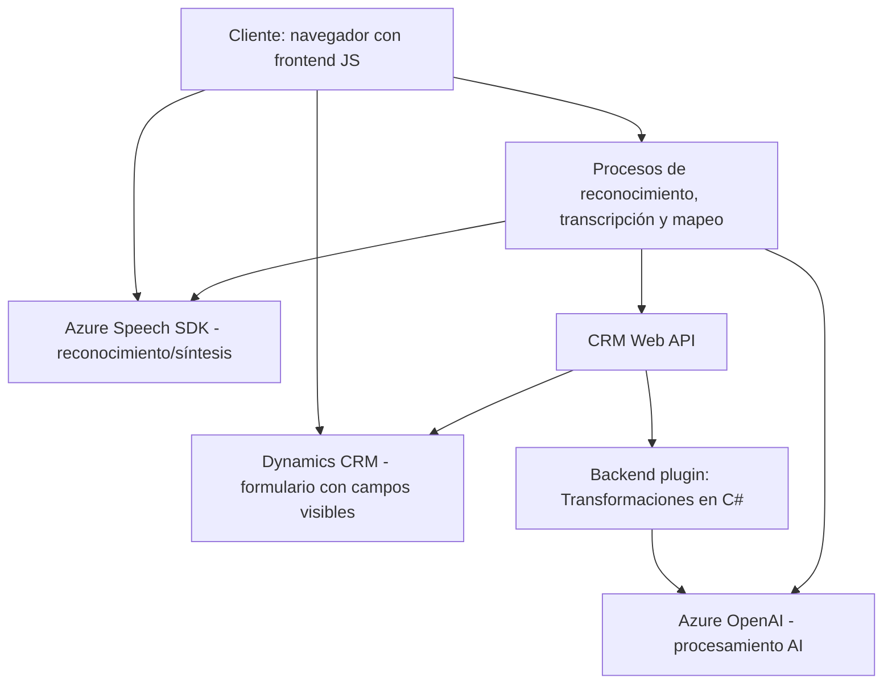

### Breve Resumen Técnico
El repositorio describe una solución que integra **Azure Speech SDK** y **Azure OpenAI** para manipular formularios en un sistema CRM (Microsoft Dynamics CRM). Se enfoca en dos funcionalidades principales: 1) reconocimiento y síntesis de voz para interactuar con formularios y 2) procesamiento de datos con inteligencia artificial mediante servicios externos como OpenAI en un plugin CRM. Está compuesto por componentes de frontend en JavaScript y un backend en C# para ejecutar plugins en Dynamics CRM.

---

### Descripción de Arquitectura
La arquitectura sigue un enfoque **modular con integración de servicios externos**. En particular:
1. **Frontend (JavaScript)**: Implementa funcionalidades de síntesis y reconocimiento de voz, interactuando dinámicamente con un formulario CRM. Aquí se utiliza una arquitectura basada en **funciones modulares y procedural** para una específica interacción con Azure Speech SDK y APIs de CRM.
2. **Backend (C#)**: Define un plugin CRM que se integra con Microsoft Dynamics CRM usando el patrón **Plugin Architecture** para ejecutar lógica de negocio basada en eventos del CRM. Este utiliza una **solicitud-rest** al Azure OpenAI para manejar procesamiento AI complejo.

La arquitectura general podría clasificarse como **n capas**, donde el frontend realiza el manejo de usuario y la capa de negocio (backend) interactúa con servicios externos (OpenAI y CRM).

---

### Tecnologías y Frameworks usados
1. **Frontend**:
   - **JavaScript** como lenguaje base.
   - **Azure Speech SDK** para tareas de síntesis y reconocimiento de voz.
   - **Microsoft Dynamics CRM Web API** para manipulación de datos del formulario.
2. **Backend**:
   - **C#** como lenguaje base.
   - **Microsoft Dynamics CRM SDK** con la interfaz IPlugin para plugins del CRM.
   - **Azure OpenAI API**: Procesamiento de lenguaje natural mediante GPT.
   - **System.Net.Http**, **System.Text.Json**, **Newtonsoft.Json.Linq** para interacción y manipulación de datos JSON.
3. **Patrones comunes**:
   - **Modularidad** en la organización de funciones.
   - **Facade Pattern** (en el frontend) para agrupar interacciones con APIs externas.
   - **Plugin Pattern** (en el backend) para extender la lógica del CRM.
   - **Dependency Injection** mediante `IOrganizationServiceFactory` en el backend.

---

### Dependencias o Componentes Externos
1. **Azure Speech SDK**: Dinámicamente importado desde Microsoft CDN para las tareas de reconocimiento y síntesis de voz en JavaScript.
2. **Azure OpenAI API**: Utilizado para la transformación de texto con reglas específicas.
3. **Dynamics CRM Web API**: Para interactuar con formularios y los datos almacenados en el CRM.
4. **External Libraries**: Uso de librerías como `Newtonsoft.Json` para JSON con el plugin de Dynamics CRM.
5. **Navegador en frontend**: Dependencia de ejecución dinámica del Speech SDK que está limitada al entorno del navegador con soporte.

---

### Diagrama Mermaid

---

### Conclusión Final
Esta solución puede clasificarse como una **n capas** porque divide responsabilidades en presentación (frontend), lógica de negocio (backend), y servicios externos (Azure SDK y APIs de CRM). Se basa en una arquitectura modular con una fuerte dependencia en tecnologías Azure y Dynamics CRM.

**Ventajas**:
- Modularidad: Cada archivo cumple una tarea específica, facilitando su mantenimiento.
- Escalabilidad: Al delegar el procesamiento en servicios externos como Azure Speech SDK y OpenAI, el sistema puede escalar de manera eficiente.
- Integración en un entorno robusto (Dynamics CRM): Aprovecha los puntos de extensión (plugins) y APIs, ofreciendo flexibilidad.

**Desafíos**:
- Dependencia significativa de servicios de terceros (Azure y Microsoft Dynamics), lo que puede aumentar costos.
- Riesgos de seguridad (como credenciales sensibles codificadas directamente).
- Complejidad en la integración y manejo combinado de múltiples APIs externas, especialmente en aplicaciones empresariales de alta carga.

Esta solución es ideal para organizaciones que desean desplegar interfaces de usuario potentes basadas en voz y procesamiento AI en plataformas CRM robustas, pero debe considerarse el uso de prácticas seguras para credenciales y optimizar manejos asíncronos a nivel de backend y frontend.