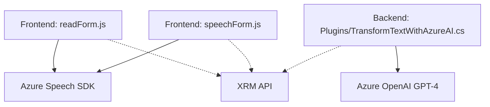

**Breve resumen técnico:**  
El repositorio combina un frontend y un backend para una solución que interactúa con Microsoft Dynamics CRM, Azure Cognitive Services (Speech SDK), y Azure OpenAI GPT. Los archivos en `FRONTEND/JS` implementan acceso y reconocimiento de voz, síntesis de texto a voz, y manipulación de formularios con soporte extendido para accesibilidad y automatización. El backend en `Plugins` extiende la funcionalidad CRM usando plugins que interactúan con Azure OpenAI GPT-4 para transformación de texto.

---

### **Descripción de arquitectura**  
La solución utiliza una arquitectura **híbrida n-capas**. El frontend (JavaScript-powered) se orienta al cliente (MVC), mientras que el backend es un plugin basado en el framework de Microsoft Dynamics CRM con integración a servicios externos como Azure OpenAI. Aunque no es estrictamente una arquitectura hexagonal o de microservicios, incorpora patrones modernos como integración de API externa y abstracción de servicios. 

La comunicación entre capas consiste en:
1. **Presentación**: El frontend gestiona interfaces (formularios) y envía datos de entrada o accesibilidad mediante voz.
2. **Negocio**: El backend centraliza la lógica de manipulación avanzada (transformación de datos mediante IA).
3. **Datos**: El CRM actúa como repositorio y contexto principal, integrando también servicios externos mediante plugins.

---

### **Tecnologías usadas**  
1. **Frontend**: 
   - **JavaScript modulares** (desacoplados y centrados en funciones específicas).
   - Microsoft Dynamics XRM API para manipulación de formularios.
   - **Azure Cognitive Services Speech SDK** para síntesis y reconocimiento de voz.
   
2. **Backend**:
   - C# y .NET Framework como lenguaje base para plugins.
   - **Azure OpenAI GPT-4**: Comunicación con servicios IA vía HTTP API.

3. **Patrones comunes**:
   - Modularización lógica por archivo.
   - Abstracción de servicios ("Service abstraction").
   - Uso de APIs externas mediante patrones integradores.
   - Event-driven y carga dinámica de dependencias.

---

### **Dependencias o componentes externos**  
1. **Azure Speech SDK**:
   - Speech-to-Text.
   - Text-to-Speech (accesibilidad).
   
2. **Azure OpenAI GPT-4**:
   - Transformación avanzada de texto.
   
3. **XRM API**:
   - Servicios de manipulación y recuperación de datos en Microsoft Dynamics CRM.  
   
4. **Librerías backend**:
   - Newtonsoft.Json (manejo de JSON).
   - System.Net.Http.
   - System.Text.Json.

5. **Servicios adicionales**:
   - Estructura de carga dinámica de JavaScript para asegurar la disponibilidad de módulos externos.

---

### Diagrama Mermaid  

Representation of component mapping and interaction flow among scripts, plugins, and external services.

---

### **Conclusión final**  
Este repositorio contiene una solución centrada en accesibilidad mediante la integración de voz, manipulación dinámica de formularios, y transformación de texto con IA. La arquitectura implementada mezcla patrones orientados a eventos, servicios y módulos, manteniendo una separación responsable entre frontend (presentación) y backend (área de negocio). Es una excelente base para un sistema CRM modernizado con soporte para accesibilidad e inteligencia artificial. Las principales áreas de mejora incluyen:
1. **Gestión de credenciales**: La API key de Azure debe ser almacenada en un sistema seguro (como Key Vault).
2. **Documentación detallada**: Aunque los archivos son explicativos, puede ampliarse documentación estructurada sobre cada capa.