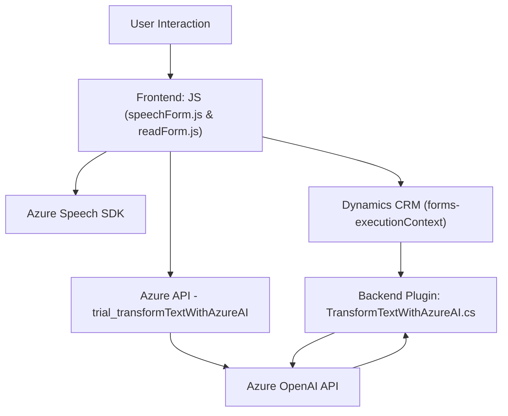

### Breve resumen técnico
El repositorio corresponde a una solución que integra **Azure Speech SDK** y **Azure OpenAI API** para interactuar principalmente con formularios en un entorno de **Dynamics 365 CRM**. Incluye funcionalidades como síntesis de voz, reconocimiento de comandos de voz, llamadas a APIs personalizadas y procesamiento de texto a través de inteligencia artificial.

---

### Descripción de arquitectura
- **Tipo de solución:**  
  La solución parece ser un **API + frontend** integrado con un **plugin** en Dynamics CRM. El frontend maneja la interacción con formularios y el reconocimiento de voz, mientras el plugin en el backend procesa datos usando Azure OpenAI.

- **Tipo de arquitectura:**  
  La solución utiliza múltiples capas:
    - **Frontend:** JavaScript/TypeScript responsables de la interacción con los formularios y el SDK de Azure.
    - **Backend:** Un plugin en C# para Dynamics CRM que conecta Azure OpenAI.
    Este diseño refleja una arquitectura **n-capas**, conectando un frontend modular con un backend que actúa como interfaz de negocio.

- **Patrones principales:**
  - **Modularización:** Cada función tiene labores bien definidas (reconocimiento de voz, API call, síntesis de texto).
  - **Integración REST:** Uso de APIs externas mediante HTTP (Azure OpenAI y Speech SDK).
  - **Lazy-loading:** SDKs cargados dinámicamente según necesidad.
  - **Domain logic separation:** En el código backend, la lógica de la API externa está separada en un método auxiliar (`GetOpenAIResponse`).

---

### Tecnologías usadas
1. **Frontend:**  
   - **Framework:** JavaScript.
   - **Servicios externos:** 
     - Azure Speech SDK.
     - Dynamics 365 CRM (`executionContext`, `formContext`).
     - API personalizada (**trial_transformTextWithAzureAI**).

2. **Backend:**  
   - **Lenguaje:** C#.
   - **Servicios externos:** Azure OpenAI API.
   - **Framework:** Dynamics CRM SDK (con `IPlugin`).

---

### Dependencias o componentes externos
1. **Azure Speech SDK (JavaScript):** Procesamiento de voz (reconocimiento y síntesis).
2. **Azure OpenAI API:** Transformación de texto mediante inteligencia artificial.
3. **Xrm.WebApi:** Manipulación de formularios y datos en Dynamics 365 CRM.
4. **Newtonsoft.Json:** Manejo de datos JSON (plugin en C#).
5. **System.Net.Http:** Para realizar peticiones RESTful en C#.
6. Formularios en **Dynamics 365 CRM.**

---

### Diagrama Mermaid

---

### Conclusión final
- La solución es una **aplicación híbrida API + frontend** que implementa reconocimiento y síntesis de voz con **Azure Speech SDK**, y transformación de datos de texto con **Azure OpenAI API**.
- La interacción del usuario se realiza mediante formularios en Dynamics CRM, y la arquitectura está basada en **n-capas** por la separación entre frontend, API y lógica backend.
- Las principales tecnologías usadas son JavaScript para la parte de interacción con formularios y Azure Speech SDK, junto con C# y APIs externas para la lógica en un backend complementado con Azure OpenAI.
- El proyecto refleja buenas prácticas como modularización, desacoplamiento y manejo dinámico de dependencias. Aunque es funcional y extensible, podría evolucionar hacia una arquitectura más distribuida usando microservicios para cada función clave.