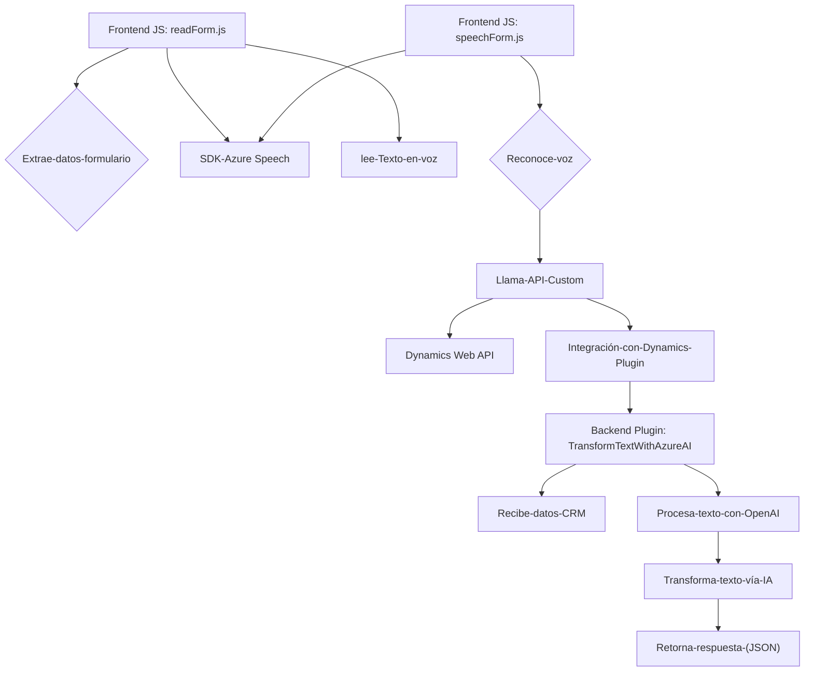

### Breve resumen técnico:
Este repositorio presenta una solución integrada que combina un **frontend de interacción conversacional** y un **backend de procesamiento inteligente**, aprovechando tecnologías de Microsoft como **Azure Speech SDK**, **Azure OpenAI** y **Dynamics CRM**. Los archivos están enfocados en convertir datos textuales en voz y viceversa, generando flujos dinámicos para formularios y tareas impulsadas por IA.  

### Descripción de arquitectura:
La solución utiliza una **arquitectura híbrida:**
- **Frontend**: Implementa un sistema modular y eventos basados en reconocimiento y síntesis de voz, integrando con SDKs externos de Azure.
- **Backend**: Define un plugin para Dynamics CRM siguiendo un patrón de arquitectura basada en eventos (plugin-based). Este plugin consume servicios externos (Azure OpenAI).
- **Capas de servicio**:
  - **Capa de presentación**: Interfaz web interactiva para formularios con integración del Azure Speech SDK.
  - **Capa lógica de negocio**: Procesos de interacción con IA y APIs personalizadas.
  - **Capa de datos**: Dynamics CRM es el repositorio de datos, junto con procesamiento adicional vía APIs externas.

### Tecnologías usadas:
- **Frontend**:
  - **JavaScript**: Lenguaje principal del lado cliente.
  - **Azure Speech SDK**: Reconocimiento y síntesis de voz.
  - **Dynamics Web API (`Xrm.WebApi`)**: Operaciones de CRM.
  - **Callbacks y eventos**: Para procesar transcripciones y manejo de flujos.
- **Backend (plugin)**:
  - **C# y .NET Framework**: Implementación del plugin para Dynamics CRM.
  - **Azure OpenAI**: Para procesar texto usando IA.
  - **Microsoft.Xrm.Sdk**: Librería para integrar el plugin en Dynamics CRM.
  - **HTTP Client**: Comunicación con servicio OpenAI.

### Dependencias o componentes externos:
1. **Azure Speech SDK**: Para síntesis y reconocimiento de voz desde el frontend.
2. **Azure OpenAI Service**: Para procesar solicitudes de transformación de texto.
3. **Dynamics CRM WebAPI**: Para manipular datos y entidades en Dynamics CRM.
4. **HTTP Client**: En el plugin de backend para consumir la API OpenAI.
5. **Newtonsoft.Json** y **System.Text.Json**: Manejo de objetos JSON (aunque el primero no se utiliza directamente).

### Diagrama **Mermaid** válido para GitHub:

### Conclusión final:
Este repositorio configura una solución orientada a mejorar la interacción humano-sistema mediante la integración de tecnologías conversacionales y de inteligencia artificial. La **arquitectura modular** permite la fácil extensión y mantenimiento, y su naturaleza híbrida combina un frontend interactivo con un backend basado en plugins que opera con datos y APIs externas. Sin embargo, hay áreas que podrían ser optimizadas: como la gestión de claves de API en el backend y el manejo más robusto de posibles errores en la interacción entre servicios.