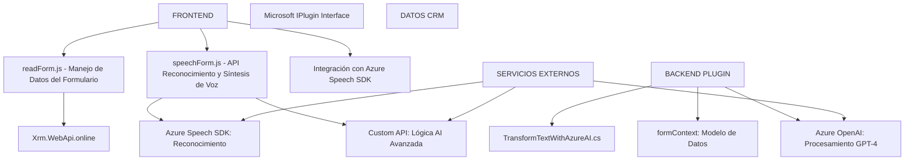

### Breve resumen técnico

El repositorio define una solución que integra funcionalidades de reconocimiento de voz, conversión de texto a voz, y manipulación de datos en tiempo real dentro de Microsoft Dynamics CRM. Además, incorpora configuraciones avanzadas de inteligencia artificial mediante Azure Speech SDK y Azure OpenAI para enriquecer la experiencia del usuario y automatizar tareas como la entrada y salida de datos en formularios.

---

### Descripción de arquitectura

La solución es híbrida, compuesta por las siguientes capas:

1. **Frontend**: Scripts en JavaScript que ejecutan la lógica de negocio en la interfaz del CRM.
2. **Backend (Plugins)**: Extendiendo Microsoft Dynamics CRM mediante el diseño estándar de Plugins.
3. **Integración de servicios externos**: Comunicación con Azure Speech SDK y Azure OpenAI.
4. **Datos**: Manejo de atributos CRM usando `formContext` y mapeo entre etiquetas visuales y atributos.

La arquitectura general sigue un modelo **n-capas** pero también incluye elementos propios de **Service-Oriented Architecture** al consumir múltiples servicios externos como Speech SDK y OpenAI, lo que la hace una solución distribuida pero aún acoplada al CRM.

---

### Tecnologías usadas

1. **Frontend**:
   - **JavaScript**: Base de interacción e integración API.
   - **Azure Speech SDK**: Reconocimiento de voz y síntesis de texto a voz.
   - **Microsoft Dynamics SDK** (Xrm API): Acceso al modelo cliente en Dynamics.

2. **Backend**:
   - **C# (.NET Framework)**: Lenguaje principal para la lógica del plugin.
   - **Azure OpenAI**: Procesamiento avanzado de texto mediante GPT-4.
   - **JSON Libraries**: `System.Text.Json` y `Newtonsoft.Json`.

3. **Patrones de diseño**:
   - **MVC**: Manipulación de datos relacionados con el modelo y el formulario (vista).
   - **Adapter Pattern**: Adaptación de datos entre Dynamics CRM y Azure OpenAI.
   - **Event-Driven Programming**: Uso de callbacks y eventos para manejo de SDK.

---

### Posibles dependencias o componentes externos

1. **Azure Speech SDK**: Proporcionado como un script externo.
2. **Azure OpenAI**: Usado para procesamiento mediante una API HTTP personalizada.
3. **Microsoft Dynamics SDK** (Xrm): Provee acceso al modelo del formulario.
4. **Librerías JSON** (Newtonsoft y System.Text.Json): Procesamiento de datos JSON.
5. **Web APIs Externas**:
   - API personalizada para lógica AI basada en comandos predefinidos.
   - Azure Speech Services para reconocimiento/síntesis de voz.
   
---

### Diagrama Mermaid

---

### Conclusión final

La solución combina herramientas modernas para atender funcionalidades críticas dentro de un entorno de CRM. El diseño mantiene modularidad mediante funciones y plugins separados, lo que facilita mantenimiento y escalabilidad. Sin embargo, al depender de servicios externos como Azure Speech SDK y Azure OpenAI, garantizar tiempos de respuesta óptimos en escenarios de producción será clave para el desempeño.