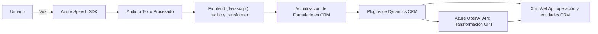

### Análisis Técnico Consolidado

#### **1. Qué tipo de solución es**
La solución abarca varios componentes y tecnologías, y se clasifica como una **aplicación híbrida de interacción** que conecta datos de formularios en la plataforma Microsoft Dynamics CRM con servicios de inteligencia artificial y reconocimiento de voz de Microsoft Azure. Más específicamente:
- Incluye un **frontend** para acceder, transformar, y sintetizar datos mediante Javascript.  
- Un **backend** basado en plugins de Dynamics CRM que interactúan con servicios de terceros (Azure OpenAI).  
- **SDKs y APIs externas**: Se integra fuertemente con Microsoft Azure Speech SDK y Azure OpenAI APIs.

#### **2. Tecnologías, frameworks y patrones usados**
- **Frontend (Javascript)**:
  - Uso de módulos de Javascript para estructurar funciones relacionadas con recopilación, síntesis y procesamiento de datos de formularios.
  - SDK usado: **Microsoft Azure Speech SDK** para síntesis y reconocimiento de voz.
  - **Promesas y callbacks** para la carga del SDK y manejo de comunicación asíncrona.
  - Estructuras basadas en funciones modulares siguiendo el patrón **Single Responsibility Principle (SRP)**.

- **Backend (C#)**:
  - **Microsoft Dynamics CRM SDK**:
    - Clase `TransformTextWithAzureAI` que implementa la interfaz `IPlugin`.
    - Manejo de datos con JSON mediante `Newtonsoft.Json` y `System.Text.Json`.
    - Comunicación externa con servicios REST usando `HttpClient`.
  - SDK utilizado: **Azure OpenAI API** para transformar texto con modelos GPT.

- **Patrones de diseño y arquitectura**:
  - **Modularidad**: tanto en el frontend como en el backend.
  - **Integración con SDKs/API externas**: En el caso de Azure Speech SDK y Dynamics CRM, los servicios de inteligencia artificial están desacoplados en módulos específicos para facilitar el mantenimiento.
  - **Plugin Pattern** en backend para extender la funcionalidad de Dynamics CRM bajo su ecosistema específico.
  - **Promesas y Async/Await Pattern**: Implementación de lógica asíncrona en comunicación HTTP.

#### **3. Tipo de arquitectura**
La arquitectura global de la solución tiene características similares a una **arquitectura en capas** con integración de servicios externos. Aunque no es una arquitectura completamente distribuida (como microservicios), sí contiene elementos que permiten desacoplar módulos. Las características destacadas son:
- **Frontend**:
  - Modular y centrado en la interacción de los usuarios, conectado con el backend mediante APIs y SDKs.
- **Backend**:
  - Desarrollado como **plugins** de Dynamics CRM (Patrón Plugin), orientado al procesamiento del texto con servicios de terceros.
  - Comunicación con servicios externos mediante **API Gateway** al utilizar OpenAI y Azure Speech SDK.

En términos generales, podemos considerarlo como una arquitectura híbrida formada por:
- **Backend acoplado**: Los plugins dependen de Dynamics CRM.
- **Frontend modular**: Separación de responsabilidades en archivos, con fuerte soporte de servicios de terceros.

#### **4. Dependencias o componentes externos que podrían estar presentes**
1. **Azure Speech SDK**: Reconocimiento y síntesis de voz.
2. **Azure OpenAI API**: Interacción con modelos GPT para transformar y procesar texto.
3. **CRM Dynamics SDK (Xrm.WebApi, Microsoft.Xrm.Sdk)**:
   - Manejo de eventos del sistema (proceso de formularios, datos, y actualizaciones de entidades).
   - Plugins integrados para transformar texto y trabajar con datos en Dynamics CRM.
4. **Newtonsoft.Json y System.Text.Json**: Para manejo de JSON en la serialización y procesamiento.
5. **System.Net.Http**: Para solicitudes HTTP hacia servicios como OpenAI.

#### **5. Diagrama Mermaid**

---

### Conclusión Final

Esta solución integra funcionalidades avanzadas de **síntesis y reconocimiento de voz**, junto con la capacidad de procesar lenguaje natural usando **GPT**. El objetivo principal es mejorar la experiencia del usuario mediante controles de voz y automatización de tareas en Microsoft Dynamics CRM. 

La arquitectura, aunque no del todo distribuida, combina componentes frontend y backend con un uso eficiente de SDKs y APIs externas, siguiendo patrones como la modularización, SRP, y el plugin pattern de Dynamics CRM. Si bien la implementación es adecuada y sigue buenas prácticas de desacoplamiento, está altamente vinculada con el ecosistema de Microsoft (Dynamics CRM, Azure), limitando el uso de la solución en otros entornos.

El diagrama muestra la interacción entre los distintos módulos y servicios, evidenciando una integración funcional pero dependiente de terceros y del entorno CRM.