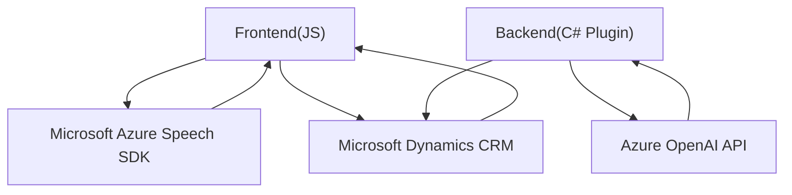

## Breve resumen técnico
El repositorio consta de tres elementos principales: un **frontend** basado en JavaScript, que interactúa con formularios y utiliza el reconocimiento y síntesis de voz del **Azure Speech SDK**, y un **plugin backend** para Microsoft Dynamics CRM desarrollado en C#, que emplea la API de Azure OpenAI para transformar texto.

---

## Descripción de arquitectura
La arquitectura del sistema presenta una combinación de componentes frontend y backend que interactúan con servicios externos (Azure APIs) y un CRM. Se puede clasificar como una **n-capas** distribuida con integración de servicios externos:
- **Frontend:** Responsable de presentar la interfaz de usuario, procesar formularios, capturar voz y gestionar datos con ayuda del SDK de Azure Speech.
- **Backend:** Ejecuta lógica de negocio relacionada con el procesamiento de texto, integrándose como un plugin para Dynamics CRM con reglas específicas. Interactúa con Azure OpenAI y el CRM.

La arquitectura se enfoca en separar responsabilidades:
- El frontend maneja la interacción del usuario y la obtención de datos.
- El backend implementa la lógica de negocio extendida y la interacción con APIs externas desde el CRM.

---

## Tecnologías usadas
1. **Frontend (JavaScript):**
   - **Azure Speech SDK**: Para síntesis de voz y transcripción de audio.
   - **Modular Programming**: Organización del código en funciones reutilizables para separación de responsabilidades.
   - **Event-driven architecture** y manejo de callbacks.

2. **Backend (C#):**
   - **.NET Framework**: Base para los plugins de Dynamics CRM.
   - **Azure OpenAI API**: Procesamiento de texto avanzado y generación de estructuras JSON.
   - **Microsoft Xrm SDK**: Interacción con la entidad CRM.
   - **HTTP Client**: Para solicitudes hacia APIs externas.

3. **Patterns and Architectures:**
   - **n-tier Design**: Separación lógica de frontend (formulario y síntesis de voz) y backend (CRM plugin).
   - **Integration with APIs**: Consumir servicios Azure Speech API y Azure OpenAI dentro de ambos componentes.

---

## Dependencias o componentes externos
1. **Azure Speech SDK**:  
   - Synthesis de texto a voz.  
   - Reconocimiento de voz para capturas y transcripción.  

2. **Azure OpenAI API**:  
   - Servicios avanzados de lenguaje para transformación textual.  

3. **Microsoft Dynamics CRM**:  
   - Gestión de entidades y campos CRM mediante plugins en C#.  

4. **Microsoft Xrm SDK**:  
   - Facilitador para la interacción del backend con las APIs del CRM.  

5. **HTTP Client / Headers**:  
   - Configuración para llamadas REST hacia Azure APIs.  

6. **Paquetes .NET adicionales**:
   - `Newtonsoft.Json.Linq`: Manipulación y parseo de datos JSON.  
   - `System.Net.Http`, `System.Net.Http.Headers` (para integraciones).  

---

## Diagrama Mermaid válido para GitHub

---

## Conclusión final
El sistema combina elementos frontend y backend para proporcionar una solución accesible e intuitiva que integra tecnología de voz y procesamiento avanzado de lenguaje. Los archivos del frontend se encargan de capturar la voz, procesar formularios y sintetizar texto gracias al **Azure Speech SDK**, mientras que el backend actúa como intermediario entre el CRM y la **Azure OpenAI API** para realizar transformaciones textuales personalizadas. La arquitectura es mayoritariamente de tipo **n-capas**, con separación estricta de lógica de presentación (frontend) y lógica de negocio (backend). El uso de SDKs y APIs externas demuestra un enfoque moderno de integración en sistemas distribuidos.