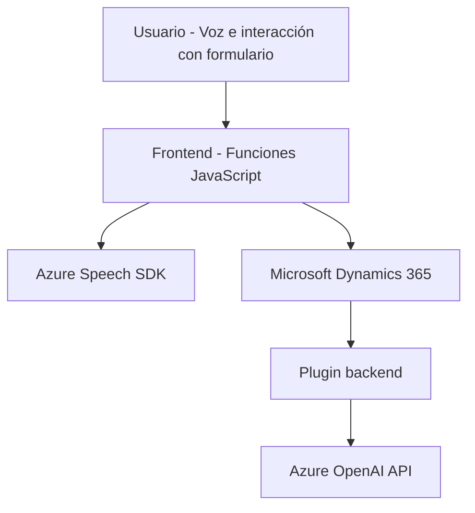

### Breve resumen técnico:
El repositorio ofrece una solución integrada que combina un frontend en JavaScript y un plugin en C# para habilitar funcionalidades de interacción por voz y procesamiento basado en inteligencia artificial (Azure). La solución está diseñada primordialmente para integrarse con sistemas CRM como Microsoft Dynamics 365, y utiliza servicios en la nube como Azure Speech SDK y Azure OpenAI API.

---

### Descripción de arquitectura:
La arquitectura de la solución sigue un modelo **híbrido de microservicios y plugin-driven architecture**, en la que:
1. **Frontend** (JavaScript) y **Dynamics CRM Plugin** (C#) son componentes independientes que interactúan para procesar datos y construir una experiencia de usuario basada en comandos de voz.
2. **Distribución en capas:**
   - **Frontend:** Interacción del usuario con formularios dinámicos y entrada por voz. Utiliza SDK de Azure Speech para análisis de voz y generación de textos hablados.
   - **Backend:** Dynamics CRM Plugin (C#) interactúa con APIs de OpenAI para procesar texto mediante inteligencia artificial.
3. **Facilitación por servicios en la nube:** El componente JavaScript se comunica directamente con Azure Speech SDK para tareas en tiempo real, mientras que el plugin consume la API de Azure OpenAI para transformaciones textuales.

---

### Tecnologías usadas:
#### Frontend:
1. **Azure Speech SDK**: Reconocimiento de voz, interacción con contenido dinámico y síntesis de voz.
2. **JavaScript**: Funciones utilitarias, manipulación de formularios y mapeo de datos visibles.
3. **Microsoft Dynamics 365 (via Xrm.WebApi)**: Exposición desde el cliente web y actualización de datos.

#### Backend:
1. **Dynamics CRM** (Plugin architecture): Backend extensible mediante `IPlugin` para responder a eventos del sistema.
2. **Azure OpenAI API**: Procesamiento de texto y generación de JSON estructurado con GPT-4.
3. **C#/.NET**: Desarrollo del plugin con interacción asincrónica hacia APIs externas.
4. **Microsoft.Xrm.Sdk**: Integración con Dynamics CRM para lectura/modificación de datos.
5. **System.Net.Http, System.Text.Json, Newtonsoft.Json.Linq**: Para comunicar y manejar respuestas JSON desde la OpenAI API.

### Patrones identificados:
- **Carga dinámica de dependencias**: El SDK de Azure Speech se carga bajo demanda según los requisitos de la aplicación.
- **Integración de servicios externos**: Conexión modular con Azure Speech y Azure OpenAI API para reconocimiento y generación de voz.
- **Modularización**: Separación clara de responsabilidades entre frontend y backend, con funciones independientes orientadas a un propósito específico.
- **Plugin Architecture**: Utilización del modelo basado en eventos de Dynamics CRM para ejecutar acciones personalizadas.
- **Tiers or Layers**: Ayudan a desacoplar la interacción directa con el usuario (frontend) y el procesamiento computacional (backend).

---

### Diagrama Mermaid:

---

### Conclusión final:
Este repositorio describe una solución bien estructurada basada en la integración de la nube. Se trata de una arquitectura híbrida que utiliza el frontend para la interacción de usuario y el backend mediante plugins en Dynamics CRM, con procesamiento intensivo externo por parte de Azure AI. Los archivos Javascript ofrecen funcionalidades de síntesis de voz y actualización dinámica de datos, mientras que el archivo del plugin en C# se especializa en interacción directa con servicios de texto cognitivo.

### Recomendación:
Considerar:
1. **Seguridad de las claves de API**: Evitar exponer credenciales directamente en el código. Mejor en variables de entorno o un sistema seguro de almacenamiento.
2. **Documentación detallada**: Añadir documentación de configuración para el despliegue en entornos diferentes (por ejemplo, habilitar variables de entorno para las regiones de Azure y las claves).