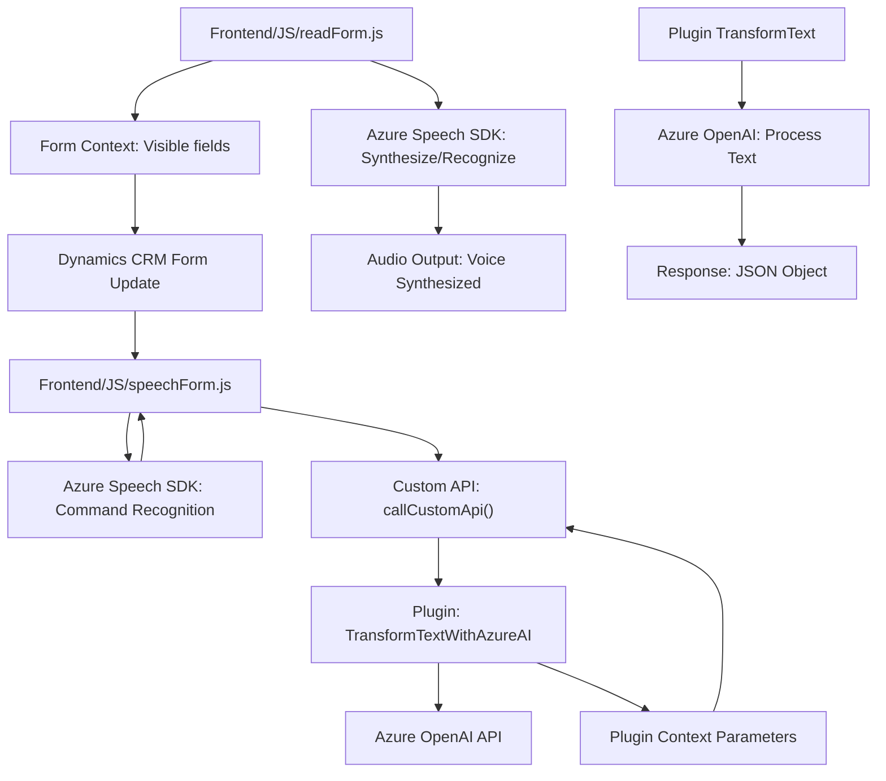

### Breve resumen técnico:
El repositorio presenta varios archivos que proporcionan funcionalidades avanzadas para un sistema Dynamics 365. Estas funcionalidades incluyen procesamiento de voz y texto mediante el SDK de Azure Speech y la API de Azure OpenAI. La solución está configurada para sintetizar texto, realizar reconocimiento de voz, transformar datos y actualizar formularios en un CRM.

---

### Descripción de arquitectura:
La solución sigue una arquitectura orientada a eventos y servicios externos. Está compuesta por un frontend dinámico desarrollado en JavaScript y plugins backend en C#. Los módulos están diseñados de forma modular, teniendo cada archivo una responsabilidad clara:
1. **JavaScript (Frontend)**:
   - Manejo de la interfaz (captura de voz, síntesis y transcripción).
   - Procesamiento y actualización de formularios dinámicos en el CRM.
   - Interacción con servicios como Azure Speech SDK y APIs de Dynamics 365.
   
2. **Plugins (Backend)**:
   - Se utilizan para las operaciones avanzadas como el procesamiento de datos usando Azure OpenAI y la transformación de texto.

La solución combina un enfoque **n-capas** donde la funcionalidad se divide entre frontend (interfaz/interacción) y backend (procesamiento avanzado). Parte de la funcionalidad también está inspirada en la arquitectura **hexagonal** al integrar servicios externos como APIs de Azure.

---

### Tecnologías usadas:
1. **Frontend**:
   - **JavaScript**: Lenguaje principal para realizar operaciones en la interfaz.
   - **Dynamics 365 Client APIs**: Para interacción con formularios/crm.
   - **Azure Speech SDK**: Reconocimiento de voz y síntesis.

2. **Backend**:
   - **C#**: Desarrollo de plugins especializados.
   - **Microsoft Dynamics CRM SDK**: Para el desarrollo de plugins personalizados.
   - **System.Net.Http**: Para interacción con APIs.
   - **Azure OpenAI API**: Transformación de texto basado en IA.
   
3. **Dependencias externas**:
   - **Newtonsoft.Json** y **System.Text.Json**: Manejo de datos en JSON.
   - **Azure**: Speech SDK y OpenAI para servicios externos.

---

### Diagrama Mermaid válido para GitHub:

---

### Conclusión final:
La solución integra múltiples servicios y tecnologías de manera eficiente para generar una funcionalidad avanzada en un entorno CRM como Dynamics 365. Tiene una arquitectura **orientada a eventos** con una separación clara entre frontend y backend (n-capas). 

**Frontend** se encarga de capturar, procesar y actualizar datos en formularios, mientras que **backend (plugins)** procesa entradas textuales mediante servicios de IA. La integración con Azure Speech y OpenAI fortalece su capacidad para ofrecer una interfaz dinámica y rica en funciones. Sin embargo, sería bueno mejorar ciertas prácticas, como la gestión segura de claves API y manejar dependencias de estado crítico.