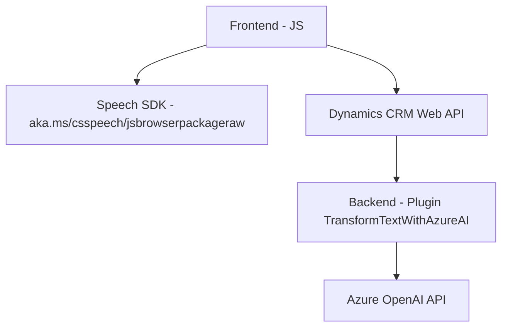

### Breve Resumen Técnico:
Este repositorio pertenece a una solución orientada al procesamiento y manejo de voz-texto en un entorno de Dynamics CRM utilizando servicios de Azure. Está compuesta por componentes frontend y backend:

- **Frontend:** Interacción del usuario con formularios y procesamiento dinámico de entrada/salida mediante Azure Speech SDK.
- **Backend:** Plugins para integración con Dynamics CRM que procesan texto usando AI de Azure OpenAI.

### Descripción de Arquitectura:
La arquitectura es **n-capas** porque separa claramente los componentes de la interfaz (frontend), los servicios (Azure Speech SDK y OpenAI), y la lógica empresarial (validación y procesamiento de datos en Dynamics CRM). A su vez, algunos componentes adoptan conceptos de arquitectura hexagonal, ya que dependen de APIs externas y SDKs integrados.

1. **Frontend:** Manejo de eventos en el navegador, interacción con el SDK de Azure Speech, y delegación del flujo a las funciones backend mediante APIs.
2. **Backend:** Plugins que gestionan transformación de datos en Dynamics CRM y conectan con Azure OpenAI para agregar funcionalidad avanzada.

### Tecnologías Usadas:
- **Frontend:**
  - JavaScript: Procesamiento de eventos y generación de voz.
  - Azure Speech SDK: Para reconocimiento de voz y síntesis de texto a voz.
  - Dynamics CRM APIs: Para manipulación de formularios y entidades.
- **Backend:**
  - C#: Programación de plugins para Dynamics CRM.
  - Azure OpenAI API: Procesamiento de texto automatizado.
  - Newtonsoft.Json & System.Net.Http: Para manejo de JSON y solicitudes HTTP.

### Diagrama Mermaid:

### Conclusión Final:
La solución está diseñada para mejorar accesibilidad y automatización en procesos relacionados con formularios en Dynamics CRM, mediante el uso de reconocimiento de voz y transformación de texto con IA. Siguiendo buenas prácticas de modularidad, escalabilidad y separación de responsabilidades, su arquitectura permite combinar capacidades locales y de servicios en la nube. Puede optimizarse implementando configuraciones más seguras para credenciales y mejores mecanismos de prueba unitaria.