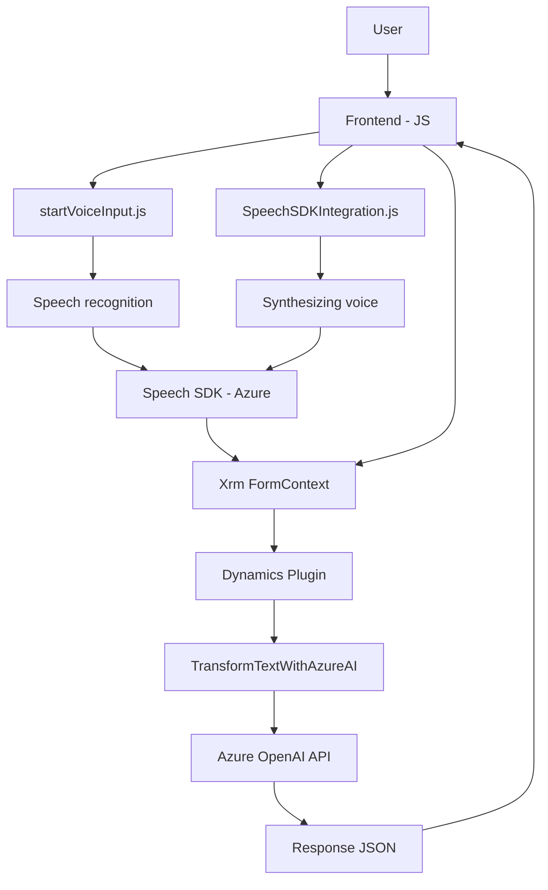

## Análisis técnico

### Breve resumen técnico
El repositorio extrae datos visibles de formularios, los procesa utilizando reglas específicas y los integra con servicios Cloud como Azure Speech SDK o Azure OpenAI API. Este diseño está pensado para brindar capacidad de síntesis y reconocimiento de voz, así como una transformación avanzada de texto vía IA.

### Descripción de arquitectura
La arquitectura general se alinea con un enfoque modular basado en una **arquitectura de capas**:
- **Presentación (Frontend):** Componentes frontend basados en JavaScript que manejan la interacción del usuario y las visualizaciones de datos en los formularios.
- **Lógica de negocio:** Implementada tanto en el frontend con lógica JavaScript y en backend con plugins (Azure OpenAI).
- **Integración externa:** Utilización de servicios externos como Azure Speech SDK y OpenAI para integración con servicios de reconocimiento y síntesis de voz, así como transformación avanzada de texto.

Sin embargo, el uso de Dynamics CRM y los eventos del sistema sugiere una **arquitectura híbrida**, donde una gran parte del comportamiento reside en los plugins de backend.

### Tecnologías usadas
1. **Frontend (JavaScript environment)**
   - Lenguaje: **JavaScript**
   - Framework/librerías: 
     - Azure Speech SDK: para síntesis y reconocimiento de voz.
     - API Xrm.WebApi: para manejar interacciones con el sistema Dynamics CRM.
2. **Backend (C#/.NET Environment)**
   - Lenguaje: **C#**
   - Frameworks: 
     - Dynamics SDK: para el manejo de plugins de CRM.
     - `System.Net.Http`, `Newtonsoft.Json` para manejo de APIs.
     - Azure OpenAI API: para transformar textos utilizando IA.

### Patrones usados
- **Plugin-based Architecture:** Patrón típico de Dynamics CRM, con componentes de servicio como plugins que ejecutan la lógica en respuesta a eventos.
- **Cargador dinámico:** El SDK se carga en tiempo de ejecución para cubrir dependencias únicamente cuando son necesarias.
- **Clean Code Principles:** División de responsabilidades entre funciones específicas del frontend y backend.
- **Integración con Microservicios:** La dependencia en Azure OpenAI y Speech SDK fomenta un modelo de servicio autónomo.
- **Separation of Concerns (SoC):** Mojón claro entre capas de presentación, lógica, y datos.

### Dependencias y componentes externos
1. **Externos:**
   - Azure Speech SDK: Síntesis y reconocimiento de voz.
   - Azure OpenAI API: Procesamiento y transformación de texto.
   - API Xrm.WebApi: Dynamics CRM API para manejo de datos contextuales.
   - Servicios HTTP: Manejo de peticiones API (`System.Net.Http`).
2. **Internos:**
   - Librerías para manipulación de formularios en Dynamics CRM.
   - Funciones auxiliares de frontend y backend para datos y lógica en tiempo de ejecución.
   - Plugins en C# para procesamiento extendido.

---

### Mermaid Diagram (100% compatible con GitHub Markdown)

---

### Conclusión final
El sistema está diseñado como una solución **híbrida** que integra una arquitectura de **n capas**, donde el frontend actúa como punto de interacción con el usuario y sintetizador, mientras que el backend emplea plugins de Dynamics CRM y microservicios como Azure OpenAI para procesamiento avanzado. El diseño modular y capacidad de integración con servicios externos hace que el sistema sea escalable, pero debe manejar mejor la seguridad y configuración (como claves de API expuestas). Esta solución es ideal para contextos empresariales donde se requiera reconocimiento, síntesis y manipulación avanzada de datos en formularios.