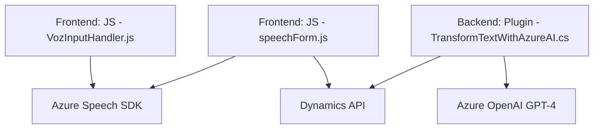

### **Análisis detallado del repositorio proporcionado**

#### **1. ¿Qué tipo de solución es?**
La solución presentada está enfocada principalmente en integrar capacidades de reconocimiento y síntesis de voz, junto con una solución para procesamiento de comandos mediante inteligencia artificial. Está diseñada para interactuar con formularios de aplicaciones, específicamente dentro del ecosistema de Microsoft Dynamics 365. Por ende, es una solución híbrida que engloba:
- **Frontend**: Principalmente construido en **JavaScript** con interacción directa desde el navegador y lógicas como la determinación de datos visibles en el formulario y su procesamiento.
- **Backend - Plugin**: El lado del servidor está implementado en **C#** como un plugin integrado en Dynamics 365. Este componente actúa como un mediador entre la aplicación y los servicios de **Azure OpenAI** para transformar texto con normas semánticas predefinidas.

#### **2. ¿Qué tecnologías, frameworks y patrones se están utilizando?**
##### **Tecnologías:**
1. **Frontend:**
   - **Azure Speech SDK:** Reconocimiento de voz y síntesis de texto a voz en tiempo real.
   - **Microsoft Dynamics Form Rendering API**: Para trabajar con datos contextuales del formulario.
   - **JavaScript estándar** para lógica de manejo de eventos y de datos en el navegador.

2. **Backend:**
   - **C#**, junto con las APIs de Dynamics como:
     - `IPlugin`.
     - `IOrganizationService`.
   - **Azure OpenAI GPT-4** para generación de texto, integrándose a través de una API REST.
   - Librerías de manipulación JSON como:
     - `System.Text.Json`.
     - `Newtonsoft.Json.Linq`.

##### **Patrones de Arquitectura y Diseño:**
1. **Event-driven Programming:** Utilizado en la lógica del frontend donde la ejecución de tareas depende de eventos emitidos en el formulario, por ejemplo, al ingresar datos.
2. **Facade Pattern:** En el plugin de backend, la interacción con el servicio externo de Azure OpenAI se encapsula dentro de un único método (`GetOpenAIResponse`) que actúa como una fachada, simplificando la integración con la API externa.
3. **Modularidad:** Tanto la estructura del frontend como del backend se dividen en funciones específicas, cada una diseñada para cumplir una responsabilidad única (extracción de datos, síntesis de voz, llamada a APIs, manipulación de formularios).
4. **Dependency Injection:** En el plugin C#, el uso de `IServiceProvider` permite la inyección de dependencias como el contexto del CRM.
5. **Integración de SDKs externos:** Incluye servicios como Azure Speech y Azure OpenAI para reconocimiento, síntesis y transformación de texto.

#### **3. ¿Qué tipo de arquitectura tiene?**
##### **Frontend:**  
La arquitectura del frontend puede describirse como una estructura **modular con un enfoque de uso de SDKs externos**, que actúa como cliente para servicios de Azure Speech y el API personalizado de Dynamics.  
Cuenta con lógica implementada para:
- Procesar eventos en la interfaz dinámica (formularios).
- Enviar y procesar datos mediante funciones de backend (API personalizada y plugin).

##### **Backend:**  
Es una **arquitectura basada en eventos con plugins**. Los plugins de Dynamics están configurados para ejecutarse en respuesta a eventos específicos dentro del ecosistema CRM (como la entrada de datos).  
También integra una **arquitectura de microservicios ligera**, ya que el plugin se comunica con servicios externos como **Azure OpenAI REST API**.

En términos generales, el sistema tiene componentes que siguen una arquitectura **híbrida**:
- Para el frontend: **n capas** (presentación, lógica, datos).
- Para el backend: Compuesta por un plugin con integración REST que interactúa mediante servicios externos y APIs de Dynamics.

#### **4. ¿Qué dependencias o componentes externos podrían estar presentes?**
1. **Azure Speech SDK:** Para síntesis y reconocimiento de voz en el frontend.
   - URL utilizado: `https://aka.ms/csspeech/jsbrowserpackageraw`.

2. **Microsoft Dynamics API (`Xrm.WebApi`)**: Permite el acceso y modificación de datos en formularios dentro del CRM.

3. **Azure OpenAI GPT-4 API (Backend)**:
   - Endpoint en uso: `https://openai-netcore.openai.azure.com`.
   - Permite transformar texto bajo normas predefinidas con el procesamiento de lenguaje natural.

4. **Librerías estándar del lenguaje C#:**
   - `HttpClient` para operaciones REST a nivel del backend.
   - `System.Text.Json` para manipulación de JSON.

---

#### **5. Diagrama Mermaid compatible con GitHub Markdown**

---

#### **Conclusión final**
Este repositorio claramente implementa una solución avanzada para la integración de capacidades de voz e inteligencia artificial en aplicaciones empresariales, específicamente diseñadas para interactuar con formularios ligados a Microsoft Dynamics 365. Se caracteriza por:
1. El uso de tecnologías punteras como **Azure Speech SDK** y **Azure OpenAI GPT-4**.
2. Arquitectura basada en **plugins y eventos**, con separación clara entre la lógica del frontend y el backend.
3. Procesos modularizados que promueven la lectura, síntesis, procesamiento y transformación de datos respetando principios de diseño como modularidad, evento-driven y encapsulación.

Este diseño es robusto y adecuado para casos empresariales donde la integración de capacidades de IA y APIs externas es esencial para mejorar la interacción y automatización entre usuarios y plataformas digitales.