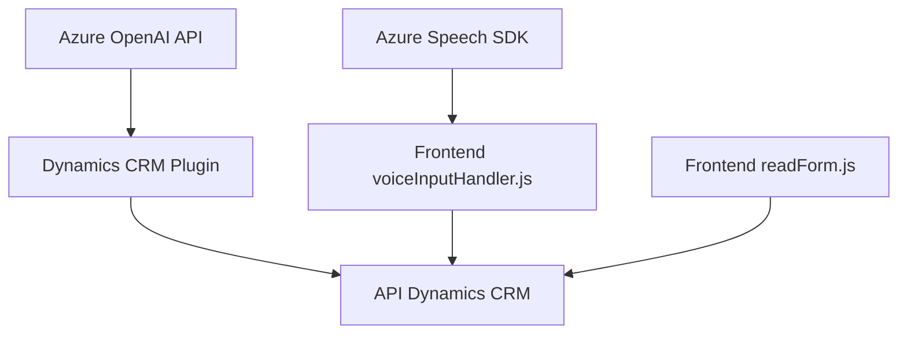

### Breve Resumen Técnico
Este repositorio contiene funcionalidades para la integración de servicios de voz y procesamiento de texto en aplicaciones relacionadas con Dynamics 365 CRM, aplicando tecnologías y servicios como Azure Speech SDK y Azure OpenAI. Los módulos descritos muestran diversos componentes que facilitan la síntesis de voz, reconocimiento de voz, y transformación avanzada de texto mediante modelos GPT, destacando patrones como modularidad, arquitectura dirigida por eventos y plugin architectures.

---

### Descripción de Arquitectura
La solución presenta una arquitectura híbrida:
1. **FrontEnd (Voice Processing Modules)**:
   - Procesamiento de datos del formulario y generación de voz usando `Azure Speech SDK`.
   - Modularización de funciones centradas en la síntesis de voz y reconocimiento, aplicando una arquitectura en *capas* enfocada en la interacción entre usuario y sistema.
2. **Dynamics Plugins**:
   - Implementación del patrón **Plugin Pattern** para extender la funcionalidad de Dynamics CRM.
   - Integración directa mediante llamadas HTTP hacia servicios externos como **Azure OpenAI API** para procesamiento estructurado de texto.

La arquitectura global combina elementos de **Arquitectura n-Capas** (módulos Frontend y Plugins que interactúan con la capa de negocio), y características de **Servicios Moleculares** (integración de APIs externas como Azure Speech SDK y OpenAI).

---

### Tecnologías Usadas
1. **Azure SDK**:
   - **Speech SDK**: Para sintetización de voz y reconocimiento de comandos.
   - **OpenAI API**: Procesamiento de texto avanzado con GPT-4.
2. **Dynamics CRM SDK**:
   - Proveedores de servicio (`IServiceProvider`) y patrones de plugins.
3. **Frontend**:
   - **JavaScript ES6** para modularización en los módulos de síntesis/reconocimiento de voz.
   - Contexto del formulario Dynamics (formContext) para gestión y manipulación de datos.
4. **Backend Plugins**:
   - Integración RESTful con OpenAI.
   - Manejo de JSON con librerías como **Newtonsoft.Json**.

---

### Diagrama Mermaid (estructura validad y simple)

---

### Conclusión Final
La solución destaca por su capacidad para integrar servicios externos de Microsoft Azure (Speech SDK y OpenAI) con un entorno empresarial como Dynamics CRM, optimizando la interacción mediante voz y automatización de contenidos estructurados. La arquitectura en **n-Capas** asegura la separación de responsabilidades y modularidad, mientras que los plugins y APIs externos refuerzan la integración con sistemas inteligentes. Se trata de una solución eficiente y escalable, además de estar bien alineada con los principios modernos de desarrollo centrado en servicios y experiencias de usuario.