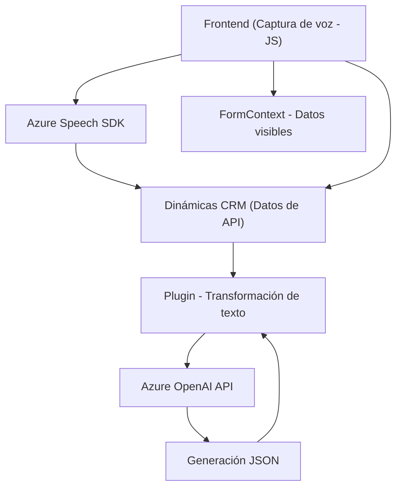

### Breve resumen técnico
Los archivos proporcionados establecen una solución que integra procesamientos de voz y manipulación de datos en formularios CRM, utilizando servicios como Azure Speech SDK y Azure OpenAI. La solución es modular y utiliza patrones como integración de servicios externos, procesamiento dinámico de datos visible en interfaces, y el uso de plugins en Dynamics 365 para manipulación avanzada de texto.

---

### Descripción de arquitectura
La solución se compone de tres capas principales:
1. **Frontend (JavaScript/HTML)**: Aloja módulos para captura de voz, lectura de datos visibles y manipulación directa de formularios CRM mediante Azure Speech SDK.
2. **Integración API (Dynamics 365 Plugin)**: Servidor que conecta formularios y lógica definida por Microsoft Dynamics 365 con procesamiento adicional vía Azure OpenAI (como JSON estructurado).
3. **Servicio externo (Azure IA)**: Usa GPT-4o para análisis de texto y estructuración dinámica.

La arquitectura es **orientada a servicios**, con una estructura modular y desacoplada. Destaca:
- Modularización de funcionalidades en el frontend.
- Plugins como "middleware" que añaden procesos intermedios en Dynamics 365.
- Dependencia declarada en soluciones de AI como `Speech SDK` y `OpenAI GPT`.

---

### Tecnologías usadas
1. **Frontend:**
   - **JavaScript**: Implementación de lógica de captura de datos y manipulación de formularios.
   - **Azure Speech SDK**: Para síntesis de voz y captura de comandos de voz.
   - **HTML/Browser**: Acceso al DOM para manipulación de datos visibles.

2. **Backend (Plugin Dynamics 365):**
   - **C#**: Desarrollo de plugins basados en Microsoft Dynamics.
   - **Dynamics 365 SDK**: Interacción con los atributos y datos del CRM.

3. **Integración externa:**
   - **Azure OpenAI**: Procesamiento avanzado de texto y estructuración JSON.
   - **Azure Speech SDK (JS)**: Procesamiento de comandos de voz.

4. **Frameworks y librerías C#:**
   - `System.Text.Json`: Procesamiento de estructuras JSON.
   - `Newtonsoft.Json.Linq`: Uso de modelos JSON dinámicos.

---

### Diagrama Mermaid

---

### Conclusión final
La solución presentada corresponde a una arquitectura orientada a servicios que integra tecnologías modernas como **Azure Speech SDK** y **Azure OpenAI**, conectadas con un entorno CRM basado en Dynamics 365. Es ideal para aplicaciones que buscan optimizar la accesibilidad mediante comandos de voz y procesos de IA para estructuración de datos. La modularización y desacoplamiento permiten escalabilidad y mantenibilidad, aunque es clave asegurar una configuración segura y eficiente para integraciones con servicios externos como API y plugins.