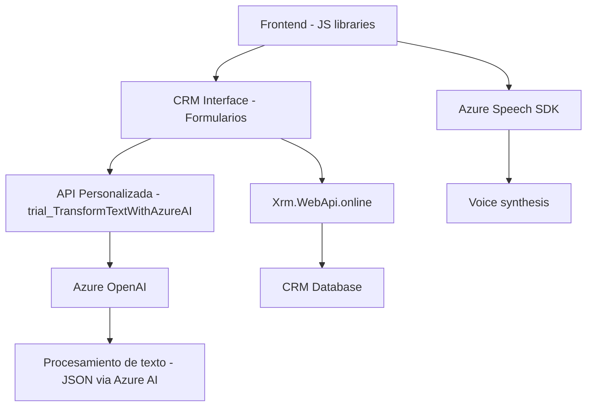

### Breve resumen técnico

La solución presentada está compuesta de tres módulos principales que reflejan una integración dinámica con servicios de **Microsoft Azure**, específicamente el **Azure Speech SDK** y **Azure OpenAI**. Esto sugiere que se trata de un conjunto de herramientas diseñadas para gestionar formularios de CRM mediante entrada/salida de voz, transformación de datos mediante IA y procesamiento de datos personalizados.

---

### Descripción de arquitectura

La arquitectura refleja un sistema especializado para la **automatización de formularios CRM** y puede clasificarse como:

- **Multi-capa (multilayer)**: Está organizada en capas independientes para lógica del cliente (procesamiento en frontend con JavaScript), lógica del servidor CRM (plugins de Dynamics 365) y servicios externos en la nube (Azure Speech SDK y OpenAI).
- Uso de **API Externa**: Se integra con servicios externos como **Azure Speech SDK** y **Azure OpenAI** para tareas de voz y procesamiento avanzado de texto.
- **Patrón Plugin**: El archivo `TransformTextWithAzureAI.cs` utiliza el patrón típico de plugins de `Dynamics CRM` para interceptar operaciones y añadir extensiones personalizadas.

Este diseño focaliza la lógica relacionada con gráficos y entrada/salida de datos en el frontend mientras delega procesos avanzados basados en IA al backend, garantizando modularidad y flexibilidad.

---

### Tecnologías usadas

1. **Frontend (JavaScript y Azure Speech SDK):**
   - **JavaScript**: Para integrar la funcionalidad de entrada/salida de voz y manipulación de formularios CRM en el navegador.
   - **Azure Speech SDK**: Utilizado para síntesis de voz y reconocimiento en el frontend.

2. **Backend (Dynamics 365 Plugin y Azure OpenAI):**
   - **Microsoft Dynamics SDK**: Para manipular recursos y procesos dentro del entorno de CRM.
   - **Azure OpenAI**: Utilizado para transformar texto en objetos JSON normativos para CRM.

3. **Otras herramientas:**
   - **Newtonsoft.Json** y **System.Net.Http**: En el backend para realizar solicitudes HTTP y manejar JSON.
   - **Xrm.WebApi.online**: Para interactuar directamente con el servidor del CRM desde el frontend.

---

### Dependencias o componentes externos

- **Azure Speech SDK:** Cargado dinámicamente en el navegador para manejo de entrada/salida de voz.
- **Azure OpenAI Services:** Comunicación con API externa para generación y transformación avanzada de texto.
- **API Personalizada:** En el CRM (ejemplo: `trial_TransformTextWithAzureAI`) para aplicar operaciones adicionales basadas en IA.
- **Dynamics SDK:** Usado en el plugin para interceptar procesos y personalizar el comportamiento de entidades dentro del CRM.

---

### Diagrama Mermaid (100 % compatible)

El siguiente diagrama describe la interacción principal dentro del sistema desde el frontend, pasando por el backend y conectando con servicios externos.

---

### Conclusión final

La solución se construye bajo una arquitectura moderna para la automatización de formularios en entornos empresariales CRM, utilizando **Microsoft Azure Speech SDK** para entrada/salida de voz y **Azure OpenAI** para la transformación avanzada de datos. Su estructura modular y multi-capa permite extensiones personalizadas para satisfacer diferentes necesidades del negocio mientras promueve un diseño desacoplado y escalable.