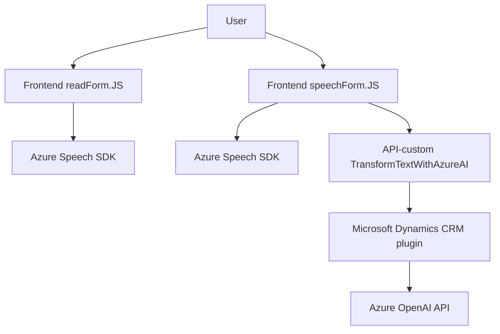

### Breve resumen técnico

El análisis de los archivos revela que el repositorio alberga una solución híbrida e integrada que consiste en un **frontend web** y una **extensión/plugin** de Dynamics CRM (Microsoft Dataverse). Se enfoca en habilitar la interacción entre usuarios y formularios mediante servicios de síntesis y reconocimiento de voz (Azure Speech SDK) e inteligencia artificial (Azure OpenAI). Además, utiliza una arquitectura de múltiples capas para integrar la interfaz, servicios externos y una capa de lógica como plugin CRM.

---

### Descripción de arquitectura

La arquitectura de la solución es una **multicapa acoplada al ecosistema Dynamics CRM**. Los componentes interactúan con el backend y servicios externos. Se puede hacer la siguiente clasificación:

1. **Frontend Layer**: Los archivos JavaScript se encargan de habilitar funcionalidades de lectura y reconocimiento de voz sobre formularios, con integración directa con Dynamics CRM y Azure Speech SDK. Tiene un enfoque modular basado en patrones como *Facade* para simplificar la complejidad en tareas de adquisición de datos, reconocimiento de voz y síntesis de texto en voz.

2. **Business Logic Layer (Plugin)**: Representada por el archivo `TransformTextWithAzureAI.cs`. Esta capa está implementada como un plugin para Dynamics CRM, siguiendo el patrón *Plugin Architecture*. Procesa datos de entrada, interactúa con Azure OpenAI para realizar transformaciones avanzadas basadas en IA y devuelve los resultados estructurados como JSON al cliente (frontend). 

3. **External Services Integration**:
   - **Azure Speech SDK**: Usado en el frontend para sintetizar y reconocer voz. Los datos del usuario (formulario, comandos de voz) se procesan para interactuar con este servicio.
   - **Azure OpenAI API (GPT-4)**: Usada en el backend/plugin para realizar transformaciones avanzadas de texto. Este API actúa como una funcionalidad adicional para el reconocimiento en formularios controlados mediante voz.

4. **Patrones usados**:
   - *Facade*: Permite orquestar la interacción entre funciones y servicios externos en un flujo simplificado en los archivos del frontend.
   - *API Gateway Pattern*: El frontend y plugin actúan como puntos de integración entre el usuario y los servicios Azure Speech SDK y OpenAI API.
   - *Asynchronous*: Implementado tanto en los archivos JS como en el plugin (`async/await` en JavaScript, promesas HTTP en C#) para manejar tareas de servicio externas y procesamiento de datos.

---

### **Tecnologías usadas**

1. **Frontend**
   - Lenguaje: JavaScript.
   - Framework: Ningún framework explícito mencionado.
   - Servicios externos: 
      - Azure Speech SDK para síntesis y reconocimiento de voz.
      - Dynamics CRM (Xrm API) para interacción con formularios y datos.
   
2. **Backend**
   - Lenguaje: C# (.NET).
   - Integraciones:
     - Microsoft Dynamics CRM (via `Microsoft.Xrm.Sdk`).
     - Azure OpenAI API para transformación de texto.
   - JSON Processing: 
     - `System.Text.Json` (C# standard library).
     - `Newtonsoft.Json.Linq`.

---

### Diagrama Mermaid

---

### Conclusión final

Este repositorio contiene una hybrid solution con las siguientes características principales:

- **Frontend web**, desarrollado en **JavaScript**, interactúa con formularios de usuario para proporcionar funcionalidades avanzadas basadas en síntesis y reconocimiento de voz (Azure Speech SDK). Hay uso de llamadas asíncronas y un proceso modular, ideal para mantener la separación de responsabilidades.
- **Plugin Backend**, desarrollado en **C#** como una extensión para Dynamics CRM. Este plugin aplica transformaciones con datos de entrada (formularios) usando la API de **Azure OpenAI** como pasarela de cálculo de IA.
- La solución tiene una **arquitectura multicapa** con integración de tecnologías como Dynamics CRM, SDK de voz, y servicios de Azure OpenAI. El patrón predominante es el **Facade Pattern**, pero también hay elementos de acoplamiento mediante integración con servicios externos (*API Gateway*).

Finalmente, la combinación de estas tecnologías y arquitectura muestra un enfoque moderno y avanzado para habilitar una experiencia basada en voz y formularios, integrando tanto la capa de frontend como la interacción en el backend con inteligencia artificial.