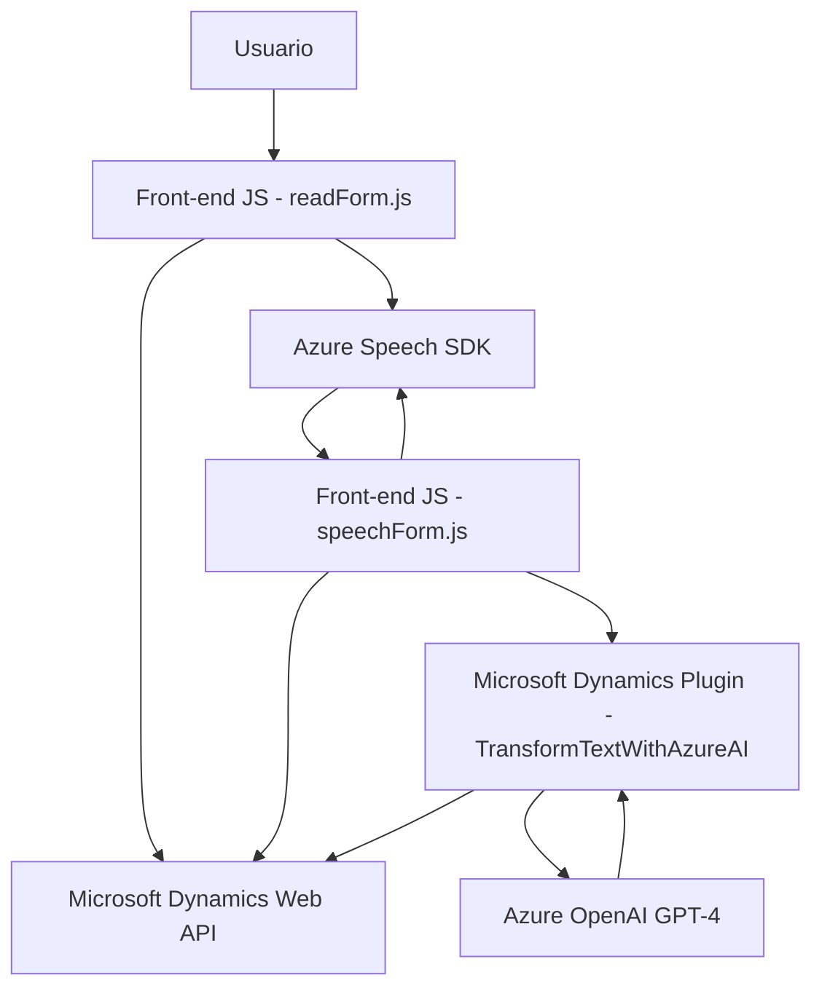

### **Análisis general del contenido y repositorio**

#### **1. Qué tipo de solución es**
La solución analizada comprende una **integración entre front-end y back-end**, con el uso de una API externa (Azure Speech SDK). Está compuesta principalmente por los siguientes módulos:
- **Front-end JavaScript files (`readForm.js`, `speechForm.js`)**: Implementan interacción directa con el usuario en la interfaz web, capturando datos de formularios y procesando entrada y salida vía audio utilizando Azure Speech SDK.
- **Back-end Plugin (`TransformTextWithAzureAI.cs`)**: Un componente de tipo plugin que genera JSON estructurados mediante el uso de Azure OpenAI para Microsoft Dynamics CRM.

En esencia, el proyecto combina un **Front-end para interacción** entre el usuario con reconocimiento de voz y un **plugin para dinamizar el procesamiento basado en estrategias de IA**.

---

#### **2. Tecnologías, frameworks y patrones**
- **Tecnologías utilizadas**:
  - **2.a Front-end**: 
    - JavaScript como lenguaje de programación.
    - **Azure Speech SDK**: Reconocimiento y síntesis de voz.
    - Microsoft Dynamics CRM APIs (`formContext`, `Xrm.WebApi`) para integrar con formularios.
  - **2.b Back-end plugin**:
    - **C#** como lenguaje de programación.
    - **Microsoft Dynamics SDK** para desarrollar extensiones de CRM.
    - **Azure OpenAI API (GPT-4)**: Para transformar texto en JSON estructurado basado en reglas de negocio.
    - **System.Net.Http**: Para realizar solicitudes HTTP.
    - **Newtonsoft.Json.Linq**: Para manipulación de JSON.

- **Patrones identificados**:
  - **Modularidad**: Las funciones y métodos están diseñados para cumplir roles específicos (p. ej., cargar datos del formulario, iniciar el reconocimiento de voz, realizar síntesis de audio).
  - **Facade-oriented architecture**: En el front-end, varias funciones actúan como fachada para interactuar con servicios externos, simplificando la integración.
  - **Event-driven integration**: Uso de eventos asíncronos junto con los `Promise` y `callback` para el manejo eficiente de SDKs externos.
  - **Microservicio-like processing**: En el plugin, la lógica de transformación se delega a un servicio externo (Azure OpenAI), siguiendo un enfoque de desacoplamiento funcional.
  - **Service-Oriented Architecture (SOA)**: Integración con servicios externos como Azure Speech SDK para reconocimiento de voz y Azure OpenAI para procesamiento de texto.

---

#### **3. Tipo de arquitectura**
La solución tiene una **arquitectura híbrida en capas**, con una **separación del código basado en clientes y servicios externos**, que permite observar varias características propias de una arquitectura más moderna:
- **Multicapa**: La solución sigue la estructura web típica donde el Front-end y el plugin (Back-end) tienen responsabilidades separadas y se comunican con componentes externos (SDKs/APIs).
- **Integración vía APIs externas**: La solución se conecta con los servicios de Azure (Speech SDK y OpenAI) que ofrecen capacidades de síntesis de voz y procesamiento de texto.
- **Enfoque de microservicios**: Aunque no es una arquitectura puramente de microservicios, el plugin se asemeja a un microservicio al focalizarse en una única responsabilidad.

---

#### **4. Dependencias o componentes externos**
- **Azure Speech SDK**: Esencial tanto en el cliente front-end como para reconocimiento/síntesis de voz y transcripción de texto.
- **Microsoft Dynamics CRM API (`Xrm.WebApi`)**: Utilizada para interactuar con contexto de formularios, obtener atributos/filtros y actualizar datos. Requiere permisos específicos para acceder a datos CRM.
- **Azure OpenAI GPT-4**: Implementado en el plugin para transformar texto en JSON. Requiere configuraciones de endpoints, manejo de claves de API, y despliegue del modelo específico en Azure.
- **Bibliotecas externas**:
  - `System.Net.Http` para solicitudes HTTP en el plugin.
  - JSON manipulaciones (`System.Text.Json`, `Newtonsoft.Json.Linq`) en el plugin.
- **Configuración de clave API para Azure Speech SDK y OpenAI**: Necesidad de estos identificadores como variables de entorno o parámetros configurables en el despliegue.

---

### **Diagrama Mermaid**

---

### **Conclusión final**
La solución es una **integración híbrida multiplataforma** que combina características de un **Front-end para la interacción con el usuario y entrada/salida de voz**, un **plugin para lógica avanzada y transformación de datos**, y el uso extensivo de **servicios en la nube** de Azure (Speech SDK y OpenAI GPT-4). Aunque la arquitectura subyacente no es explícitamente definida como microservicios o hexagonal, ciertas características la acercan a un estilo **modular y orientado a servicios externos**, con separación clara de responsabilidades.

Optimización recomendada:
1. **Parámetros configurables**: Centralizar las claves de Azure SDK y endpoints en una configuración accesible y segura.
2. **Mismas bibliotecas de JSON**: Unificar el uso de bibliotecas para manipulación JSON (`System.Text.Json` vs `Newtonsoft.Json.Linq`) para simplificación y consistencia.
3. **Handle respuesta API externa**: Robustecer la gestión de posibles errores en la conexión con Azure para escalabilidad y resiliencia.