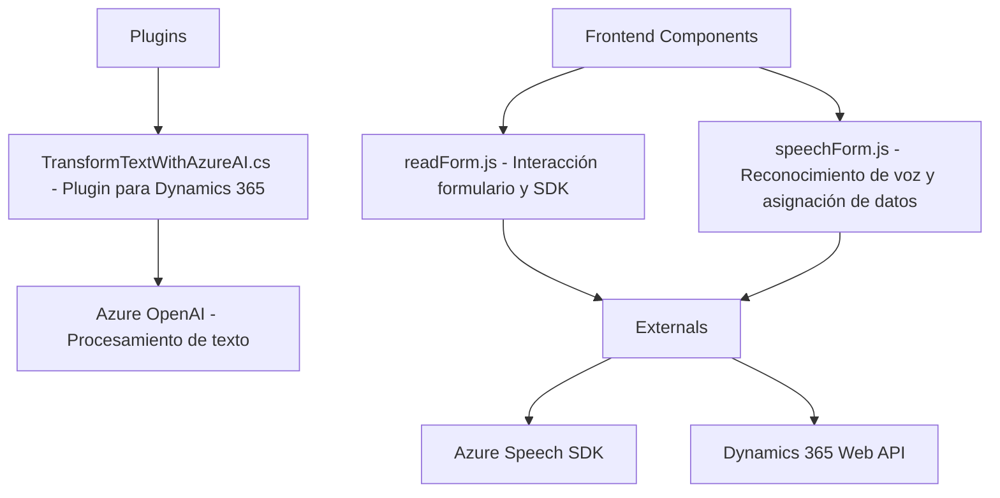

### Breve resumen técnico

El repositorio analizado contiene tres archivos clave:
1. **Frontend** para la interacción entre formularios y servicios externos, específicamente Azure Speech SDK y Microsft Dynamics 365.
2. **Plugins** para el procesamiento de datos mediante Azure AI y Microsoft Dynamics CRM.
3. Integra tecnologías modernas como APIs de Azure, reconocimiento de voz y manipulación de datos CRM.

El enfoque general es el procesamiento dinámico y modular de datos de formularios mediante reconocimiento de voz y síntesis de texto. Además, el plugin en `TransformTextWithAzureAI.cs` agrega capacidades de transformación avanzada utilizando Azure OpenAI.

---

### Descripción de arquitectura

La arquitectura general del repositorio apunta a un modelo **modular orientado a servicios**, incluyendo principios de microservicios en el diseño de los componentes de frontend. Cada módulo está desacoplado y cumple con una función específica. Algunos componentes del sistema siguen principios de **arquitectura de servicios (SOA)** y **cliente-servidor**.

1. **Frontend:**
   - Las operaciones se organizan siguiendo un patrón **Modelo de Ayudante ("Helper-driven")**, donde funciones auxiliares procesan los datos del DOM/formulario dinámicamente.
   - **Dependencias asincrónicas:** Varían según la interacción del usuario (Azure Speech SDK).
   - Enfoque modular: Las tareas están divididas en funciones bien definidas, como la extracción del formulario o la síntesis de voz.

2. **Plugins:**
   - Plugin basado en **Microsoft Dynamics estándar** mediante la interfaz `IPlugin`.
   - Utiliza **Azure OpenAI** como sistema externo para realizar transformaciones con lógica avanzada.
   - Dependencia directa de servicios externos mediante HTTP y SDK de Dynamics CRM.

La arquitectura del repositorio es un híbrido que combina:
- **Frontend orientado a eventos**.
- **Microservicios:** Interacciones con servicios externos son distribuidas e independientes.
- **Plug-in Architecture:** En Dynamics CRM con integración directa de servicios externos.

---

### Tecnologías usadas

1. **Frameworks y servicios externos:**
   - **Azure Speech SDK:** Para síntesis y reconocimiento de voz en la capa Frontend.
   - **Azure OpenAI (GPT-4):** Para procesamiento avanzado de texto en los plugins.
   - **Dynamics 365 SDK:** Gestión de formularios y datos en el contexto CRM.

2. **JavaScript y DOM API:** Manipulación y extracción de datos visuales.
   - Carga dinámica de dependencias vía scripts (`<script>`).

3. **C#:** Para la extensión personalizada en Dynamics CRM.
   - Uso de `HttpClient` para interactuar con Azure OpenAI.

4. **Patrones:** Modularidad, eventos, orientación a servicios asincrónica.

---

### Diagrama **Mermaid**

A continuación, un diagrama que describe las relaciones entre los componentes del repositorio:

---

### Conclusión final

Este repositorio muestra una solución moderna centrada en la interacción de un sistema CRM con servicios avanzados de inteligencia artificial y reconocimiento de voz. Los principales elementos del diseño incluyen:
1. **Frontend modular gestionado por eventos:** Utilizando herramientas como Azure Speech SDK para manipulación de datos y reconocimiento de voz dinámico.
2. **Plugins extensibles basados en Dynamics CRM:** Integración de Azure AI para procesamiento avanzado.
3. **Arquitectura orientada a servicios:** Dependencias desacopladas pero bien integradas con servicios externos (Azure, Dynamics).

La solución puede escalar hacia la conexión de más proveedores de servicios o extenderse para distintos casos de uso dentro de los sistemas CRM gracias a su diseño modular y orientado a servicios. Sin embargo, hay áreas donde las operaciones síncronas pueden convertirse en un cuello de botella.