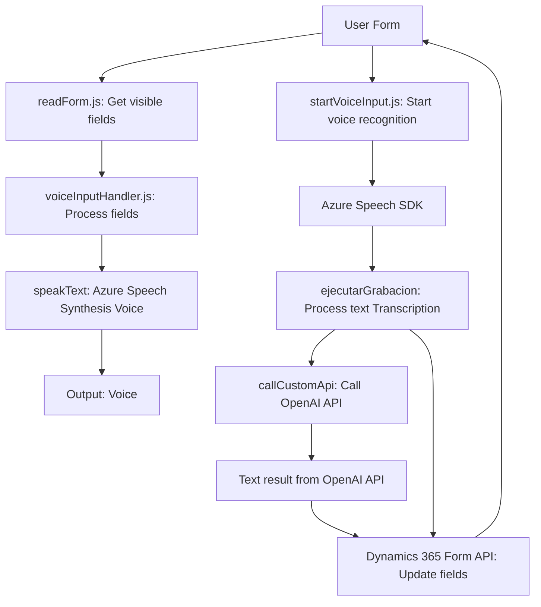

### Breve resumen técnico
El repositorio contiene una solución que combina manejo de formularios dinámicos con capacidades de accesibilidad y procesamiento de datos por voz mediante tecnologías de Microsoft Azure (Speech SDK y OpenAI API). La funcionalidad incluye extracción de datos desde formularios y su conversión o interacción asistida por reconocimiento de voz y transformación de texto, tanto en frontend (JavaScript) como con sistemas backend (C#).

---

### Descripción de arquitectura
1. **Tipo de solución:**
   - **Multicapa**:
     - **Frontend**: Implementado en JavaScript, realiza la interacción directa con los usuarios para el reconocimiento de voz y la síntesis de texto.
     - **Backend de Dynamics CRM (C#)**: Procesa datos y realiza llamadas al servicio Azure OpenAI para transformar texto y estructurarlo para formularios.

2. **Estructura arquitectónica:**
   - **N capas** con enfoque modular:
     - Capa de presentación: Representada en el frontend para el manejo de formularios y generación de voz.
     - Capa de servicios: Gestiona la interacción con API REST de Azure Speech y Azure OpenAI.
     - Capa de negocio: Implementación con Dynamics CRM plugins para lógica empresarial avanzada.

3. **Patrones de diseño:**
   - **Event-driven**: Uso de eventos callback en funciones del frontend para cargar SDK y procesar inputs.
   - **Modularización**: Separación de funcionalidades en fragmentos pequeños (por ejemplo, lectura de texto y síntesis de voz).
   - **Plugin architecture**: En el backend, el diseño sigue las normas de desarrollo de plugins en Dynamics CRM.
   - **Microservicio**: El backend depende de Azure OpenAI como servicio externo desacoplado para procesamiento de tareas específicas.

---

### Tecnologías usadas
- **Frontend:**
   - **JavaScript**: Manejo del DOM y lógica de acceso a formularios vía APIs del navegador y Dynamics.
   - **Azure Speech SDK**: Reconocimiento de voz, síntesis y entrada basada en audio.
- **Backend:**
   - **C#**: Código desarrollado con .NET Framework.
   - **Microsoft Dynamics SDK**: Para interacción con datos y eventos del entorno CRM.
   - **Azure APIs**:
     - **Speech**: Procesamiento y reconocimiento de voz.
     - **OpenAI**: Transformación de texto interpretado por modelos IA.
- **Dependencias de otros servicios:**
   - `Newtonsoft.Json`: Para manipulación y serialización de datos en JSON.
   - `System.Net.Http`: Para consumos de APIs REST.
   - **Web API de Dynamics**: Interacción con datos de entidades y atributos en formularios dinámicos.

---

### Diagrama Mermaid válido para GitHub

---

### Conclusión final
El repositorio presenta una solución específica orientada a mejorar la gestión de formularios en Dynamics CRM mediante la integración de capacidades avanzadas de accesibilidad (reconocimiento de voz y síntesis de texto a voz) y procesamiento de texto asistido por inteligencia artificial. La arquitectura sigue el modelo de **N capas** y está diseñada con alta modularidad y extensibilidad. La interoperabilidad con servicios externos como Azure Speech y OpenAI refuerza su actuación como una solución híbrida, donde el frontend se centra en la interacción y el backend en la lógica avanzada y la delegación de funciones.