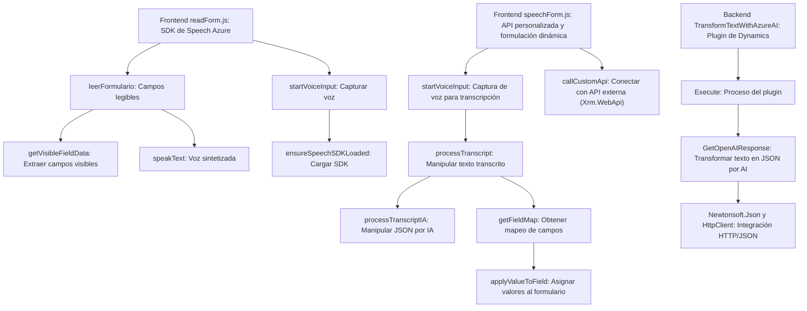

### Breve resumen técnico
El repositorio parece ser una solución que combina funcionalidades de reconocimiento y síntesis de voz junto con procesamiento avanzado de texto basado en inteligencia artificial (Azure OpenAI). Los archivos indicados (readForm.js, speechForm.js y TransformTextWithAzureAI.cs) están organizados como componentes independientes de una aplicación que integra funcionalidades en una arquitectura que parece adaptarse al ecosistema de Microsoft Dynamics 365.

---

### Descripción de arquitectura
- **Tipo de solución**: Se trata de un módulo ubicado en la capa de presentación y lógica, integrado a Microsoft Dynamics 365. Combina procesamiento de voz en tiempo real para la interacción con el usuario y la integración de servicios AI externos (Azure OpenAI) para transformar datos y actualizar formularios. Es una mezcla entre frontend y backend funcional.
- **Arquitectura**:
  - La solución sigue un enfoque modular y de microservicios:
    - Los archivos de frontend (en la carpeta FRONTEND/JS) parecen ser módulos para la interacción del usuario mediante reconocimiento y síntesis de voz.
    - El archivo backend (Plugins/TransformTextWithAzureAI.cs) implementa un plugin para Dynamics CRM. Implementa las reglas del proveedor de datos y realiza una integración directa con el servicio Azure OpenAI a través de solicitudes HTTP.
  - Usa patrones como **callback-driven**, **encapsulación lógica** y **integración de servicios externos**.

---

### Tecnologías usadas
1. **Frontend** (Javascript/HTML):
   - **Azure Speech SDK**: Reconocimiento de voz y síntesis de texto a voz.
   - **Microsoft Dynamics CRM JavaScript SDK** (`Xrm.WebApi.online`) para interacción con formularios y servicios Dynamics.
   - **Vanilla JavaScript** para manipulación de formularios y flujos dinámicos.

2. **Backend** (.NET Framework/Plugin para Dynamics CRM):
   - **Microsoft Dynamics SDK** (`IPlugin`, `IOrganizationService`, `IPluginExecutionContext`) para ejecutar lógica personalizada.
   - **Azure OpenAI Service** para procesamiento avanzado de texto.
   - **Newtonsoft.Json**, `System.Net.Http.HttpClient`, y `System.Text.Json` para manipulación de estructuras JSON y realizar solicitudes HTTP.

3. **Integración AI**:
   - Servicios externos de procesamiento de lenguaje natural (NLP) y reconocimiento de voz/síntesis.

4. **Patrones de diseño**:
   - **Modular**: Cada componente tiene una función claramente definida.
   - **Callback-driven execution**: Uso de callbacks en la carga del SDK en frontend.
   - **Encapsulación lógica**: Backend con métodos encapsulados para comunicación remota y dinámica con Azure OpenAI.

---

### Diagrama Mermaid (100% compatible con GitHub)

---

### Conclusión final
Este repositorio parece ser una solución híbrida que combina tecnologías orientadas a frontend y backend con integración de servicios externos. Su propósito principal es mejorar la interacción entre usuarios y formularios mediante voz y procesamiento de datos basado en inteligencia artificial. Está estructurado en módulos independientes que siguen patrones bien definidos (como encapsulación lógica y callbacks). La arquitectura modular facilita extensiones futuras, aunque su dependencia alta de servicios externos (Azure Speech y Azure OpenAI) puede representar un desafío ante posibles modificaciones o pérdida de conectividad.